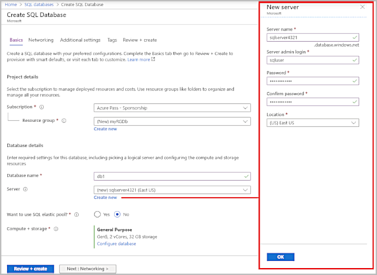
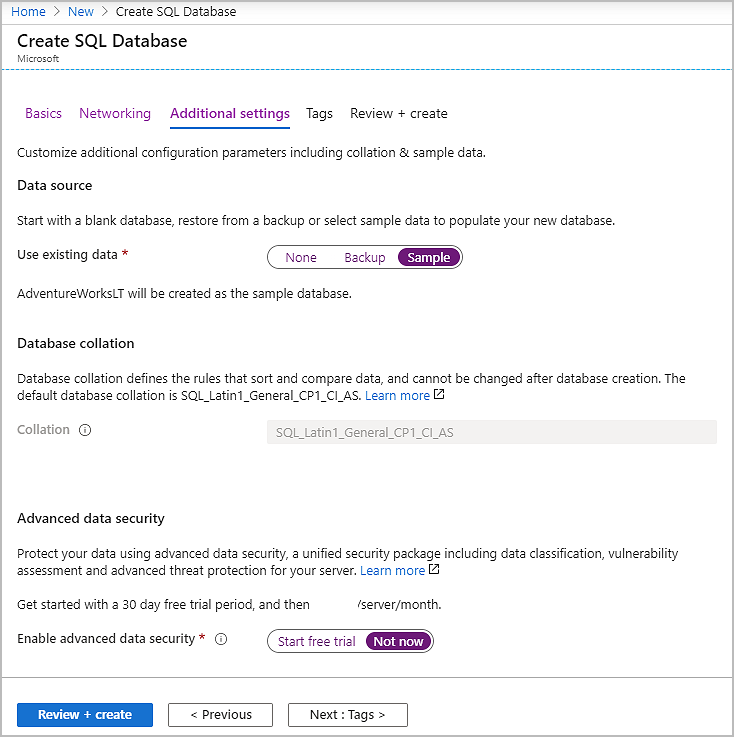
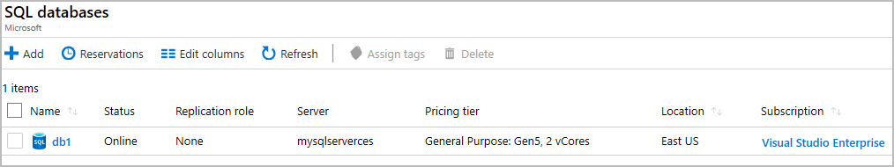
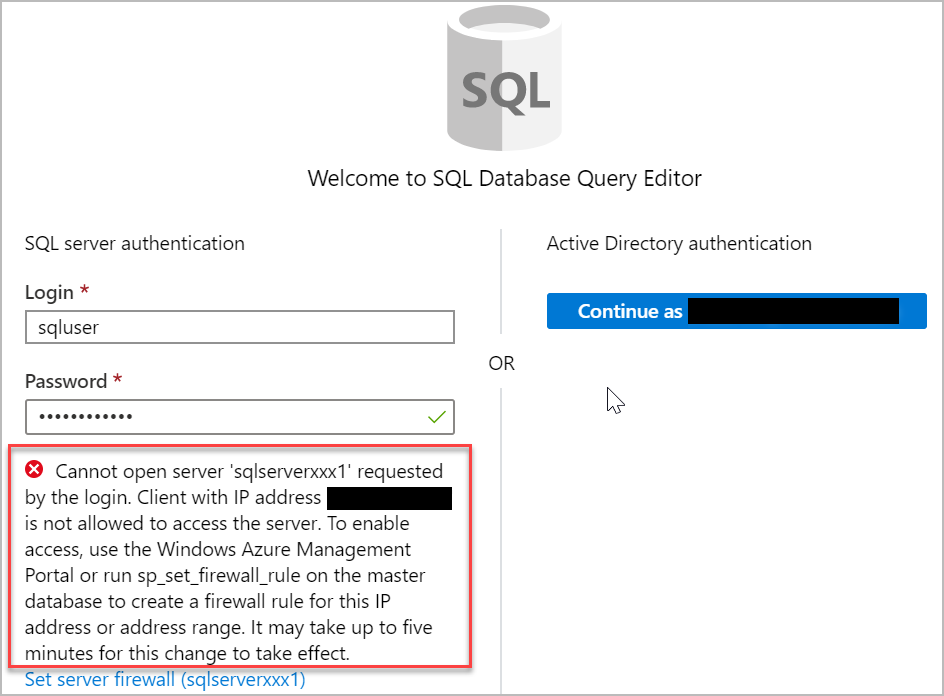
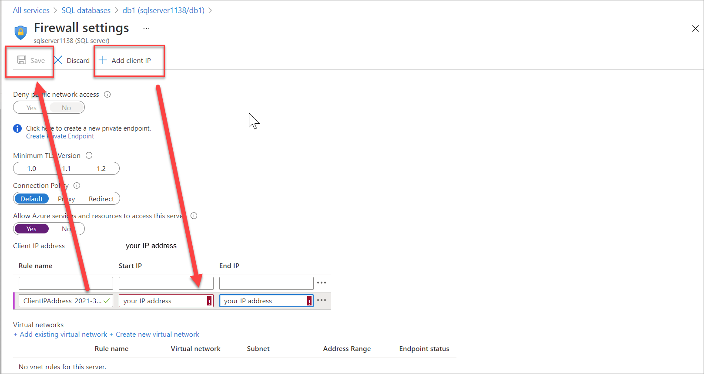
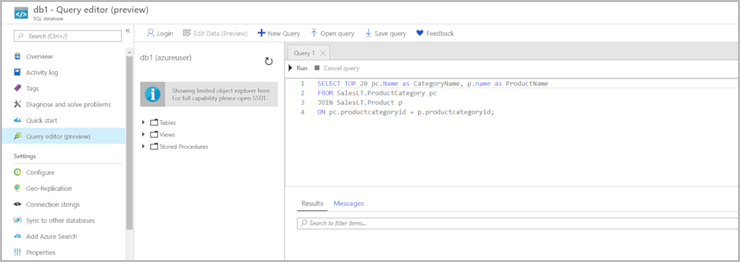

Tailwind Traders has chosen Azure SQL Database for part of its migration. You've been tasked with creating the database.

In this exercise, you'll create a SQL database in Azure and then query the data in that database.

## Task 1: Create the database

In this task, you create a SQL database based on the _AdventureWorksLT_ sample database. 

1. Sign in to the [Azure portal](https://portal.azure.com/learn.docs.microsoft.com?azure-portal=true).

1. Select **Create a resource** > **Databases** > **SQL database**. Fill in the following information.

    | Setting | Value |
    | --- | --- |
    | On the **Basics** tab, under **Project details** section: |
    | Subscription | **Concierge Subscription** |
    | Resource group | **<rgn>[sandbox resource group name]</rgn>** |
    | Under **Database details** section: |
    | Database name | **db1** |
    | Server | Select **Create new**. |

1. The **New server** panel appears. Enter the following information (replace **nnnn** in the name of the server with letters and digits, such that the name is globally unique).

    | Setting | Value |
    | --- | --- |
    | Server name | **sqlservernnnn** (must be unique) |
    | Server admin login | **sqluser** |
    | Password | **Pa$$w0rd1234** |
    | Location | **(US) East US** |

    [](../media/server-pane-expanded.png#lightbox)

1. Select **OK** when you have finished.

1. Select **Next : Networking**, and configure the following settings (leave defaults for remainder of fields).

    | Setting | Value |
    | --- | --- |
    | Under **Network connectivity** section: |
    | Connectivity method | **Public endpoint** (*default*) |

    :::image type="content" source="../media/tab.png" alt-text="Screenshot of the Networking tab of the Create SQL Database pane with settings selected.":::

1. Select **Next : Additional settings**, and configure the following settings.

    | Setting | Value |
    | --- | --- |
    | Under **Data source** section: |
    | Use existing data | **Sample** (this will create the _AdventureWorksLT_ sample database) |
    | Under **Database collation** section: |
    | Collation | *default* |
    | Under **Azure Defender for SQL** section: |
    | Enable Azure Defender for SQL | **Not now** |

    

1. Select **Review + create**.

1. After validation succeeds, on the **Create SQL Database** window, select **Create** to deploy the server and database.

    It can take approximately two to five minutes to create the server and deploy the sample database.

1. Select **Go to resource**.

1. Select **Set server firewall**, and then select **Yes** to **Allow Azure services and resources to access this server**.

1. Select **Save**.

1. Select **OK**.

## Task 2: Test the database

In this task, you configure the server and run a SQL query. 

1. From the **All resources** pane, search and select **SQL databases** and ensure that your new database was created. You might need to refresh the page.

    

1. Select the **db1** entry representing the SQL database you created, and then select **Query editor (preview)** in the nav bar.

1. Sign in as **sqluser**, with the password **Pa$$w0rd1234**.

1. You will not be able to sign in. Read the error closely and make note of the IP address that needs to be allowed through the firewall.

    

1. Select **Overview** > **Set server firewall**.

1. In **Client IP address** your IP will be shown. Select **Rule name**, add your IP in both the **Start IP** and **End IP** fields, and then select **Save**.

    

1. Return to your SQL database and the Query Editor sign-in page. Try to sign in again as **sqluser**, with the password **Pa$$w0rd1234**. This time you should succeed. It might take a couple of minutes for the new firewall rule to be deployed. If you wait and still get an error, try selecting **Firewall settings >** again.

1. After you sign in successfully, the query pane appears. Enter the following query into the editor pane.

    ```SQL
    SELECT TOP 20 pc.Name as CategoryName, p.name as ProductName
    FROM SalesLT.ProductCategory pc
    JOIN SalesLT.Product p
    ON pc.productcategoryid = p.productcategoryid;
    ```

    [](../media/query-editor-expanded.png#lightbox)

1. Select **Run**, and then review the query results in the **Results** pane. The query should run successfully.

    

Congratulations! You've created a SQL database in Azure and successfully queried the data in that database.
