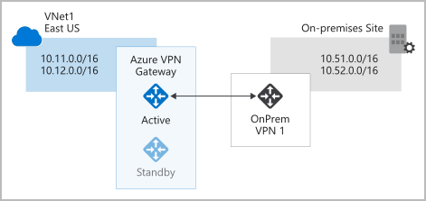
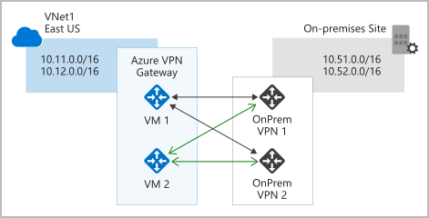

A virtual private network (VPN) is a type of private interconnected network. VPNs use an encrypted tunnel within another network. They're typically deployed to connect two or more trusted private networks to one another over an untrusted network (typically the public internet). Traffic is encrypted while traveling over the untrusted network to prevent eavesdropping or other attacks.

For our Tailwind Traders scenario, VPNs can enable branch offices to share sensitive information between locations. For example, let's say that your offices on the East Coast region of North America need to access your company's private customer data, which is stored on servers that are physically located in a West Coast region. A VPN that connects your East Coast offices to your West Coast servers allows your company to securely access your private customer data.

## VPN gateways

A VPN gateway is a type of virtual network gateway. Azure VPN Gateway instances are deployed in Azure Virtual Network instances and enable the following connectivity:

- Connect on-premises datacenters to virtual networks through a *site-to-site* connection.
- Connect individual devices to virtual networks through a *point-to-site* connection.
- Connect virtual networks to other virtual networks through a *network-to-network* connection.

All transferred data is encrypted in a private tunnel as it crosses the internet. You can deploy only one VPN gateway in each virtual network, but you can use one gateway to connect to multiple locations, which includes other virtual networks or on-premises datacenters.

When you deploy a VPN gateway, you specify the VPN type: either _policy-based_ or _route-based_. The main difference between these two types of VPNs is how traffic to be encrypted is specified. In Azure, both types of VPN gateways use a pre-shared key as the only method of authentication. Both types also rely on Internet Key Exchange (IKE) in either version 1 or version 2 and Internet Protocol Security (IPSec). IKE is used to set up a security association (an agreement of the encryption) between two endpoints. This association is then passed to the IPSec suite, which encrypts and decrypts data packets encapsulated in the VPN tunnel.

### Policy-based VPNs

Policy-based VPN gateways specify statically the IP address of packets that should be encrypted through each tunnel. This type of device evaluates every data packet against those sets of IP addresses to choose the tunnel where that packet is going to be sent through.

Key features of policy-based VPN gateways in Azure include:

- Support for IKEv1 only.

- Use of *static routing*, where combinations of address prefixes from both networks control how traffic is encrypted and decrypted through the VPN tunnel. The source and destination of the tunneled networks are declared in the policy and don't need to be declared in routing tables.

- Policy-based VPNs must be used in specific scenarios that require them, such as for compatibility with legacy on-premises VPN devices.

### Route-based VPNs

If defining which IP addresses are behind each tunnel is too cumbersome, route-based gateways can be used. With route-based gateways, IPSec tunnels are modeled as a network interface or virtual tunnel interface. IP routing (either static routes or dynamic routing protocols) decides which one of these tunnel interfaces to use when sending each packet. Route-based VPNs are the preferred connection method for on-premises devices. They're more resilient to topology changes such as the creation of new subnets.

Use a route-based VPN gateway if you need any of the following types of connectivity:

- Connections between virtual networks
- Point-to-site connections
- Multisite connections
- Coexistence with an Azure ExpressRoute gateway

Key features of route-based VPN gateways in Azure include:

- Supports IKEv2
- Uses any-to-any (wildcard) traffic selectors
- Can use *dynamic routing protocols*, where routing/forwarding tables direct traffic to different IPSec tunnels

    In this case, the source and destination networks aren't statically defined as they are in policy-based VPNs or even in route-based VPNs with static routing. Instead, data packets are encrypted based on network routing tables that are created dynamically using routing protocols such as Border Gateway Protocol (BGP).

## VPN gateway sizes

The capabilities of your VPN gateway are determined by the SKU or size that you deploy. This table shows the main capabilities of each available SKU.

| SKU | Site-to-site/Network-to-network tunnels | Aggregate throughput benchmark | Border Gateway Protocol support |
| --- | --- | --- | --- |
| Basic [See Note] | Maximum: 10 | 100 Mbps | Not supported |
| VpnGw1/Az | Maximum: 30 | 650 Mbps | Supported |
| VpnGw2/Az | Maximum: 30 | 1 Gbps | Supported |
| VpnGw3/Az | Maximum: 30 | 1.25 Gbps | Supported |

> [!NOTE]
>
> A Basic VPN gateway should only be used for Dev/Test workloads. In addition, it's unsupported to migrate from Basic to the VpnGW1/2/3/Az SKUs at a later time without having to remove the gateway and redeploy.

## Deploy VPN gateways

Before you can deploy a VPN gateway, you'll need some Azure and on-premises resources.

### Required Azure resources

You'll need these Azure resources before you can deploy an operational VPN gateway:

- **Virtual network**. Deploy a virtual network with enough address space for the additional subnet that you'll need for the VPN gateway. The address space for this virtual network must not overlap with the on-premises network that you'll be connecting to. You can deploy only one VPN gateway within a virtual network.
- **GatewaySubnet**. Deploy a subnet called `GatewaySubnet` for the VPN gateway. Use at least a **/27** address mask to make sure you have enough IP addresses in the subnet for future growth. You can't use this subnet for any other services.
- **Public IP address**. Create a Basic-SKU dynamic public IP address if you're using a non-zone-aware gateway. This address provides a public-routable IP address as the target for your on-premises VPN device. This IP address is dynamic, but it won't change unless you delete and re-create the VPN gateway.
- **Local network gateway**. Create a local network gateway to define the on-premises network's configuration, such as where the VPN gateway will connect and what it will connect to. This configuration includes the on-premises VPN device's public IPv4 address and the on-premises routable networks. This information is used by the VPN gateway to route packets that are destined for on-premises networks through the IPSec tunnel.
- **Virtual network gateway**. Create the virtual network gateway to route traffic between the virtual network and the on-premises datacenter or other virtual networks. The virtual network gateway can be either a VPN or ExpressRoute gateway, but this unit only deals with VPN virtual network gateways. (You'll learn more about ExpressRoute in a separate unit later in this module.)
- **Connection**. Create a connection resource to create a logical connection between the VPN gateway and the local network gateway.

  - The connection is made to the on-premises VPN device's IPv4 address as defined by the local network gateway.
  - The connection is made from the virtual network gateway and its associated public IP address.

   You can create multiple connections.

The following diagram shows this combination of resources and their relationships to help you better understand what's required to deploy a VPN gateway.

### Required on-premises resources

To connect your datacenter to a VPN gateway, you'll need these on-premises resources:

- A VPN device that supports policy-based or route-based VPN gateways
- A public-facing (internet-routable) IPv4 address

## High-availability scenarios

There are several ways to ensure you have a fault-tolerant configuration.

### Active/standby

By default, VPN gateways are deployed as two instances in an active/standby configuration, even if you only see one VPN gateway resource in Azure. When planned maintenance or unplanned disruption affects the active instance, the standby instance automatically assumes responsibility for connections without any user intervention. Connections are interrupted during this failover, but they're typically restored within a few seconds for planned maintenance and within 90 seconds for unplanned disruptions.

### Active/active

With the introduction of support for the BGP routing protocol, you can also deploy VPN gateways in an active/active configuration. In this configuration, you assign a unique public IP address to each instance. You then create separate tunnels from the on-premises device to each IP address. You can extend the high availability by deploying an additional VPN device on-premises.

### ExpressRoute failover

Another high-availability option is to configure a VPN gateway as a secure failover path for ExpressRoute connections. ExpressRoute circuits have resiliency built in. But they aren't immune to physical problems that affect the cables delivering connectivity or outages that affect the complete ExpressRoute location. In high-availability scenarios, where there's risk associated with an outage of an ExpressRoute circuit, you can also provision a VPN gateway that uses the internet as an alternative method of connectivity. In this way, you can ensure there's always a connection to the virtual networks.

### Zone-redundant gateways

In regions that support availability zones, VPN gateways and ExpressRoute gateways can be deployed in a zone-redundant configuration. This configuration brings resiliency, scalability, and higher availability to virtual network gateways. Deploying gateways in Azure availability zones physically and logically separates gateways within a region while protecting your on-premises network connectivity to Azure from zone-level failures. These gateways require different gateway SKUs and use Standard public IP addresses instead of Basic public IP addresses.
