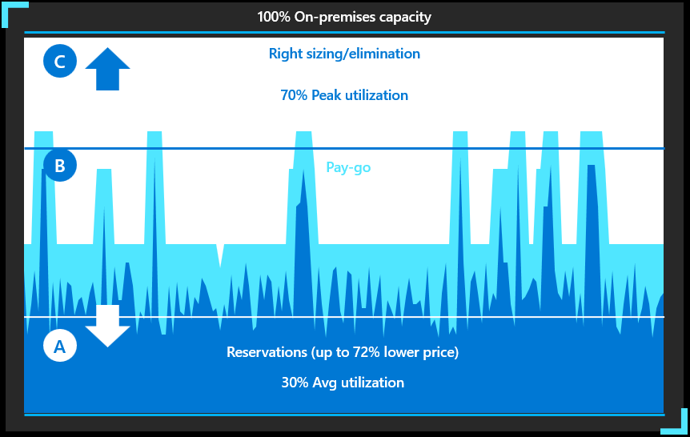
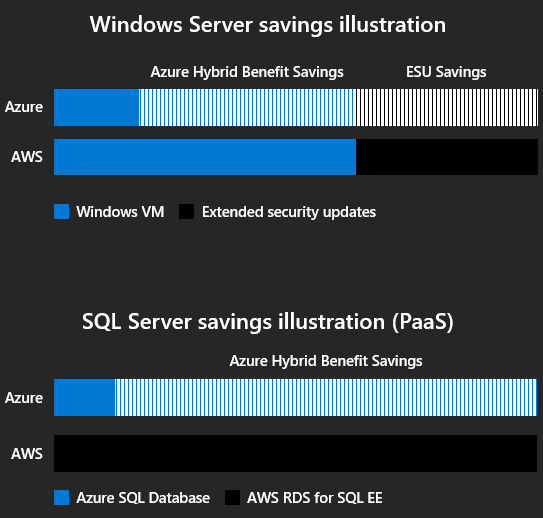
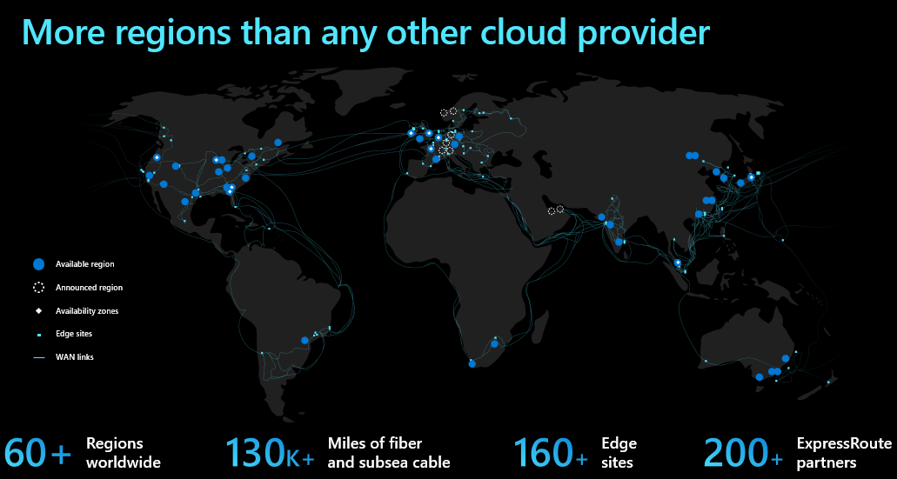
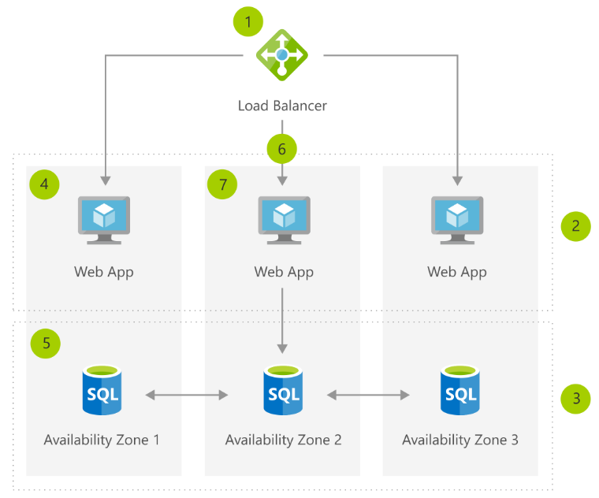
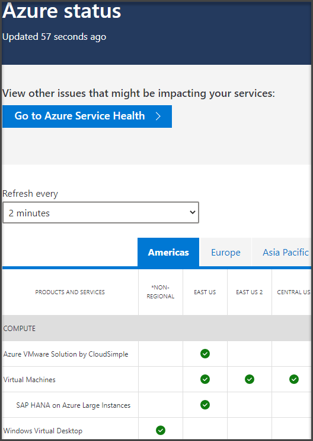
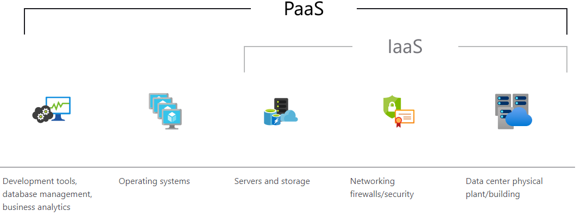

Many organizations are interested in moving to the cloud, but the benefits aren't always clear. Moving to the cloud is a fundamental shift in how systems are purchased, designed, deployed, and secured. As a solution architect for Tailwind Traders, it is essential to understand the cloud's benefits and align your business and technical goals to enjoy them. 

The cloud delivers fundamental technology benefits that can help your enterprise execute on multiple goals:

- Optimize costs
- Build resilience and security
- Scale applications and workloads on demand
- Application innovation

## Optimize costs

Datacenters are expensive, with the costs of real estate, power, servers, storage, and networks, plus operations staff tugging on a company’s bottom line. When migrating to Azure, customers convert upfront capital expenditures to operating expenditures that can be paid over time. Your cash flow is improved by only paying for what you need, and you can also achieve cost savings and efficiency.

In a [Forrester study](https://azure.microsoft.com/resources/forrester-economic-impact-azure-iaas/?azure-portal=true), customers report a 25% increase in productivity of IT Staff, $10M in savings from avoided hardware, software and staff cost and a 478% return on investments.

### Pay less with Azure

Azure customers with existing SQL Server or Windows Server license can re-use their licenses in the cloud with the Azure Hybrid benefit for exclusive savings, and you can be confident you’re getting the best price on any cloud as Azure costs 5x less than AWS for WS and SQL server.

Azure Hybrid Benefit is a licensing benefit that helps you to significantly reduce the costs of running your workloads in the cloud. It works by letting you use your on-premises Software Assurance-enabled Windows Server and SQL Server licenses on Azure. And now, this benefit applies to RedHat and SUSE Linux subscriptions, too.

## Build resilience and security

Resilience is a core tenet of Azure trusted cloud commitments, alongside compliance, security, privacy, and transparency.  Microsoft is committed to providing a trusted set of cloud services, giving you the confidence to unlock the cloud's potential.

### High-availability network design

Unlike many other public cloud providers, data that traverses between Azure datacenters and regions doesn’t go through the public Internet - it stays in Microsoft’s network. The reliability and performance of cloud services is determined in part by the network and in addition to having more datacenter regions than any of our competitor. Microsoft’s network is also one of the largest in the world.

The Microsoft global wide-area network (WAN) plays an essential part in delivering a great cloud service experience – offering near-perfect availability, high capacity, and the flexibility to respond to unpredictable demand spikes.

Azure traffic between our datacenters stays on our network and does not flow over the Internet. This includes all traffic between Microsoft services anywhere in the world. For example, within Azure, traffic between virtual machines, storage, and SQL communication traverses only the Microsoft network, regardless of the source and destination region. Intra-region VNet-to-VNet traffic, as well as cross-region VNet-to-VNet traffic, stays on the Microsoft network, giving us more control.

### Availability Zones

An [Availability Zone](https://docs.microsoft.com/azure/availability-zones/az-overview?azure-portal=true) is a high-availability offering that protects your applications and data from datacenter failures. Availability Zones are unique physical locations within an Azure region. Each zone is made up of one or more datacenters equipped with independent power, cooling, and networking.

To ensure resiliency, there's a minimum of three separate zones in all enabled regions. The physical separation of Availability Zones within a region protects applications and data from datacenter failures. Zone-redundant services replicate your applications and data across Availability Zones to protect from single-points-of-failure. With Availability Zones, Azure offers industry best 99.99% VM uptime SLA. The full [Azure SLA](https://azure.microsoft.com/support/legal/sla/?azure-portal=true) explains the guaranteed availability of Azure as a whole.

### Maintenance and Service Health Alerts

Azure has invested in improving zero-impact and low-impact update technologies including hot patching, live migration, and in-place migration. The Azure operations teams deploys dozens of security and reliability patches to host infrastructure each year, many of which were implemented with no customer impact or downtime.

### Machine Learning driven failure prediction

Microsoft uses predictive techniques to determine when a server might fail, so that operations can migrate virtual machines away from failing servers. Machine Learning and artificial intelligence is used to to collect data and analyze data to learn the patterns that signal a server might be imminently failing. We apply this to disk failures, memory failures, and other types of hardware failures.

### Azure Service health alerts and status

Azure has a full service health dashboard and fires alerts when issues happen. You can connect to the dashboard to receive information about the [status](https://status.azure.com/status/?azure-portal=true) of the Azure infrastructure and your services.  Azure Service Health (in the Azure portal) provides tailored information for your resources.

### Security

Azure provides a strong secure foundation to strengthen your security posture across operations, technology and partnerships. Microsoft invests 1 billion USD annually in cybersecurity and has over 3,500 global security experts to monitor and secure the environment Azure resources. The Microsoft Intelligent Security Graph, uses trillions of signals from Microsoft services and systems around the globe to identify new and evolving threats.

These ongoing investments protect workloads across your hybrid environments with intelligent security services. Customers will have reduced costs and complexity with a highly secure cloud foundation managed by Microsoft. Azure also has more compliance certifications than any other cloud provider—view the comprehensive list.

#### Azure Security Center

Microsoft uses a wide variety of physical, infrastructure, and operational controls to help secure Azure, but there are additional actions you need to take to help safeguard your workloads. Turn on Azure Security Center to strengthen your cloud security posture. Within [Azure Security Center](https://azure.microsoft.com/services/security-center/?azure-portal=true), use [Azure Defender](https://azure.microsoft.com/services/azure-defender/?azure-portal=true) to protect your hybrid cloud workloads.

#### Start with a secure foundation

Take advantage of multi-layered security provided by Microsoft across physical datacenters, infrastructure, and operations in Azure. Gain from the state-of-art security delivered in Azure datacenters globally. Rely on a cloud that is built with customized hardware, has security controls integrated into the hardware and firmware components, and added protections against threats such as DDoS.

#### Simplify security with built-in controls

Protect your workloads quickly with built-in controls and services in Azure across identity, data, networking, and apps. Get continuous protection with deeper insights from Azure Security Center. Extend protections to hybrid environments and easily integrate partner solutions in Azure.

#### Detect threats early with unique intelligence

Identify new threats and respond quickly with services that are informed by real-time global cybersecurity intelligence delivered at cloud scale. These actionable insights are developed by analyzing vast sources including 18 billion Bing web pages, 400 billion emails, 1 billion Windows device updates, and 450 billion monthly authentications. Using machine learning, behavioral analytics, and application-based intelligence, Microsoft data scientists analyze the flood of data in the Microsoft Intelligent Security Graph. The resulting insights inform services in Azure and help you detect threats faster.

## Scale Applications and Workloads on demand

Migrating to the cloud also allows for more flexibility and scalability and the ability to command growing or diminishing resources to capably meet business demands. When you plan for peak usage through on-premises systems, your servers are typically under-utilized, as you need more capacity than average to accommodate spikes when they occur. The cloud releases you from this model, enabling a scale-when-you-need-it approach.

Increase agility with best-in-class Azure infrastructure that scales to your business needs. With almost limitless scale customers can scale up or out using [Infrastructure as a Service (IaaS)](https://azure.microsoft.com/overview/what-is-azure/iaas/?azure-portal=true) or [Platform as a Service (PaaS)](https://azure.microsoft.com/overview/what-is-paas/?azure-portal=true).

### Azure Autoscale

Most Azure Solutions can be manually scaled up or down, with many also allowing for autoscale. Autoscale is a built-in feature of [App Services](https://docs.microsoft.com/azure/azure-monitor/autoscale/autoscale-overview?azure-portal=true), [Azure Kubernetes Services](https://docs.microsoft.com/azure/aks/cluster-autoscaler?azure-portal=true), [Virtual Machine Scale Sets](https://docs.microsoft.com/azure/virtual-machine-scale-sets/virtual-machine-scale-sets-autoscale-overview?azure-portal=true), and [Azure Cosmos DB](https://docs.microsoft.com/azure/cosmos-db/provision-throughput-autoscale?azure-portal=true).

Scaling helps applications perform their best when demand changes. Of course, performance means different things for different applications. Some apps are CPU-bound, others memory-bound. For example, you could have a web app that handles millions of requests during the day and none at night. Autoscale can scale your service by any of these or by a custom metric you define. An Azure administrator can scale other services such as Azure Database or Azure SQL to increase the size or responsiveness.

### Increase performance

The benefits of migration can be immediate in terms of performance. Azure is available in 60 regions worldwide, more than any other cloud provider. Azure has one of the largest global networks, over 130,000 miles of fiber on land and sub-sea. With 160+ edge sites, pairing points, and over 200 [ExpressRoute](https://azure.microsoft.com/services/expressroute?azure-portal=true) partners network speed and connectivity is unparalleled.

## Application Innovation

Innovation can provide great business value by supporting both current development efforts and visions for future products. The key to innovation is understanding customer needs so you can create inventions that shape how your they interact with your products. Intelligent cloud services like AI and machine learning make continuous innovation possible and can help to unlock new technical skills and expand business capabilities.
