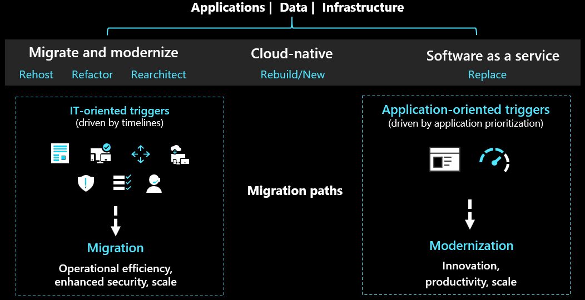
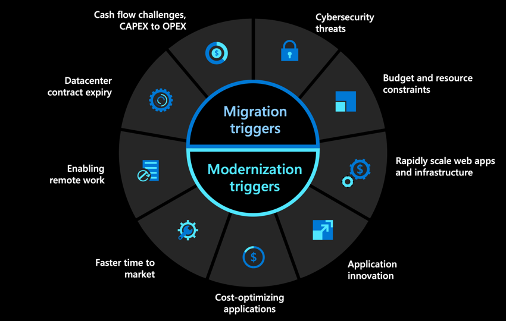
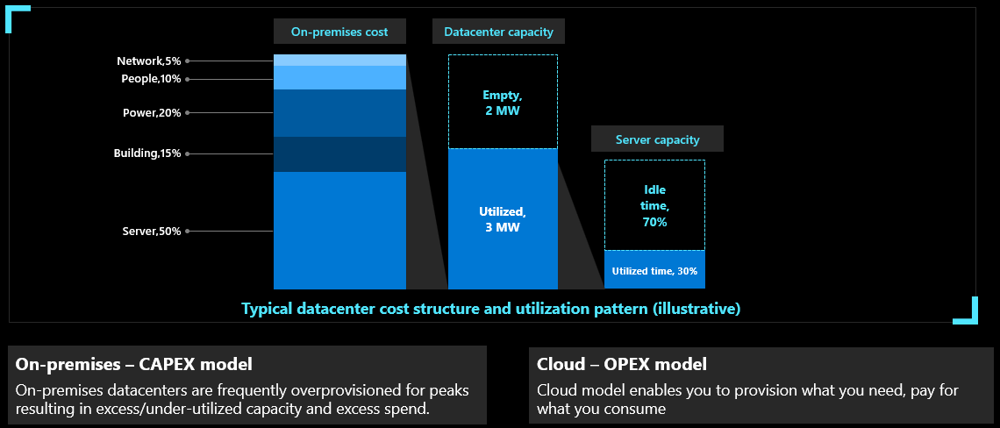

One crucial part of building a cloud migration strategy for an organization is identifying what is triggering cloud adoption. Some triggers may prompt quick action, while others may call for a more active, ands-on approach.

Understanding the challenges a business faces and how migration triggers map to those challenges can help determine which strategy to take when moving to the cloud. In some cases, it might be best to lift-and-shift or migrate your workloads, while in other instances, re-platforming or modernization of your applications might be necessary.

As the solution architect on the Contoso team you will need to understand the triggers for your migration or modernization.

## Migration triggers

Migrate triggers are typically IT-oriented or based on timelines. The migration to the cloud is driven by the need to quickly reduce on-premises costs, stay secure and simplify operations. These triggers include the following:

- Data center contract expiration
- Cash flow challenges & resource constraints
- Business continuity
- Cybersecurity threats

### Data center contract expiration

The expiration of data center contracts is a excellent opportunity for beginning the cloud migration journey since many organizations may consider if it’s worth continuing to run their data center if they’re facing resource and cash flow challenges.

#### Eliminate recurring expenses

- Owning and managing physical data centers can be expensive, both in terms of financial cost and effort.
- Data center contract expiration can be an inflection point to consider cloud migration, as it can provide almost immediate benefits in the form of cost reductions, better performance, and simpler management.
- Moving data center operations to the cloud frees you from recurring contract expenses, and provides built-in scalability and other key
management features that make it much easier to run your data center efficiently.

### Cash flow challenges & resource constraints

One of the most impactful incentives of the cloud and adopting a more flexible operating model is the opportunity to eliminate large upfront investments in physical infrastructure assets.Identifying areas to optimize costs and free up resources for growth and innovation are critical to helping you establish your business case for migrating to the cloud. Often companies struggle to meet their growth needs or can't
provide the resources requested by IT teams. The cloud changes this with almost infinite scale of the Azure data centers.

#### Shift from CAPEX to OPEX

Maintaining a physical data center can cause serious cash flow challenges, since there are typically investments reserved for infrastructure.
Moving to the cloud helps you shift from a capital expenses (CAPEX) to an operational expenses (OPEX) model, since you are no longer paying for the
costs of a physical data center and its associated hardware and software. Instead you only pay for the resources you use on the cloud and can scale up or down as needed. This can provide more cash flow flexibility across an organization.

### Business continuity

Moving to the cloud can help ensure security and resilience for business-critical workloads, as having day-to-day operations interrupted by issues like network connectivity and data loss can result in productivity losses and increased risk of losing critical data.

> [!IMPORTANT]
> Customers see a 66% reduction in recovery time on average for data hosted in Azure.

#### Resilient apps and operations

- By moving core business applications to the cloud, you can minimize
the amount of disruptions and more easily maintain operations, which
are often among the top concerns for organizations.
- By taking advantage of native disaster recovery and high availability
services, you can ensure that applications are not only resilient, but can
also scale up or down to meet performance demands.
- Azure provides options for replicating key workloads across different
regions, so their uptime is maximized, and built-in recovery options so
the risk of losing important apps or data is severely reduced, if not
eliminated entirely.

### Cybersecurity threats

The growing evolution of cybersecurity threats, increased need to protect people and resources wherever
they are located, and difficulty finding security talent has many security teams feeling overwhelmed. The
cloud provides a suite of comprehensive security options that can address many of their challenges.

#### Suite of cloud security solutions

- Traditional IT solutions are incapable of keeping up with the evolving threat
landscape of advanced cyber attacks, and many businesses feel more
vulnerable. The cloud offers built-in security solutions which provide
comprehensive protection against advanced threats.
- Azure is secured with a variety of physical, infrastructure, and operational
controls that allows organizations to take actions that ensure their applications
and data are protected, backed up, and compliant.
  - Azure Backup protects your environment from ransomware attacks and
recovers maliciously or accidentally deleted backup data.
  - Azure Security Center provides unified infrastructure security management
to protect your resources.
  - Azure Sentinel provides intellig

## Modernization triggers

- Scale web apps and infrastructure
- Application innovation

### Scale web apps and infrastructure

### Application innovation

