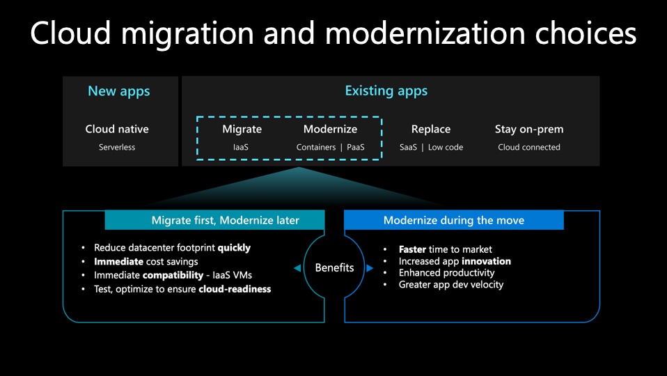
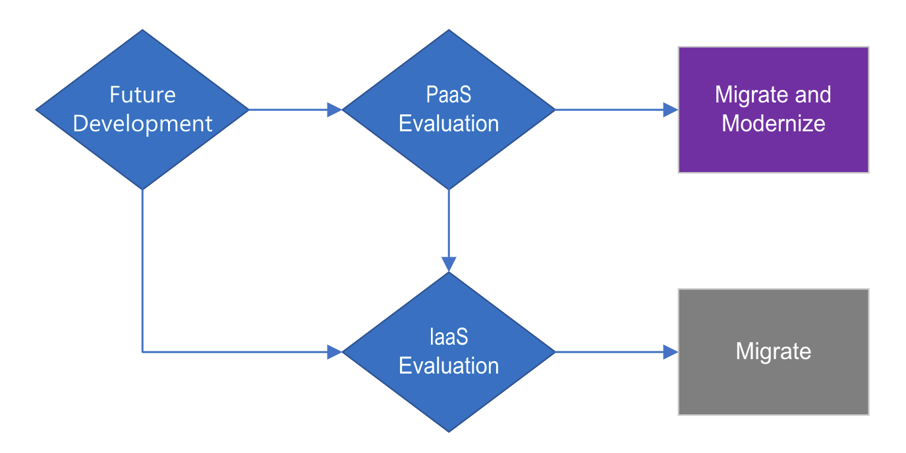
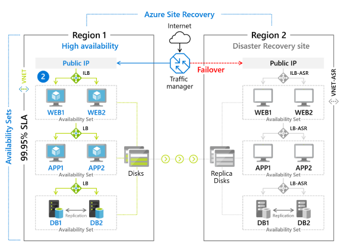

One crucial part of building a cloud migration and modernization strategy for an organization is identifying what is triggering cloud adoption. Some triggers may prompt quick action, while others may call for a more active, hands-on approach.

Business and IT-driven goals point to migration and modernization triggers, which determine the strategy for moving applications to the cloud. For IT-based triggers, *migration* of your workloads is best. When you're presented with business-focused goals, we recommend *modernizing* your applications.

With a migration, the workloads will remain unchanged and moved to the cloud. If modernization is selected, the application code will be changed or the application could be rewritten or replaced to use new cloud technologies.

At Tailwind Traders, you could develop a decision tree, which can help you to evaluate your applications:

As the solution architect on the Tailwind Traders team, you will need to understand the triggers for your **migration** or **modernization**.

## Migration triggers

Migration triggers are typically IT-oriented or based on timelines. The migration to the cloud is driven by the need to quickly reduce on-premises costs, stay secure, and simplify operations. These triggers include:

- Datacenter contract expiration
- Cash flow challenges & resource constraints
- Business continuity
- Cybersecurity threats

### Datacenter contract expiration

The expiration of datacenter contracts is an excellent opportunity for beginning the cloud migration journey since many organizations may consider if it’s worth continuing to run their datacenter if they’re facing resource and cash flow challenges.

#### Eliminate recurring expenses

- Owning and managing physical datacenters can be expensive, both in terms of financial cost and effort.
- Datacenter contract expiration can be an inflection point to consider cloud migration, as it can provide almost immediate benefits in the form of cost reductions, better performance, and simpler management.
- Moving datacenter operations to the cloud frees you from recurring contract expenses, and provides built-in scalability and other key
management features that make it much easier to run your datacenter efficiently.

### Cash flow challenges & resource constraints

One of the most impactful incentives of the cloud and adopting a more flexible operating model is the opportunity to eliminate large upfront investments in physical infrastructure assets. Identifying areas to optimize costs and free up resources for growth and innovation is critical to establishing your business case for migrating to the cloud. Often companies struggle to meet their growth needs or can't provide the resources requested by IT teams. The cloud changes this with an almost infinite scale of the Azure datacenters.

#### Shift from CAPEX to OPEX

Maintaining a physical datacenter can cause serious cash flow challenges with investments reserved for infrastructure.
Moving to the cloud helps you shift from capital expenses (CAPEX) to an operational expenditures (OPEX) model since you are no longer paying for a physical datacenter's costs and its associated hardware and software. Instead, you only pay for the resources you use on the cloud and can scale up or down as needed, providing more cash flow flexibility across an organization.

### Business continuity

Moving to the cloud can help ensure security and resilience for business-critical workloads, as having day-to-day operations interrupted by issues like network connectivity and data loss can result in productivity losses and increased risk of losing critical data.

> [!IMPORTANT]
> Customers see a 66% reduction in recovery time on average for data hosted in Azure.

#### Resilient apps and operations

- By moving core business applications to the cloud, you can minimize
the number of disruptions and more easily maintain operations, which
are often among the top concerns for organizations.
- By taking advantage of native disaster recovery and high availability
services, you can ensure that applications are not only resilient, but can
also scale up or down to meet performance demands.
- Azure provides options for replicating key workloads across different
regions, so their uptime is maximized, and built-in recovery options so
the risk of losing important apps or data is severely reduced, if not
eliminated entirely.

Azure was designed for business continuity and disaster recovery with solutions built into the Regions (datacenters) and many of services including:

- [Azure Paired Regions](/azure/best-practices-availability-paired-regions?azure-portal=true)
- [Azure Storage](/azure/storage/common/storage-redundancy?azure-portal=true) redundancy and replication
- [Azure Site Recovery](https://azure.microsoft.com/services/site-recovery/?azure-portal=true) for virtual machine replication and failover
- [Azure Backup](https://azure.microsoft.com/services/backup/?azure-portal=true) for data protection and recovery

### Cybersecurity threats

The growing evolution of cybersecurity threats, increased need to protect people and resources wherever
they are located, and difficulty finding security talent has many security teams feeling overwhelmed. The
cloud provides a suite of comprehensive security options that can address many of their challenges.

#### Suite of cloud security solutions

- Traditional IT solutions are incapable of keeping up with the evolving threat
landscape of advanced cyber attacks, and many businesses feel more
vulnerable. The cloud offers built-in security solutions, which provide
comprehensive protection against advanced threats.
- Azure is secured with a various physical, infrastructure, and operational
controls that allow organizations to take actions that ensure their applications
and data are protected, backed up, and compliant.
  - [Azure Backup](https://azure.microsoft.com/services/backup/?azure-portal=true)
) protects your environment from ransomware attacks and recovers maliciously or accidentally deleted backup data.
  - [Microsoft Defender for Cloud](https://azure.microsoft.com/services/security-center/?azure-portal=true) provides unified infrastructure security management
to protect your resources.
  - [Microsoft Sentinel](https://azure.microsoft.com/services/azure-sentinel/?azure-portal=true) provides intelligent security analytics across your entire enterprise.

## Modernization triggers

Modernization triggers are business-oriented and focused on future development or investment in the application. If you are going to continue investment into an application by modernizing for the cloud new features and capabilities can be created to enable business growth or improve a customer experience.

These triggers include:

- Scaling web apps and infrastructure
- Focus on innovation
- Faster time to market
- Cost-optimizing applications
- Focus on innovation

### Scale web apps and infrastructure

The ability to meet surges in demand is one of the key priorities for businesses. However, many organizations lack the confidence or technical capacity to keep up with fluctuating demands providing yet another incentive to look to the cloud.

Azure allows you to scale for urgent capacity needs. When you plan for peak usage through on-premises systems, your servers are typically under-utilized, as you need more capacity than average to accommodate spikes when they occur. The cloud releases you from this model, enabling a scale-when-you-need-it approach.

Moving to the cloud increases your agility with an infrastructure that scales to your business needs.

#### Built-in autoscaling

Several industries such as healthcare, insurance, and banking are experiencing considerable growth, but many organizations within these verticals are finding it difficult to keep pace with significant surges in demand.

By moving to managed services in the cloud, organizations can modernize their business-critical applications and take advantage of managed services such as [Azure App Service](https://azure.microsoft.com/services/app-service/?azure-portal=true) and [Azure SQL Managed Instances](https://azure.microsoft.com/services/azure-sql/sql-managed-instance/?azure-portal=true) to reduce operational tasks and focus scarce resources on higher value work.

### Application innovation

Here are some of the opportunities that the cloud presents when embarking on innovation:

- Moving to the cloud can help to significantly reduce or eliminate operational responsibilities significantly. For this reason, you can focus on innovating your products and offering new capabilities for customers.
- Azure can help you better understand and anticipate users' needs with a full set of AI services and capabilities. You can use these capabilities to infuse your apps, websites, and bots with intelligent algorithms. You can also gain instant and continuous insights that can help inform your decisions by taking advantage of cloud-native analytics services.
- With cloud-native applications, you can develop and deploy quickly, test safely, and iterate rapidly.
- You can gain time and resources by letting Microsoft take care of patching operating systems, upgrading operating system, and monitoring for vulnerabilities while you focus on innovation and performing tasks that can bring value to your business.

- Azure can help you better understand and anticipate users’ needs with a full set of AI services and capabilities, allowing you to infuse your apps, websites, and bots with intelligent algorithms. You can also gain instant and continuous insights that can help 
inform your decisions by taking advantage of cloud-native analytics services.

- With cloud services like these, you can develop and deploy quickly, test safely, and iterate rapidly.

### Faster time to market

Application modernization enables Tailwind Traders to develop and bring applications to market much faster.  Developing on a modern cloud, like Azure, means developers are not constrained by the lead time to procure and build on-premises systems and databases. These extended lead times for infrastructure slowed down your development efforts in the past. Some examples of this may be:

- You can stand up Azure App Service in a matter of minutes to start developing a website. Previously you may have had to create a new server, patch the servers, install Internet Information Services (IIS), and make any necessary configuration changes. Now you can get to developing your application immediately rather than waiting for days to start.
- Modernizing applications using serverless in Azure once again provides the ability to bring solutions and updates to the market with even less infrastructure.  Leveraging services like Azure Kubernetes Services, Azure Functions, Azure Logic Apps, Azure Cognitive Services, developers have many options for building applications. 
Azure supports the use of DevOps tools, including GitHub, to build and deploy modern applications. Using GitHub actions, you build and release applications and updates faster to get ahead of the competition and keep your customers happy.

### Cost-optimizing applications

Modernizing your applications changes the cost structure of your applications. In traditional development, the infrastructure that services the application must be purchased and scaled for the busiest day possible for that application. With modernized cloud applications, the infrastructure is scaled by Azure to meet the demand. Tailwind Traders will only have to pay for the services consumed, thus optimizing the costs associated with delivering the service to customers.

Modernizing leads to cost savings on an application-by-application basis by only paying for the resources that you need when you need them.
