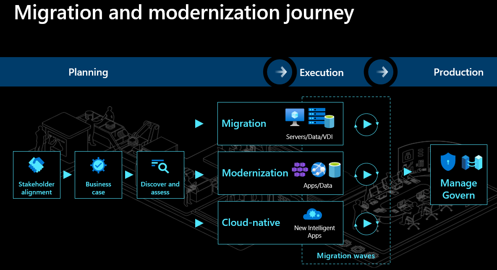

Cloud migration involves organizational change management spanning people, process, and technology. Taking a holistic approach will help you navigate the journey successfully and ensure that your organization realizes new benefits, including efficiency, agility, and scale, once your workload runs in the cloud.

The phases of your migration journey at Tailwind Traders include:

- Planning
- Execution
- Production

> [!IMPORTANT]
> The [Cloud Adoption Framework](https://docs.microsoft.com/azure/cloud-adoption-framework/?azure-portal=true) is a collection of documentation, implementation guidance, best practices, and tools that are proven guidance from Microsoft designed to accelerate your cloud adoption journey.

## Planning

Planning will set the stage for a successful migration to the cloud. During planning, three activities must be completed:

- Stakeholder alignment
- Business Case
- Discover and assess

### Stakeholder alignment

To avoid common migration blockers, create a clear and concise business strategy for migration. Stakeholder alignment on motivations and expected business outcomes shape decisions made by the cloud adoption team. Involving key stakeholders will facilitate a smoother, faster migration that meets organizational goals by enlisting the broad support of a cross-functional team made up of IT, finance, and business owners.

- [Motivations](https://docs.microsoft.com/azure/cloud-adoption-framework/strategy/motivations?azure-portal=true): The first step to strategic alignment is to gain agreement on the motivations that drive the migration effort. Start by understanding and categorizing motivations and common themes from various stakeholders across business and IT.
- [Business outcomes](https://docs.microsoft.com/azure/cloud-adoption-framework/strategy/business-outcomes/?azure-portal=true): After motivations are aligned, it's possible to capture the desired business outcomes. This information provides clear metrics you can use to measure the overall transformation.

### Business Case

Making the business case for migration is likely to be an iterative conversation among stakeholders. In this first pass at building the business case, evaluate the initial high-level return from a potential cloud migration. The goal of this step is to ensure that all stakeholders align around one simple question: based on the available data, is the overall adoption of the cloud a wise business decision.

- [Building a cloud migration business case.](https://docs.microsoft.com/azure/cloud-adoption-framework/strategy/cloud-migration-business-case?azure-portal=true) is a good starting point for developing a migration business case. Clarity on formulas and tools can aid in business justification.

At the highest level, the formula for business justification is simple. But the subtle data points required to populate the formula can be difficult to align. On a basic level, the business justification focuses on the return on investment (ROI) associated with the proposed technical change. The generic formula for ROI is:

### Discover and assess

Use discovery and assessment to improve technical alignment and create an action plan for executing your strategy. During this step, validate the business case using data about the current state environment. Then perform quantitative analysis and an in-depth qualitative assessment of the highest priority workloads.

You will need to discover and assess your apps, databases, and infrastructure. Build an inventory of your infrastructure, assess your on-premises environments, get right-sizing guidance, workload-level cost estimates, and performance metrics. [Azure Migrate](https://azure.microsoft.com/services/azure-migrate/?azure-portal=true) will be used to build this inventory. You can also gain insights into your dependencies, such as which web servers connect to your database servers.

### Approach: Migration or Modernization

With this information in hand, your cloud migration CoE at Tailwind Traders can now build a holistic migration plan. Account for workload priorities, timelines, milestones, resources, and funding. Determine if each application will be **migrated** or **modernized**. Define your approach based on three considerations: migration triggers, business goals, and workload priorities. Migrate if you have time-sensitive triggers. Modernize for targeted and business-critical workloads that will see continued investment

Next, break up your overall plan into migration waves, each with a group of related workloads. Get buy-in from leadership and your new migration center of excellence.

## Execution

Executing on the plan is where the act of moving to the cloud starts to unfold. Three main workstreams take place during the execution phase of an Azure migration:

- Building cloud skills
- Landing Zone
- Migration

### Building cloud skills

Existing employees can play a hands-on role in the migration effort, but additional skills might be required. In this step, find ways to develop those skills or use partners to add to those skills. Get your IT and app development teams up to speed on cloud technologies, migration tools, and operational processes. Upfront training investment helps you to scale your migration efforts more efficiently and set up your organization for success.

Ensure your teams are ready and skilled up on Azure fundamentals and workload-level considerations.  For example: If you are migrating virtual machines, your IT teams need to be well versed in Azure IaaS capabilities and how to operate them once they get here.  Same for databases and apps.

[Build a skills-readiness plan](https://docs.microsoft.com/azure/cloud-adoption-framework/plan/adapt-roles-skills-processes?azure-portal=true). Quickly evaluate your existing skills to identify what other skills the team should develop.

### Landing zone

To migrate your applications, you will first need to set up a landing zone. A landing zone is an environment deployed to Azure, which is ready for hosting your workloads. Pre-configured landing zones include networking, identity, management, security, and governance elements that balance agility with organizational standards. By using landing zone best practices, you avoid governance issues during and after migration.

- [Choose a landing zone](https://docs.microsoft.com/azure/cloud-adoption-framework/ready/landing-zone/?azure-portal=true): Find the right approach to deploying a landing zone based on your adoption pattern. Then deploy that standardized codebase.

- [Expand your landing zone](https://docs.microsoft.com/azure/cloud-adoption-framework/ready/considerations/?azure-portal=true): Whatever your starting point, identify gaps in the deployed landing zone and add required components for resource organization, security, governance, compliance, and operations.

### Migration

During the migration use a wave-based approach to execute a manageable set of workloads. **Migrate** and **modernize** in waves with an iterative approach. Pick a manageable-sized cohort of workloads for each wave and perform the move using automated tools. Select the target cloud services to move your workloads into—like Azure IaaS for infrastructure or Azure App Service for web apps.

The [Azure Migration Program](https://azure.microsoft.commigration/migration-program/?azure-portal=true) at Microsoft has determined that projects with six to eight applications in a wave enjoy the most success. This approach enables teams to work in a focused manner thereby increasing the quality of migration and to make improvements along the way.

## Production

[Operations management](https://docs.microsoft.com/azure/cloud-adoption-framework/manage/?azure-portal=true) is another requirement to reach migration success. Migrating individual workloads to the cloud without an understanding of ongoing enterprise operations is a risky decision. In parallel with migration, you should start planning for longer-term operations.

The preceding steps create actionable approaches to deliver on the Cloud Adoption Framework's Manage methodology.

### Governance

Governance is a key factor to the long-term success of any migration effort. Speed to migration and business impact is important. But speed without governance can be dangerous. Your organization needs to make decisions about governance that align to your adoption patterns and your governance and compliance needs.

- [Governance approach](https://docs.microsoft.com/azure/cloud-adoption-framework/govern/?azure-portal=true): This methodology outlines a process for thinking about your corporate policy and processes. After determining your approach, you can build the disciplines required to enable governance across your enterprise cloud adoption efforts.

### Azure Policy

[Azure policy](https://docs.microsoft.com/azure/governance/policy/overview?azure-portal=true) is a important tool when implementing the policies of your business at Tailwind Traders. Azure Policy helps to enforce organizational standards and to assess compliance at-scale. Through its compliance dashboard, it provides an aggregated view to evaluate the overall state of the environment, with the ability to drill down to the per-resource, per-policy granularity. It also helps to bring your resources to compliance through bulk remediation for existing resources and automatic remediation for new resources.

