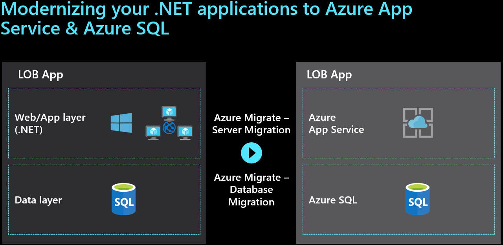
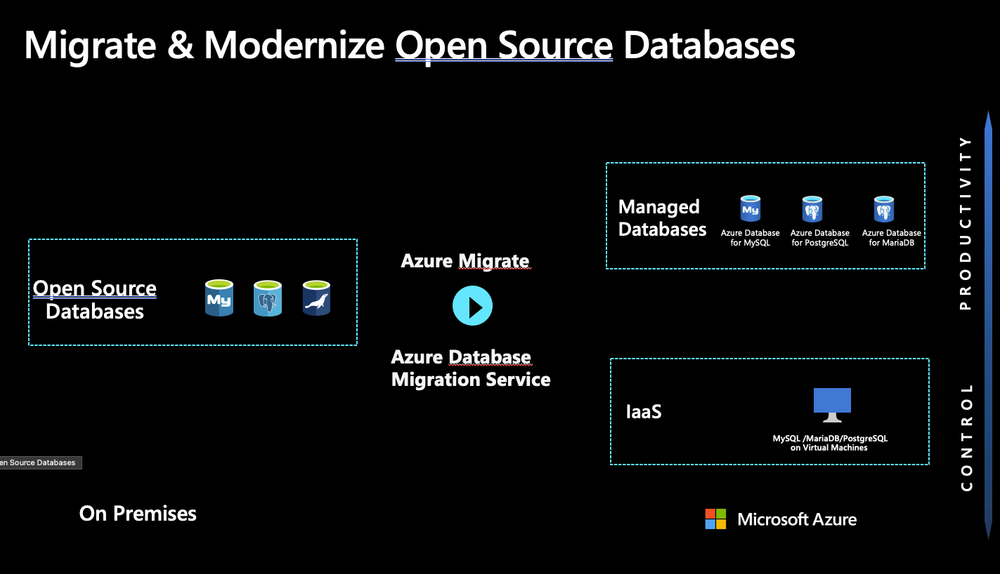

Azure provides access to a comprehensive set of cloud services. As developers and IT professionals, you can use these services to build, deploy, and manage applications on a range of tools and frameworks through a global network of datacenters. There are common migration projects that take place in most businesses.

Some of the common migration projects that Tailwind Traders will come across include:

- Windows and SQL Server
- Linux and open-source databases
- Dev/test
- VMware
- SAP
- Virtual Desktop Infrastructure (VDI)

> [!NOTE]
> For more information about these migration [scenarios](https://docs.microsoft.com/azure/cloud-adoption-framework/scenarios/?azure-portal=true), connect to the Cloud Adoption Framework for Azure.

For all workloads, the decision to *migrate* or *modernize* will drive the solution that's chosen. When you do a migration, the workload will be moved into an infrastructure as a service (IaaS) platform running on virtual machines (VMs) in Azure. If you use a modernization approach, platform as a service (PaaS) components will be used to deploy the application after changes are made to the codebase or architecture.

## Windows and SQL Server

Azure is the cloud that knows SQL Server best. There are many options for the migration of these applications, and they include a migration path or modernization.

### Migration: Windows and SQL Server

A typical application to be moved to Azure is a two-tier Windows .NET front-end application connected to SQL Server running on VMs. When you migrate or *rehost* these applications, you use [Azure Migrate](https://azure.microsoft.com/services/azure-migrate/?azure-portal=true) to move them. They'll run like they do today in the datacenter, only now they're connected to a virtual network running in Azure.

**Deep dive on migration scenarios**

- [Rehost](https://docs.microsoft.com/azure/cloud-adoption-framework/migrate/azure-best-practices/contoso-migration-rehost-vm/?azure-portal=true) an on-premises application on Azure Virtual Machines by using Azure Migrate.
- Rehost an on-premises application with Azure Virtual Machines and [SQL Server Always On availability groups](https://docs.microsoft.com/azure/cloud-adoption-framework/migrate/azure-best-practices/contoso-migration-rehost-vm-sql-ag/?azure-portal=true).
- Rehost an on-premises application by migrating to Azure Virtual Machines and [Azure SQL Managed Instance](https://docs.microsoft.com/azure/cloud-adoption-framework/migrate/azure-best-practices/contoso-migration-rehost-vm-sql-managed-instance/?azure-portal=true).

### Modernize: Windows and SQL Server

When you modernize an application, you'll use other cloud provider services to optimize the cost, reliability, and performance. Your application can take advantage of PaaS products like Azure App Service, Azure SQL Managed Instance, and containers. If you decide to modernize, three different methods are used:

- Refactor
- Rearchitect
- Rebuild

#### Refactor

The advantages of employing modernized services in this scenario include lower cost and management, by using your current application as is or with some minor code or configuration changes, and connecting to new infrastructure services.

#### Rearchitect

The rearchitect strategy is also known as redesigning an application to modernize it, that is, to transform it with a modular architecture. Rearchitecting modifies or extends an existing application's codebase to optimize it for a cloud platform and better scalability. Cloud provider services can be used directly as back-end services of modern apps, which are highly scalable and reliable. The advantages include improving agility by applying innovative DevOps practices, bringing new Azure capabilities to existing apps, and cost-effectively meeting scalability requirements.

#### Rebuild

The rebuild strategy revises the existing application by aggressively adopting PaaS or even software as a service (SaaS) architecture. The advantages of this strategy include building new applications by using cloud-native technologies, faster development if your existing application is slowing you down, and innovation opportunities that take advantage of advancements in technology like AI, blockchain, and IoT.

**Deep dive on migration scenarios**

- Migrate an application to [Azure App Service](https://docs.microsoft.com/azure/cloud-adoption-framework/migrate/azure-best-practices/contoso-migration-refactor-web-app-sql/?azure-portal=true) and Azure SQL Database.
- Migrate [SQL Server databases](https://docs.microsoft.com/azure/cloud-adoption-framework/migrate/azure-best-practices/contoso-migration-sql-server-db-to-azure/?azure-portal=true) to Azure.
- [Refactor](https://docs.microsoft.com/azure/cloud-adoption-framework/migrate/azure-best-practices/contoso-migration-refactor-web-app-sql-managed-instance/?azure-portal=true) an on-premises application to an Azure App Service web app and an instance of SQL Managed Instance.
- [Rebuild](https://docs.microsoft.com/azure/cloud-adoption-framework/migrate/azure-best-practices/contoso-migration-rebuild/?azure-portal=true) an on-premises application in Azure.

## Linux and open-source databases

Azure has broad support for Linux and open-source databases. Tailwind Traders can quickly move on-premises Linux distributions to Azure. There's support for moving MySQL and PostgreSQL to fully managed Azure services, which help achieve minimal downtime and built-in high availability, monitoring, and security. Many options are available for the migration of these applications, and they include a migration path or modernization.

### Migration: Linux and open-source databases

When you migrate Linux and open-source applications to Azure, the experience is much like Windows. If you decide to rehost these applications, you use [Azure Migrate](https://azure.microsoft.com/services/azure-migrate/?azure-portal=true) to move them. They'll run like they do today in the datacenter, only now they're connected to a virtual network running in Azure.

**Deep dive on migration scenarios**

- Rehost an on-premises Linux application to [Azure Virtual Machines](https://docs.microsoft.com/azure/cloud-adoption-framework/migrate/azure-best-practices/contoso-migration-rehost-linux-vm/?azure-portal=true).
- Rehost an on-premises Linux application to [Azure Virtual Machines and Azure Database for MySQL](https://docs.microsoft.com/azure/cloud-adoption-framework/migrate/azure-best-practices/contoso-migration-rehost-linux-vm-mysql/?azure-portal=true).

### Modernize: Linux and open-source databases

Modernizing Linux and open-source applications will focus on the method selected based on your needs at Tailwind Traders. The key activities will be to replace VMs with PaaS services that match the needs of the workload. These scenarios could include using Azure App Service or Azure database services.

**Deep dive on migration scenarios**

- [Refactor](https://docs.microsoft.com/azure/cloud-adoption-framework/migrate/azure-best-practices/contoso-migration-refactor-linux-app-service-mysql/?azure-portal=true) a Linux application by using Azure App Service, Azure Traffic Manager, and Azure Database for MySQL.
- [Migrate Java applications](https://docs.microsoft.com/azure/developer/java/migration/migration-overview?azure-portal=true) to Azure.
- [Migrate open-source databases](https://docs.microsoft.com/azure/cloud-adoption-framework/migrate/azure-best-practices/contoso-migration-oss-db-to-azure/?azure-portal=true) to Azure.
- [Migrate MySQL](https://docs.microsoft.com/azure/cloud-adoption-framework/migrate/azure-best-practices/contoso-migration-mysql-to-azure/?azure-portal=true) databases to Azure.
- [Migrate PostgreSQL](https://docs.microsoft.com/azure/cloud-adoption-framework/migrate/azure-best-practices/contoso-migration-postgresql-to-azure/?azure-portal=true) databases to Azure.
- [Migrate MariaDB](https://docs.microsoft.com/azure/cloud-adoption-framework/migrate/azure-best-practices/contoso-migration-mariadb-to-azure/?azure-portal=true) databases to Azure.

## Dev/test

Azure is a great choice for running dev/test workloads in the cloud. Tailwind Traders can provision fast, lean, and secure dev/test environments while saving substantially with the [Azure Pay-As-You-Go Dev/Test offer](https://azure.microsoft.com/offers/ms-azr-0023p/). A few options are available for the migration of dev/test VMs, and they include a migration path or modernization.

### Migration: Dev/test

When you migrate or rehost your dev/test environment to Azure, they'll run on VMs in the cloud. You use [Azure Migrate](https://azure.microsoft.com/services/azure-migrate/?azure-portal=true) to move them. They'll run like they do today in the datacenter, only now they're connected to a virtual network running in Azure.

**Deep dive on migration scenarios**

Rehost an [on-premises dev/test environment](https://docs.microsoft.com/azure/cloud-adoption-framework/migrate/azure-best-practices/contoso-migration-devtest-to-iaas/?azure-portal=true) on Azure Virtual Machines via Azure Migrate.

### Modernize: Dev/test

Tailwind Traders might enable your team to quickly provision dev/test and pre-production environments to deliver quality products, applications, and services. Use purpose-built managed developer services like [Azure DevTest Labs](https://azure.microsoft.com/services/devtest-lab/?azure-portal=true).

Migrate a dev/test environment to [DevTest Labs](https://docs.microsoft.com/azure/cloud-adoption-framework/migrate/azure-best-practices/contoso-migration-devtest-to-labs/?azure-portal=true).

### Azure dev/test pricing

There are [discounted rates on Azure](https://azure.microsoft.com/pricing/dev-test?azure-portal=true) to support your ongoing development and testing:

- No Microsoft software charges on VMs.
- Significant dev/test pricing discounts on other Azure services.
- Access to Windows 10 VMs and Windows Virtual Desktop.

## VMware

By using [Azure VMware Solution](https://azure.microsoft.com/services/azure-vmware/?azure-portal=true), VMware workloads run natively on Azure. These workloads can be seamlessly moved from your datacenter to Azure and integrate your VMware environment with Azure. Tailwind Traders can keep managing existing environments with the same VMware tools you already know while you modernize your applications with Azure native services.

> [!IMPORTANT]
> Azure VMware Solution is a Microsoft service, verified by VMware, that runs on Azure infrastructure.

Tailwind Traders can use Azure VMware Solution to create a private cloud in Azure with native access to VMware vCenter and other tools VMware supports for workload migration. Move to Azure seamlessly by using VMware's HCX technology and continue to manage your environment by using the same VMware tools you already know: vSphere Client, NSX-T, Power CLI, or any popular DevOps toolchain.

After you deploy Azure VMware Solution, you can create vSphere VMs in the Azure portal via API calls or CLI, automate deployments, and enable single sign-on. Enhance your workloads with the full range of Azure compute, monitor, backup, database, IoT, and AI services.

VMware VMs running on Azure VMware Solution are made accessible by using [Azure ExpressRoute](https://azure.microsoft.com/services/expressroute/?azure-portal=true), so services or users on-premises can access the VMs that were migrated to Azure. These VMs also have connectivity to Azure services like Azure database instances, Azure Key Vault, and Azure Storage.

Learn more about [deploying Azure VMware Solution](https://docs.microsoft.com/azure/cloud-adoption-framework/migrate/azure-best-practices/contoso-migration-vmware-to-azure/?azure-portal=true).

## SAP

Azure is SAP-certified to run your mission-critical SAP applications. Azure is the industry's most effective and scalable SAP cloud infrastructure. Azure offers 192-gigabyte to 12-terabyte SAP HANA–certified virtual machines in more regions than any other public cloud provider.

A commissioned [Forrester Consulting TEI study](https://azure.microsoft.com/resources/sap-on-azure-forrester-tei/?azure-portal=true) showed that organizations can experience a three-year ROI of more than 100 percent after moving their legacy SAP infrastructure to Azure, with investment payback in nine months.

Learn more about running SAP on Azure:

- SAP on Azure [Implementation Guide](https://azure.microsoft.com/resources/sap-on-azure-implementation-guide/?azure-portal=true)
- eBook: [Migrating SAP applications](https://azure.microsoft.com/resources/migrating-sap-applications-to-azure/?azure-portal=true) to Azure
- SAP to Azure migration [methodology](https://azure.microsoft.com/resources/migration-methodologies-for-sap-on-azure/?azure-portal=true)

## Virtual Desktop Infrastructure

Moving an organization's user desktops to the cloud is a common scenario in cloud migrations. Doing so helps improve employee productivity and accelerate the migration of various workloads to support the organization's user experience. There's also a heavy focus on remote workers worldwide.

There are two options for VDI in Azure. One option is to move your current Remote Desktop Services VMs to Azure running in IaaS. Most customers will choose to modernize their VDI implementation where existing Citrix, VMware, or Remote Desktop Services farms are replaced with a PaaS solution called [Windows Virtual Desktop](https://azure.microsoft.com/services/virtual-desktop/?azure-portal=true).

Tailwind Traders can set up Windows Virtual Desktop in minutes to enable secure remote work. Provide the familiarity and compatibility of Windows 10 with the new scalable multisession experience for your users. You can also save costs by using the same Windows licenses. Manage the end-to-end Windows Virtual Desktop deployment alongside other Azure services within the Azure portal.

In this scenario, desktop images are either migrated to Azure or new images are generated. Similarly, user profiles are either migrated to Azure or new profiles are created. The client solution is enabled but largely unchanged by this migration effort.

Learn more about using [Windows Virtual Desktop](https://docs.microsoft.com/azure/cloud-adoption-framework/migrate/azure-best-practices/contoso-migration-rds-to-wvd/?azure-portal=true) in Azure to move an on-premises Remote Desktop Services environment to Azure.
