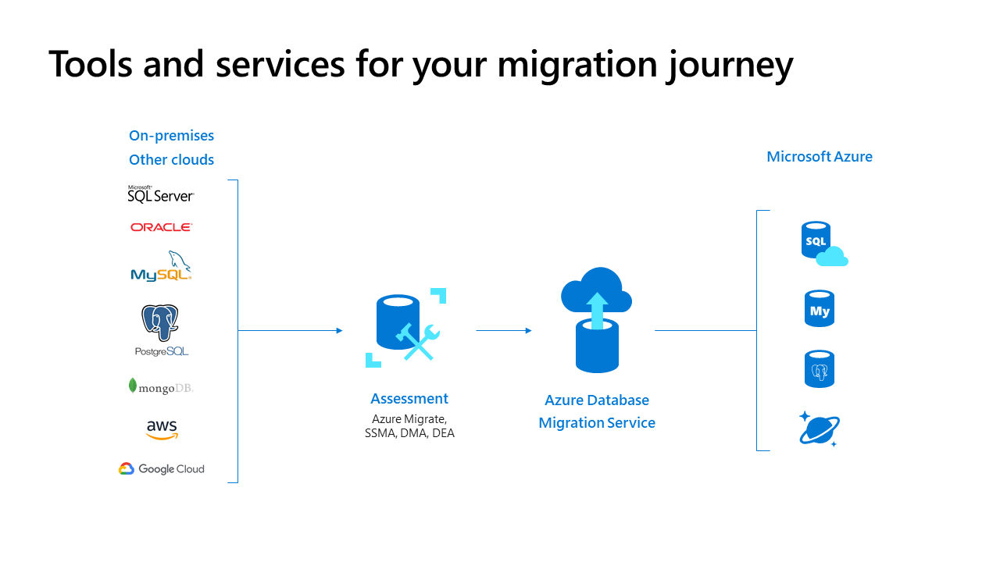
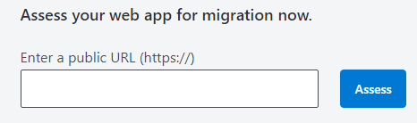
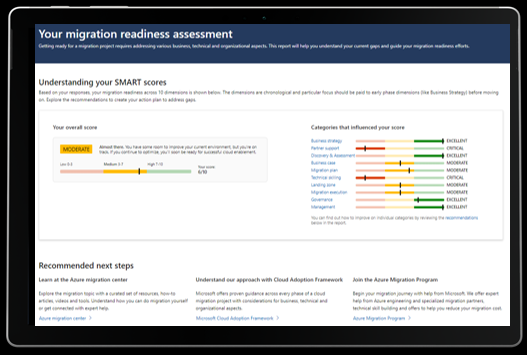

Microsoft has invested heavily in developing tools and services which support Azure migrations. These range from expert guidance, technical tools to move your workloads and databases, and business-focused tools to help with the cloud's economics.

Tools available to support successful Azure migrations:

- Microsoft Cloud Adoption Framework
- Azure Migrate
- Azure Database Migration Service
- Azure App Service Migration Assistant
- SMART Tool
- Cloud Economics

## Microsoft Cloud Adoption Framework

The [Cloud Adoption Framework](https://docs.microsoft.com/azure/cloud-adoption-framework/?azure-portal=true)(CAF) is a collection of documentation, implementation guidance, best practices, and tools that are proven advice from Microsoft designed to accelerate your cloud adoption journey.

CAF for Azure is proven guidance that's designed to help you create and implement the business and technology strategies necessary for your organization to succeed in the cloud. It provides best practices, documentation, and tools that cloud architects, IT professionals, and business decision-makers need to achieve short-term and long-term objectives successfully.

Using the Microsoft Cloud Adoption Framework for Azure best practices, organizations can better align their business and technical strategies to ensure success. Watch the following video to learn more.

The Cloud Adoption Framework brings together cloud adoption best practices from Microsoft employees, partners, and customers. It provides a set of tools, guidance, and narratives that help shape technology, business, and people strategies for driving desired business outcomes during your cloud adoption effort. Review the guidance for each methodology below, providing you with easy access to the right guidance at the right time.

- Learn more about CAF in this [overview](https://docs.microsoft.com/azure/cloud-adoption-framework/overview/?azure-portal=true).
- Download [Tools and Templates](https://docs.microsoft.com/azure/cloud-adoption-framework/reference/tools-templates/?azure-portal=true) from CAF to get started on your journey to Azure.

## Azure Migrate

[Azure Migrate](https://azure.microsoft.com/services/azure-migrate/?azure-portal=true) is the central hub of Azure cloud migration services and tools to discover, assess, and migrate workloads to the cloud. Tailwind Traders can get all of the Azure migration tools and guidance you need to plan and implement your move to the cloud—and track your progress using a central dashboard that provides intelligent insights.

Tailwind Traders can use a comprehensive approach to migrating your application and datacenter estate. Get support for critical migration workloads like Windows, SQL, and Linux Server, databases, data, web apps, and virtual desktops. Migrate to destinations including Azure Virtual Machines, Azure VMware Solution, Azure App Service, and Azure SQL Database. Migrations are holistic across VMware, Hyper-V, physical server, and cloud-to-cloud migration.

Azure Migrate provides the following benefits:

- End-to-end visibility
- Diverse Capabilities
- Save money

### End-to-end visibility

The guided experience and progress dashboard walk you through discovery, assessment, and migration phases for different business areas in one central data repository. Make the best migration decisions with built-in insights and recommendations.

### Diverse Capabilities

Take advantage of free Azure tools with features like agentless datacenter discovery, Azure readiness analysis, cost estimation, app modernization, and app dependency visualization—or choose from a collection of integrated partner tools for additional capabilities.

### Save money

Migrate efficiently with rapid lift-and-shift migration tools, all included in your Azure subscription at no additional cost—right-size resources in the cloud based on performance insights and fluctuating demand. Avoid sunk infrastructure costs from on-premises resources.

## Azure Database Migration Service

[Azure Database Migration Service](https://azure.microsoft.com/services/database-migration/?azure-portal=true) is a tool that helps you simplify, guide, and automate your database migration to Azure. Easily migrate your data, schema, and objects from multiple sources to the cloud at scale. Migrate your database and server objects—including user accounts, agent jobs, and SQL Server Integration Services (SSIS) packages—all at once with almost no downtime.

Execute a complete migration with near-zero downtime:

- Database-sensitive migration moves data, schema, and objects to Azure
- Easy-to-understand process helps you get the job done right the first time
- Highly resilient and self-healing migration service provides reliable outcomes with near-zero downtime.
- Supports Microsoft SQL Server, MySQL, PostgreSQL, MongoDB, and Oracle migration to Azure from on-premises and other clouds

## Azure App Service Migration Assistant

Bring your web apps to the cloud with minimal or no code changes using the[Azure App Service Migration Assistant][(](https://azure.microsoft.com/services/app-service/migration-assistant/?azure-portal=true) - a free and simple tool to migrate .NET web applications from on-premises to the cloud automatically.

This tool can assess and migrate your on-premises .NET, Java, and Linux web apps to Azure. Download the App Service migration assistant — a fast, free, and automated way to migrate web apps with minimal or no code changes. Run readiness checks and get potential remediation steps for common issues. Receive step-by-step guidance for moving your web app to App Service. 

Versions of the Azure App Service Migration Assistant:

- Migrate .NET web apps from Windows OS to App Service
- App Service migration assistant—for Java on Apache Tomcat Preview (Linux)
- App Service migration assistant—for Java on Apache Tomcat Preview (Windows)

Tailwind Traders can get a free compatibility report for your external app. The tool allows you to run a scan on your web app’s public URL to report the technologies it uses and whether App Service fully supports them. If compatible, you’ll be guided to download the migration assistant to simplify your migration.

## SMART Tool

The Strategic Migration Assessment and Readiness Tool (SMART) helps you prepare for your Microsoft Azure migration. Areas in the assessment include business planning, training, security, and governance. The SMART tool is a significant first step for Tailwind Traders to help you understand your readiness to migrate.

The tool's output contains a readiness heatmap tool to you by distilling Microsoft's real-life experience running migration engagements. The heatmaps help to identify the areas where you will need to focus on being successful.

This tool addresses your readiness across all dimensions of migration, from initial strategy to ongoing management. By answering a few questions, you’ll get a customized report that will help you plan and close gaps.

## Cloud Economics

Moving to the cloud is as important business decision as a technical one. To support customers like Tailwind Traders, Microsoft has released the [Cloud economics](https://Azure.com/cloudeconomics/?azure-portal=true) guidance and offerings. These will help you to understand your cloud investment with detailed financial analysis upfront.

Included is guidance where you’ll find technical and financial tips from Azure experts on going about your case. Cloud economics can help get the most value for your cloud investment. These tips can help you understand how moving to the cloud will shape your company’s overall financial posture and KPIs, as well as new processes to ensure that budget and ROI control are met.
