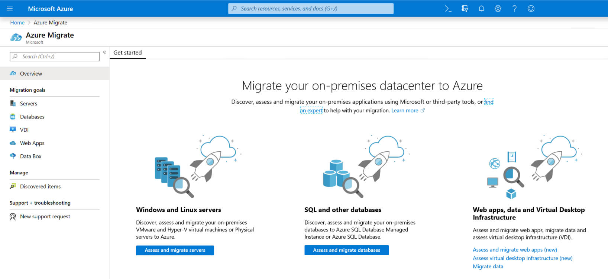

This unit examines tools provided by Microsoft to enable successful migrations to Azure. 

The learner will gain introductory knowledge of the tools available to support their Azure migration. 

## Azure Migrate
A central hub of Azure cloud migration services and tools to discover, assess, and migrate workloads to the cloud.

Get all of the Azure migration tools and guidance you need to plan and implement your move to the cloud—and track your progress using a central dashboard that provides intelligent insights.

Support for key migration scenarios across servers, data, databases, web apps, and virtual desktops

Comprehensive discovery, assessment, and migration capabilities powered by Azure and partner tools

Centralized migration repository delivering end-to-end tracking and insights

Cost-efficient migration with Azure cost optimization features and tools

Use a comprehensive approach to migrating your application and datacenter estate. Get support for key migration workloads like Windows, SQL and Linux Server, databases, data, web apps, and virtual desktops. Migrate to destinations including Azure Virtual Machines, Azure VMware Solution, Azure App Service, and Azure SQL Database. Migrations are holistic across VMware, Hyper-V, physical server, and cloud-to-cloud migration.

End-to-end visibility
The guided experience and progress dashboard walk you through discovery, assessment, and migration phases for different business areas in one central data repository. Make the best migration decisions with built-in insights and recommendations.

Diverse Capabilities
Take advantage of free Azure tools with features like agentless datacenter discovery, Azure readiness analysis, cost estimation, app modernization, and app dependency visualization—or choose from a collection of integrated partner tools for additional capabilities.

Save money
Migrate efficiently with rapid lift-and-shift migration tools, all included in your Azure subscription at no additional cost. Right-size resources in the cloud based on performance insights and fluctuating demand. Avoid sunk infrastructure costs from on-premises resources.

## Azure Database Migration Service
Azure Database Migration Service is a tool that helps you simplify, guide, and automate your database migration to Azure. Easily migrate your data, schema, and objects from multiple sources to the cloud at scale. Migrate your database and server objects—including user accounts, agent jobs, and SQL Server Integration Services (SSIS) packages—all at once with almost no downtime.

Execute a complete migration with near-zero downtime:

- Database-sensitive migration moves data, schema, and objects to Azure

- Easy-to-understand process helps you get the job done right the first time

- Highly resilient and self-healing migration service provides reliable outcomes with near-zero downtime.

- Supports Microsoft SQL Server, MySQL, PostgreSQL, MongoDB, and Oracle migration to Azure from on-premises and other clouds

## Azure App Service Migration Assistant

## Azure Arc

## Smart Tool
From business planning to training to security and governance, find out what you need to do to prepare for your Microsoft Azure migration with SMART—the Strategic Migration Assessment and Readiness Tool.

https://docs.microsoft.com/en-us/assessments/?mode=pre-assessment&session=local

## Cloud Economics

https://azure.microsoft.com/en-us/pricing/tco/calculator/

https://azure.microsoft.com/en-us/resources/videos/azure-migration-business-case/

## Microsoft Cloud Adoption Framework
