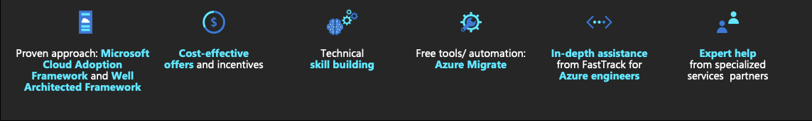
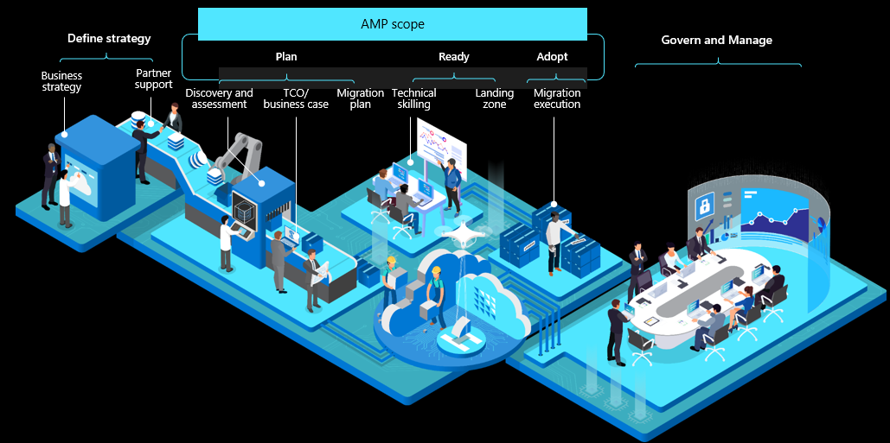
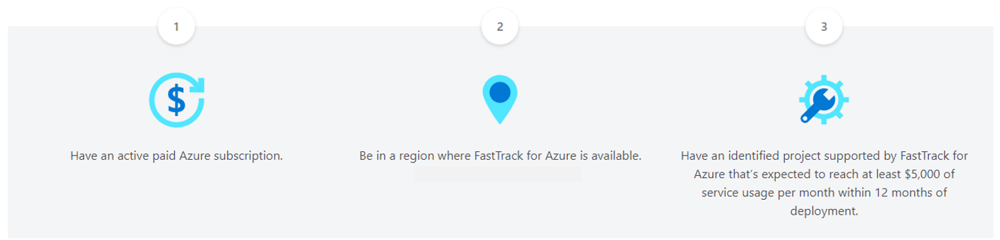

Microsoft provides expert migration guidance and assistance via programs made available to customers and partners. You can 
accelerate Azure deployments while building cloud skills and learning from Azure engineers.

As a part of the migration team at Contoso, it is essential to learn the programs available to support your Azure migration:

- Azure Migration Program (AMP)
- FastTrack for Azure
- Azure Expert managed service providers (MSPs)

## Azure Migration Program (AMP)

The [Azure Migration Program (AMP)](https://azure.microsoft.com/migration/migration-program/?azure-portal=true) helps accelerate your migration journey. It includes prescriptive guidance and tools customers need for a path to the cloud from start to finish. Using proven cloud adoption methodologies, tools, resources, and best practices, AMP will enable your move to the cloud, working hand in hand with Microsoft experts and specialized migration partners.

Here are some of the benefits available from AMP:

- Curated, step-by-step guidance from Microsoft experts and specialized migration partners based on the proven Microsoft Cloud Adoption Framework for Azure.
- Technical skill building with foundational and role-specific courses to develop new Azure skills and long-term organizational readiness.
- Free Azure migration tools, including Azure Migrate to assess and migrate workloads, and free Azure Cost Management to optimize costs.
- Offers to reduce migration costs, including Azure Hybrid Benefit and free Extended Security Updates for Windows Server and SQL Server 2008.

### Self-Guided Digital Support

As a part of AMP, Microsoft provides self-guided support, which will put your team on a path to success. You will gain immediate access to curated resources designed to support your migration efforts. A call from an Azure sales specialist to help answer questions about Azure and your migration plans. Along with a short email series with guidance and access to learning cloud skills with Azure technical training through Microsoft Learn and accredited partners.

### Guided Deployments

AMP includes guided deployments which include expert help from FastTrack for Azure engineers and specialized migration partners. Assistance to deliver your project, including planning, design, and migrating your workloads to Azure, is included. There are also offers to help offset your migration costs (based on eligibility). Your team can learn Azure with included technical training and certifications tailored to your organization's needs.

> [!NOTE]
> Guided deployments have a minimum project size to qualify. See the application form for details.

Begin your migration journey with [AMP](https://azure.microsoft.com/en-us/migration/migration-program/#program-form).

## FastTrack for Azure

FastTrack for Azure is a customer success program that helps with rapid and effective design and cloud solutions deployment. It includes tailored guidance from Azure engineers to provide proven practices and architectural advice.

### How does FastTrack for Azure work?

First, a Microsoft partner must nominate you as a qualified customer for consideration. Once accepted into the program, you will work with a FastTrack for Azure program manager to identify stakeholders, validate the cloud migration vision, establish goals and requirements, and evaluate the Azure solution's architectural needs. After qualifying the project, Azure engineers join the project to assist in developing the engagement from solution enablement through deployment.

### How does a project qualify for FastTrack for Azure?

To qualify, customers must be working with a Microsoft partner and meet the criteria of the program:

### What qualifies as an Azure project?

An Azure project consists of one or more Azure solutions—a group of Azure services, third-party applications, and related products—that help meet the most common business needs and scenarios deployed in production.

FastTrack for Azure can help with many solutions including:

- Windows Server migration
- SQL Server migration
- SAP migration
- App modernization
- Data analytics
- Windows Virtual Desktop

## Azure Expert managed service providers (MSPs)

As production systems are migrated to Azure, operations will become critical. Microsoft has built the[ Azure Expert managed service providers (MSPs) program](https://www.microsoft.com/azure/partners/azureexpertmsp?filters=all) to ensure customers have a partner to meet their operational needs. You will work with a trusted advisor that can offer repeatable, highly automated solutions to enable and support hyper-scale cloud implementations.

### MSP qualifications

When you see the Azure Expert MSP logo, this means Microsoft has validated that you are connecting with one of our most capable Azure Managed Service Providers. Whether you are working on mission-critical apps, entire data center footprints, or hybrid environments, Azure Expert MSPs have proven their capabilities to help you. These MSPs must meet the following requirements to be a part of the program:

- Microsoft Gold Cloud Platform Partner
- Pass an intensive audit performed by Microsoft
- Re-evaluated annually to ensure MSP continues to meet update technology standards
