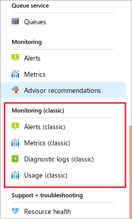

In your video analysis company, you use Azure Blob Storage for storing daily rushes. Performance is a key consideration, and you want to ensure your administrators can see how the system behaves and whether it responds optimally to users.

To do that, you must understand how your Storage Account sends information to Azure Monitor and how to access that information.

## Overview of Azure Monitor

Azure Monitor is a solution that can gather and store information from many different types of application components. It includes a wide range of tools for analyzing, visualizing, and responding to this data. As such, Azure Monitor is a single tool that you can use to watch and optimize all the components of your system wherever they run.

:::image type="complex" source="../media/2-azure-monitor-overview.png" alt-text="Conceptual overview diagram of Azure Monitor.":::
   Diagram of Azure Monitor taking in inputs of Application, Operating System, Azure Resources, Azure Subscription, Azure Tenant, and Custom Sources. Those inputs lead to Metrics and Logs data stores. The data stores then feed to systems for reporting and reaction, titled Insights, Visualize, Analyze, Respond, and Integrate.
:::image-end:::

Azure Monitor collects two types of data:

| Data Type | Description |
|-----|-----|
| **Metrics** | Numerical values that describe some aspect of a component at a point in time. For example, an Average Server Response Time metric measures how long a component has taken to respond to users on average over the last few minutes. You can use the **Metrics Explorer** to show how these metrics vary over time. |
| **Logs** | Records of the behavior of a component that may contain telemetries such as events and traces. In the Azure portal, you can use the **Log Analytics** page to drill into this data and find individual events that interest you. |

By default, you can access 93 days of data in Azure Monitor. If you need to retain data for a longer period, you can archive it to an Azure Storage account.

In addition to using the Azure portal to view and analyze Azure Monitor data, you can also use Application Programming Interfaces (APIs) to examine logs and metrics in code:

| API | Description |
|-----|-----|
| **Azure Monitor REST API** | A REST API is a web service that you can call from your code over HTTP and port 80. The responses are usually in JSON format. |
| **Azure Monitor .NET API** | The .NET API is a set of .NET classes that you can add to any .NET project such as a desktop application, a mobile app, or an ASP.NET web app. |

The .NET API is slightly easier to use and requires fewer lines of code for typical operations. However, you can only use this API in .NET projects. If you want to use Node.js, for example, you can't use the .NET API. The REST API can be called from any code that can make HTTP requests.

The optional exercise in the next unit shows you how to use the **curl** command-line tool to make REST requests.

## Azure Monitor and Azure Storage

When you create a Storage Account in Azure, it's automatically configured to send storage metrics to Azure Monitor for later display and analysis.

## Storage account metrics and classic storage metrics

Originally, Azure Storage collected metrics and stored them in **$Metric** tables within the same storage account. These metrics are known as old metrics or classic metrics, and they included capacity measurements for blob storage, and transaction measurements for blob, table, file, and queue storage.

In the Azure portal, classic storage metrics are shown on pages with **(classic)** appended to the title:



Old storage metrics still work, but they're deprecated, and support for them is likely to end in the future. If you're using old metrics, you should migrate them to the new storage metrics as soon as possible.

For new storage metrics, Azure Storage sends the data to the Azure Monitor backend in order to unify the metrics from Azure Storage with the metrics of other Azure services. You get the same monitoring experience regardless of the data source in Azure Monitor, and you can integrate metrics from different sources into the same displays.

This module discusses new Azure Storage metrics, but bear in mind: when you read about storage metrics, both old and new metrics exist. (Some third-party articles may not be entirely clear about which metrics they discuss.)

## How to use curl to make queries against the REST API

**curl** is a command-line tool that is available in the Azure Cloud Shell, which you can use to make requests through the HTTP protocol. Because a REST API works over port 80, you can use **curl** to make test requests. This technique is helpful for learning about the REST API you're using and for examining its behavior in order to help you write code to implement it.

Many REST APIs, including the Azure Monitor API, require you to authenticate before you can make requests in order to ensure security. To authenticate, you can use the **az** command to retrieve an authentication token:

```bash
AUTH_TOKEN="Authorization: Bearer $(az account get-access-token --query accessToken -o tsv)"
```

Now you can use the **curl** tool and pass the authentication token:

```bash
curl -s -H "$AUTH_TOKEN" <url> | jq
```

The previous command pipes the response to the **jq** utility, which helps to present the JSON data in a more readable format.

## How to formulate the correct URL for a request to the Azure Monitor REST API

Any request to a REST API requires you to formulate the correct URL. Because functional APIs like the Azure Monitor API are often complex, the URL can be long and complex.

To request the list of Azure Storage metrics from the Azure Monitor, use a URL like the one in the following example:

```bash
curl -s -H "$AUTH_TOKEN" https://management.azure.com/subscriptions/<Subscription ID>/resourceGroups/<Resource Group>/providers/Microsoft.Storage/storageAccounts/<Storage Account>/providers/microsoft.insights/metricdefinitions?api-version=2018-01-01 | jq
```

Identify the following values by using the Azure portal and substitute them for the placeholders in the URL:

| URL Component | Description |
|-----|-----|
| `<Subscription ID>` | The GUID for the Azure subscription where your storage account is located. |
| `<Resource Group>` | The name of the resource group where your storage account is located. |
| `<Storage Account>` | The name of your Azure Storage account. |

Once you have retrieved a list of the Azure Storage metrics, you can query for the values of specific metrics over a time period. For example:

```bash
curl -s -H "$AUTH_TOKEN" https://management.azure.com/subscriptions/<Subscription ID>/resourceGroups/<Resource Group>/providers/Microsoft.Storage/storageAccounts/<Storage Account>/providers/microsoft.insights/metrics?metricnames=Availability&aggregation=Average&interval=PT1H&api-version=2018-01-01 | jq
```

If you perform the optional exercise in the next unit, you'll execute queries by using this method.
