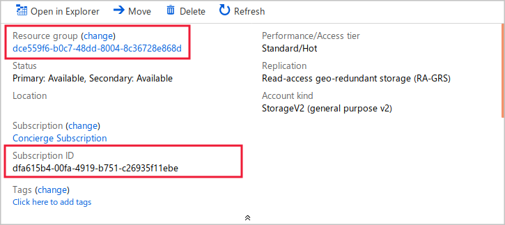

Before you begin writing code that retrieves and displays metrics in an app, connect to the REST API and observe the data that is available. To make this connection, use the **curl** command-line tool to send a request.

> [!NOTE]
> This exercise is optional. If you don't have an Azure account, you can read through the instructions so you understand how to use the REST API to retrieve metrics.
> If you want to complete this exercise but don't have an Azure subscription or prefer not to use your own account, you will need to create a [free account](https://azure.microsoft.com/free/?azure-portal=true) before you begin.

## Create a storage account

Start by creating the Azure Storage account that sends data to Azure Monitor. Follow these steps:

1. Go to the [Azure portal](https://portal.azure.com/) and in the left nav bar, select **Create a resource**.

1. In the **Search the marketplace** textbox, enter **Storage Account**, and then press <kbd>Enter</kbd>.

1. In the list of results, select **Storage Account**, and then select **Create**. The **Create a storage account** window appears. Enter the following information.

    | Setting | Value |
    |---|---|
    | In the **Basics** tab, under **Project details** section: |
    | Subscription | Select your subscription |
    | Resource group | Select **Create new**. Provide a name for the new resource group, and select **OK**. For example, you could use **videostorageresources**. |
    | Under **Instance details** section: |
    | Storage account name | Enter a name that is all lower case and unique to Azure. For example, you could use **&lt;yourname&gt;videostorage**, if that isn't already in use. Make a note of the name you use. |
    | Location | Select a location near you. |
    | *Other settings* | Leave *default*. |

1. Select **Review + create**.

1. Review the configuration, and then select **Create**.

## Obtain the required values

To retrieve metrics from Azure Monitor that relate to your new storage account, identify the storage account uniquely in your request by including the storage account name, resource group name, and subscription ID in the request URL. You already know the name of the storage account but you must determine the resource group name and the subscription ID. Follow these steps:

1. When the storage account has been created, select **Go to resource**. Or, select **All resources**, and then select the storage account you created.

1. In the **Essentials** section of the **Overview** page, carefully make a note of the following values:

    - **Resource group**
    - **Subscription ID**

    

## Send queries to the REST API

A REST API responds to requests sent through the HTTP protocol. Use the **curl** tool to send those requests and receive data in JSON format, by passing an authentication token with your request and formulating the request URL carefully. Follow these steps:

1. In the Azure portal, select **Cloud Shell (&gt;_)** on the toolbar at the top of the window, and, if prompted, select the **Bash** shell option.

1. To retrieve an authentication token, run the following command, and then press <kbd>Enter</kbd>.

    ```bash
    AUTH_HEADER="Authorization: Bearer $(az account get-access-token --query accessToken -o tsv)"
    ```

1. To store the necessary identifiers and names, run the following commands, substituting the values you determined earlier in this unit:

    ```bash
    SUB_ID="<Subscription ID>"
    RG_NAME="<Resource Group Name>"
    SA_NAME="<Storage Account Name>"
    ```

    > [!NOTE] 
    > In this **curl** command, the **Subscription ID** and **Resource Group Name** are at the top of the Overview page. The **Storage Account Name** is the name of the storage account you just created / page you should be on.

1. To formulate the correct URL for a query to list metrics, run the following command, and then press <kbd>Enter</kbd>.

    ```bash
    LIST_METRICS_URL="https://management.azure.com/subscriptions/$SUB_ID/resourceGroups/$RG_NAME/providers/Microsoft.Storage/storageAccounts/$SA_NAME/providers/microsoft.insights/metricdefinitions?api-version=2018-01-01"
    ```

1. To make a query against the REST API, run the following command, and then press <kbd>Enter</kbd>. Examine the results and identify the available metrics.

    ```bash
    curl -s -H "$AUTH_HEADER" "$LIST_METRICS_URL" | jq
    ```

    > [!NOTE]
    > In this **curl** command, the **-s** option suppresses the progress bar and the -H option passes the authentication token. The JSON results are piped to the **jq** tool for a more readable presentation.

1. To formulate the correct URL for a query to list metrics, run the following command, and then press <kbd>Enter</kbd>.

    ```bash
    AVAILABILITY_URL="https://management.azure.com/subscriptions/$SUB_ID/resourceGroups/$RG_NAME/providers/Microsoft.Storage/storageAccounts/$SA_NAME/providers/microsoft.insights/metrics?metricnames=Availability&aggregation=Average&interval=PT1H&api-version=2018-01-01"
    ```

1. To make a query against the REST API, run the following command, and then press <kbd>Enter</kbd>. Examine the results and identify the available metrics.

    ```bash
    curl -s -H "$AUTH_HEADER" "$AVAILABILITY_URL" | jq
    ```

    You can also make requests for other metrics that were listed in the first query results.
