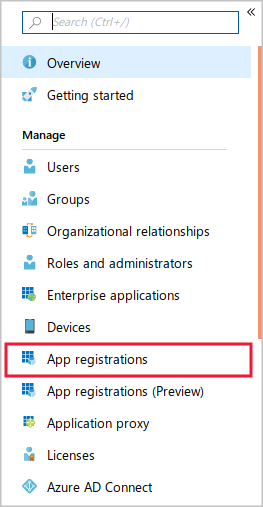
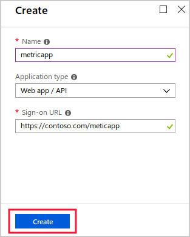
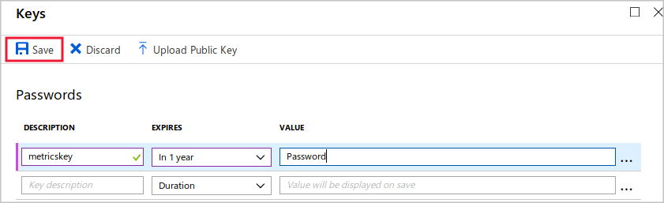

You want to start writing code that retrieves metrics about your video app storage account from Azure Monitor. To do this, you must create a service principal for your app in the Azure Active Directory. You'll then configure the correct security information in the app, and write the code that lists metric definitions.

> [!NOTE]
> This exercise is optional. If you don't have an Azure account, you can read through the instructions so you understand how to use the Azure Storage .NET API to create applications that can retrieve metrics.
> If you want to complete this exercise but you don't have an Azure subscription or prefer not to use your own account, you will need to create a [free account](https://azure.microsoft.com/free/?azure-portal=true) before you begin.

## Create a new console application and add the Azure Monitor API

To begin creating your application, use git to clone the sample application code.

1. In the Azure portal, select **Cloud Shell (&gt;_)** on the toolbar at the top of the window, and, if prompted, select the **Bash** shell option.

1. Enter the following command to create a folder for the new console application in the root of your cloud shell:

    ```bash
    mkdir ~/metricapp
    ```

1. To clone the console app from Git Hub into the new folder, enter the following command:

    ```bash
    git clone https://github.com/MicrosoftDocs/mslearn-access-blob-storage-metrics-from-code ~/metricapp
    ```

1. To change to the app's **starter** folder, enter the following command:

    ```bash
    cd ~/metricapp/starter
    ```

## Create a service principal and access key for the new app

In order to grant your app permission to access Azure Monitor metrics, you must create a service principal in the Azure Active Directory. When your app identifies itself to Azure, it will use an access key. To create a service principal and access key, follow these steps:

1. Go to the [Azure portal](https://portal.azure.com/) and in the navigation on the left, click **Azure Active Directory**.
1. In the **Azure Active Directory** blade, under **Manage** click **App registrations**

    

1. Click **New application registration**.
1. In the **Name** textbox, type **metricapp**.
1. In the **Application type** drop-down list, select **Web app/API**.	
1. In the **Sign-on URL** type **https://contoso.org/metricapp** and then click **Create**.

    

1. On the **metricapp** registration page, make a note of the **Application ID**, and then click **Settings**
1. Under **API Access** click **Keys**.
1. In the **Passwords** section, type **metricskey** in the **Key description** textbox.
1. In the **Expires** drop-down list, select **In 1 Year**.
1. Click **Save**.

    

1. Make a note of the key in the **VALUE** column.

## Determine the tenant ID for your app

When your app identifies itself to Azure, it will also need to provide a tenant ID, which is also called a directory ID. To determine your tenant ID, follow these steps:

1. Go to the [Azure portal](https://portal.azure.com/) and in the navigation on the left, click **Azure Active Directory**.
1. Under **Manage**, click **Properties**.
1. Make a note of the **Directory ID** value; this is the tenant ID for your app.

## Determine your resource group and subscription IDs and assign the app to a role

You must now add the app service principal to a role, so that the app has permission to access Azure Monitor:

1. Go to the [Azure portal](https://portal.azure.com/) and in the navigation on the left, click **Resource Groups**, and then click the resource group that you created as part of the optional exercise in unit 3.
1. On the resource group page, click **Overview**.
1. Copy the name of your resource group and your **Subscription ID**; you will use these values when you modify your application code.
1. Click **Access control (IAM)** in the menu.
1. Click **+ Add**, and then click **Add a role assignment**.
1. In the **Role** drop-down list, select **Contributor**.
1. In the **Assign access to** drop-down list, select **Azure AD user, group, or service principal**.
1. In the **Select** textbox, type **metricapp**, and then click **metricapp**.

    

1. Click **Save**.

## Start coding the app

Now that the app service principal has been created and configured, you can complete the app's code:

1. In the Cloud Shell on the right, to ensure you are in the correct folder, type the following command and then press Enter:

    ```bash
    cd ~/metricapp/starter
    ```

1. To start the code editor, type the following command and then press Enter:

    ```bash
    code .
    ```

1. In the list of files on the left, click **Program.cs**.
1. At the top of the code file, add the following lines of code:

    ```c#
    using Microsoft.Azure.Management.Monitor;
    using Microsoft.Azure.Management.Monitor.Models;
    ```

## Formulate the resource ID

The app must request metrics by specifying the resource ID. To formulate the resource ID, follow these steps:

1. In the **Main** procedure, locate the following line of code, and add the name of the resource group that you determined earlier within the quotes:

    ```c#
    string resourceGroupName = "";
    ```

1. Locate the following line of code and add the subscription ID that you determined earlier within the quotes:

    ```c#
    string subscriptionID = "";
    ```

1. Locate the following line of code and add the name of the storage account that you created in unit 3 within the quotes:

    ```c#
    string storageAccountName = "";
    ```

## Store the correct security information

Now, you must ensure that the app uses the security details you configured and noted earlier:

1. Locate the following line of code and add the directory ID or tenant ID you determined earlier within the quotes:

    ```c#
    string tenantID = "";
    ```

1. Locate the following line of code and add the application ID you determined earlier within the quotes:

    ```c#
    string applicationID = "";
    ```

1. Locate the following line of code and add the access key you determined earlier within the quotes:

    ```c#
    string accessKey = "";
    ```

## Obtain a list of metric definitions

You can now write the code that retrieves a list of metric definitions for the storage account:

1. In the **Program.cs** file, within the **GetMetricDefinitions** method, locate the following comment:

    ```c#
    //Evaluate metric definitions here
    ```

1. To get a list of metric definitions, replace the comment with the following code:

    ```c#
    IEnumerable<MetricDefinition> metricDefinitions = await readOnlyClient.MetricDefinitions.ListAsync(resourceUri: resourceURI, cancellationToken: new CancellationToken());
    ```

1. To show the list of metrics to the user, on the next lines, type the following code:

    ```c#
    Console.WriteLine("Metric Definitions:");
    foreach (var metricDef in metricDefinitions)
    {
        Console.WriteLine(metricDef.Name.Value);
    }
    ```

1. To close the code editor, click **...** on the right, and then click **Close code editor**.

1. To run your application, type the follow command, and then press Enter:

    ```bash
    dotnet run
    ```

    Your application will compile and execute, and it will display a list of metric definitions in the console window.
