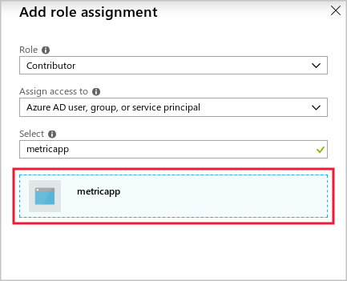

You want to start writing code that retrieves metrics about your video app storage account from Azure Monitor. First, you must create a service principal for your app in the Azure Active Directory. Then, you configure the correct security information in the app, and write the code that lists metric definitions.

> [!NOTE]
> This exercise is optional. If you don't have an Azure account, you can read through the instructions so you understand how to use the Azure Storage .NET API to create applications that can retrieve metrics.
> If you want to complete this exercise but you don't have an Azure subscription or prefer not to use your own account, you will need to create a [free account](https://azure.microsoft.com/free/?azure-portal=true) before you begin.

## Create a new console application and add the Azure Monitor API

To begin creating your application, use git to clone the sample application code.

1. In the Azure portal, select **Cloud Shell (&gt;_)** on the toolbar at the top of the window, and, if prompted, select the **Bash** shell option.

1. Run the following command to create a folder for the new console application in the root of your Cloud Shell.

    ```bash
    mkdir ~/metricapp
    ```

1. To clone the console app from Git Hub into the new folder, run the following command.

    ```bash
    git clone https://github.com/MicrosoftDocs/mslearn-access-blob-storage-metrics-from-code ~/metricapp
    ```

1. To change to the app's **starter** folder, run the following command:

    ```bash
    cd ~/metricapp/starter
    ```

## Create a service principal and access key for the new app

To grant your app permission to access Azure Monitor metrics, you must create a service principal in the Azure Active Directory. When your app identifies itself to Azure, it uses an access key. To create a service principal and access key, follow these steps:

1. Go to the [Azure portal](https://portal.azure.com/), and in the left nav bar, select **Azure Active Directory.**

1. In the left nav bar, under the **Manage** section, select **App registrations**

    :::image type="content" source="../media/5-access-app-registrations.png" alt-text="Screenshot of the Azure Active Directory navigation options with the app registrations option highlighted.":::

1. Select **+ New registration**. The **Register an application** window appears.

1. In the **Name** textbox, enter **metricapp**.

1. For **Supported account types**, select **Accounts in this organizational directory only (Microsoft only - Single tenant)**.

1. For **Redirect URI**, select **Web** in the dropdown, and enter **https://contoso.org/metricapp** for the redirect URI. 

1. Select **Register**.

    :::image type="content" source="../media/5-create-app-registration.png" alt-text="Screenshot of the Register an application with the Register button highlighted.":::

1. On the **metricapp** registration page, make a note of the **Directory (tenant) ID**. This GUID uniquely identifies the Active Directory that contains the service principal and is also referred to as the **Tenant ID**.

1. Under **Manage**, select **Certificates & secrets**.

1. Select **+ New client secret**. In the **Add a client secret** pane, enter **metricskey** in the **Description** textbox.

1. In the **Expires** dropdown, select **180 days (6 months)**.

1. Select **Add**.

    :::image type="content" source="../media/5-configure-access-key.png" alt-text="Screenshot of the Add a client secret pane with the Add button highlighted.":::

1. On the **Certificates & secrets** screen, be sure and save the **Value** of the client secret.

## Determine the tenant ID for your app

When your app identifies itself to Azure, it also needs to provide a tenant ID, which is also called a directory ID. To determine your tenant ID, follow these steps:

1. Go to the [Azure portal](https://portal.azure.com/), and in the left nav bar, select **Azure Active Directory**.

1. Under **Manage**, select **Properties**.

    Make a note of the **Tenant ID** value; this value is the tenant ID for your app.

## Determine your resource group and subscription IDs and assign the app to a role

You must now add the app service principal to a role, so that the app has permission to access Azure Monitor:

1. Go to the [Azure portal](https://portal.azure.com/), and in the left nav bar, select **Resource Groups**, and then select the resource group that you created as part of the optional exercise in unit 3.

1. On the resource group page, select **Overview**.

1. Copy the name of your resource group and your **Subscription ID**; you use these values when you modify your application code.

1. In the left nav bar, select **Access control (IAM)**.

1. Select **+ Add**, and then select **Add a role assignment**.

1. In the **Role** dropdown, select **Contributor**.

1. In the **Assign access to** dropdown, select **Azure AD user, group, or service principal**.

1. In the **Select** textbox, enter **metricapp**, and then select **metricapp**.

    

1. Select **Save**.

## Start coding the app

Now that the app service principal has been created and configured, you can complete the app's code:

1. In the Cloud Shell, to ensure you are in the correct folder, run the following command, and then press <kbd>Enter</kbd>.

    ```bash
    cd ~/metricapp/starter
    ```

1. To start the code editor, run the following command, and then press <kbd>Enter</kbd>.

    ```bash
    code .
    ```

1. In the list of files on the left, select **Program.cs**.

1. At the top of the code file, add the following lines of code.

    ```c#
    using Microsoft.Azure.Management.Monitor;
    using Microsoft.Azure.Management.Monitor.Models;
    ```

## Formulate the resource ID

The app must request metrics by specifying the resource ID. To formulate the resource ID, follow these steps:

1. In the **Main** procedure, locate the following line of code, and add the name of the resource group that you determined earlier within the quotes.

    ```c#
    string resourceGroupName = "";
    ```

1. Locate the following line of code, and add the subscription ID that you determined earlier within the quotes.

    ```c#
    string subscriptionID = "";
    ```

1. Locate the following line of code, and add the name of the storage account that you created in unit 3 within the quotes.

    ```c#
    string storageAccountName = "";
    ```

## Store the correct security information

Now, you must ensure that the app uses the security details you configured and noted earlier:

1. Locate the following line of code, and add the directory ID or tenant ID you determined earlier within the quotes.

    ```c#
    string tenantID = "";
    ```

1. Locate the following line of code, and add the application ID you determined earlier within the quotes.

    ```c#
    string applicationID = "";
    ```

1. Locate the following line of code, and add the client secret value you determined earlier within the quotes.

    ```c#
    string accessKey = "";
    ```

## Obtain a list of metric definitions

You can now write the code that retrieves a list of metric definitions for the storage account:

1. In the **Program.cs** file, within the **GetMetricDefinitions** method, locate the following comment.

    ```c#
    //Evaluate metric definitions here
    ```

1. To get a list of metric definitions, replace the comment with the following code.

    ```c#
    IEnumerable<MetricDefinition> metricDefinitions = await readOnlyClient.MetricDefinitions.ListAsync(resourceUri: resourceURI, cancellationToken: new CancellationToken());
    ```

1. To show the list of metrics to the user, on the next lines, enter the following code.

    ```c#
    Console.WriteLine("Metric Definitions:");
    foreach (var metricDef in metricDefinitions)
    {
        Console.WriteLine(metricDef.Name.Value);
    }
    ```

1. To save your changes close the code editor, select **...** on the right, select **Save** and then select **Close Editor**.

1. To run your application, run the following command, and then press <kbd>Enter</kbd>.

    ```bash
    dotnet run
    ```

    Your application compiles and executes, and a list of metric definitions in the console window appears.
