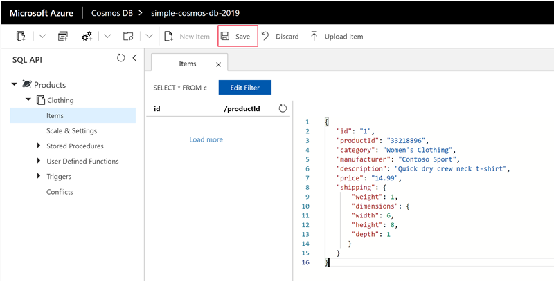
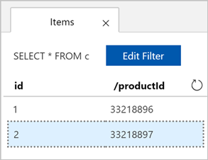

There are several ways to add data to an Azure Cosmos DB database. You can do it using REST APIs, with native SDKs for Python, C#, Java, and Node.js, or even using the Azure portal.

Since we're prototyping things right now, we'll use this latter approach - it's quick and easy and we can try out different query styles, insert, and modify data as needed so we can experiment without having to build a bunch of code.

In the Azure portal, you use the _Data Explorer_ tool.

## What is the Data Explorer?
The Azure Cosmos DB Data Explorer is a tool included in the Azure portal that is used to manage data stored in an Azure Cosmos DB. It provides a UI for navigating and viewing data, querying and modifying data, and creating and running stored procedures. The Data Explorer is a great tool to get you acquainted with the inner workings and functionality provided by Azure Cosmos DB.

## Open the Data Explorer in the Azure portal

1. Sign into the [Azure portal](https://portal.azure.com/learn.docs.microsoft.com?azure-portal=true) using the account you activated the sandbox with.

1. On the Azure portal menu (left hand side blue lines at the top), select **All services**.

1. Select **Databases** > **Azure Cosmos DB**. Then select the DB you just created, click **Data Explorer** at the top.

1. In the **Open Full Screen** box, click **Open** as shown in the following screenshot.

    :::image type="complex" source="../media/3-azure-cosmosdb-data-explorer-full-screen.png" alt-text="Screenshot showing how to open the Data Explorer tool in the Azure portal with a full screen of data.":::
        Screenshot highlights selecting the Data Explorer navigation item, then the open icon button, then the open text button from within the Open Full Screen pop-up.
    :::image-end:::

    The web browser displays the new full-screen Data Explorer, which gives you more space and a dedicated environment for working with your database.

## Add data using the Data Explorer

1. To create a new JSON document, in the SQL API pane, expand **Clothing**, select **Items**, then select **New Item** in the toolbar.

    :::image type="complex" source="../media/3-azure-cosmosdb-data-explorer-new-document.png" alt-text="Screenshot showing the steps to create new documents in Data Explorer in the Azure portal.":::
        Screenshot highlights selecting the Products > Clothing > Items node within the Products database, then the New Item button.
    :::image-end:::

1. Now, add a document to the container with the following structure. Paste the following JSON block into the **Items** tab, overwriting the current content:

     ```json
    {
        "id": "1",
        "productId": "33218896",
        "category": "Women's Clothing",
        "manufacturer": "Contoso Sport",
        "description": "Quick dry crew neck t-shirt",
        "price": "14.99",
        "shipping": {
            "weight": 1,
            "dimensions": {
            "width": 6,
            "height": 8,
            "depth": 1
           }
        }
    }
     ```

1. Select **Save**.

    

1. Create and save another document by selecting **New Item** again, and pasting the following JSON object into Data Explorer and then saving the item.

     ```json
    {
        "id": "2",
        "productId": "33218897",
        "category": "Women's Outerwear",
        "manufacturer": "Contoso",
        "description": "Black wool pea-coat",
        "price": "49.99",
        "shipping": {
            "weight": 2,
            "dimensions": {
            "width": 8,
            "height": 11,
            "depth": 3
           }
        }
    }
     ```

1. Confirm the documents have been saved by clicking **Items** on the left-hand menu. You should see two items as shown in the following screenshot.

    

You've added two documents, each representing a product in your product catalog, to your database by using the Data Explorer. The Data Explorer is a good way to create documents, modify documents, and get started with Azure Cosmos DB.
