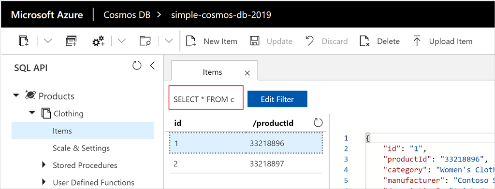
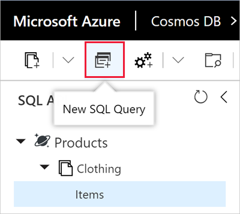
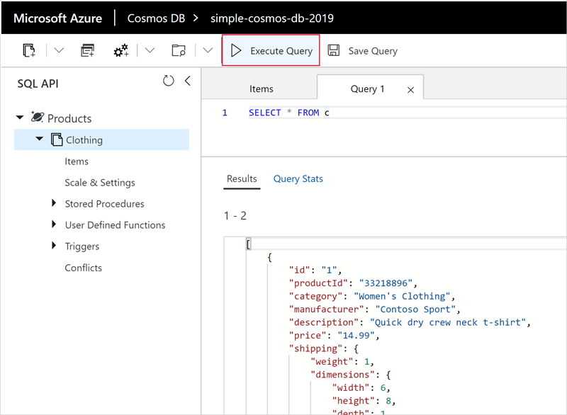

Now that you've learned about the kinds of queries you can create, let's use the Data Explorer in the Azure portal to retrieve and filter your product data.

Switch back to the Data Explorer window. Notice that by default, the query on the **Items** tab is set to `SELECT * FROM c` as shown in the following image. This default query retrieves and displays all documents in the container.



## Create a new query

1. In Data Explorer, select **New SQL Query** from the toolbar as shown below.

    

    The default query on the new  **Query 1** tab is again `SELECT * from c`, which will return all documents in the container.

1. Select **Execute Query** to run the SQL statement. This query returns all results in the database.

    

### Run custom queries

Let's run some of the queries we learned earlier.

1. Replace the `SELECT * from c` query and paste the following query into the text box.

    ```sql
    SELECT * 
    FROM Products p 
    WHERE p.id ="1"
    ```

1. Select **Execute Query** to run the modified SQL.

    The results return the product whose `id` is 1 as shown here.

    ```json
    [
        {
            "id": "1",
            "productId": "33218896",
            "category": "Women's Clothing",
            "manufacturer": "Contoso Sport",
            "description": "Quick dry crew neck t-shirt",
            "price": "14.99",
            "shipping": {
                "weight": 1,
                "dimensions": {
                    "width": 6,
                    "height": 8,
                    "depth": 1
                }
            },
            "_rid": "hxoKANnJfPQBAAAAAAAAAA==",
            "_self": "dbs/hxoKAA==/colls/hxoKANnJfPQ=/docs/hxoKANnJfPQBAAAAAAAAAA==/",
            "_etag": "\"0b011de9-0000-0500-0000-5cdc96250000\"",
            "_attachments": "attachments/",
            "_ts": 1557960229
        }
    ]
    ```
1. Replace the query with the following text and click **Execute Query**. This query returns the price, description, and product ID for all products, ordered by price, in ascending order.
 
    ```sql
    SELECT p.price, p.description, p.productId 
    FROM Products p 
    ORDER BY p.price ASC
    ```

    The output pane should show results similar to:

    ```json
    [
        {
            "price": "14.99",
            "description": "Quick dry crew neck t-shirt",
            "productId": "33218896"
        },
        {
            "price": "49.99",
            "description": "Black wool pea-coat",
            "productId": "33218897"
        }
    ]
    ```

Now that we've tried out some queries, let's learn how to build more complex queries and user-defined functions.