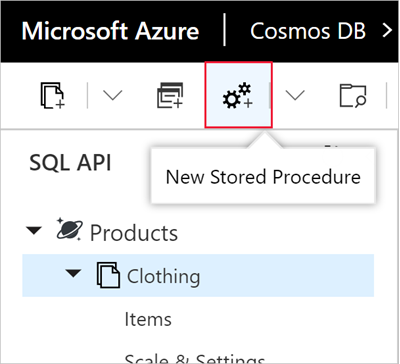
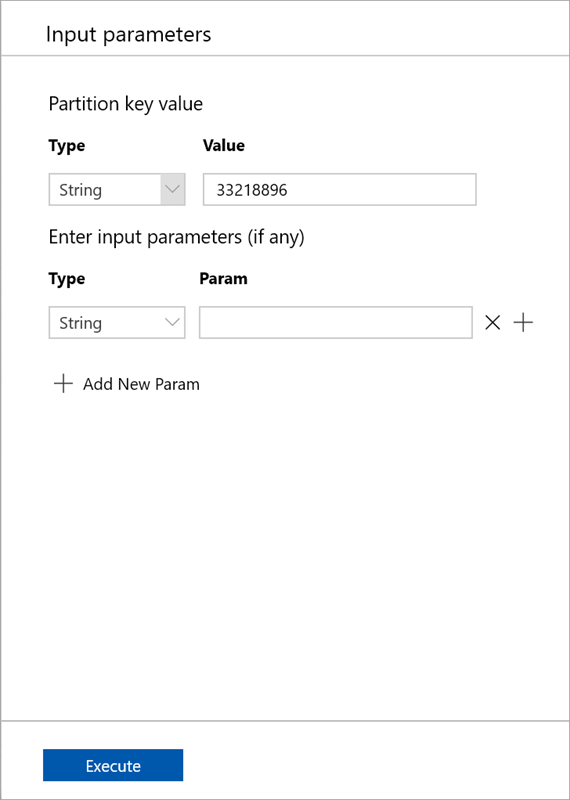
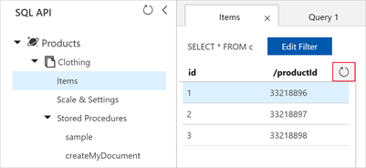
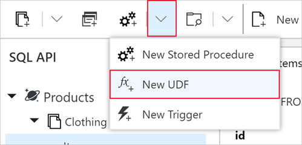
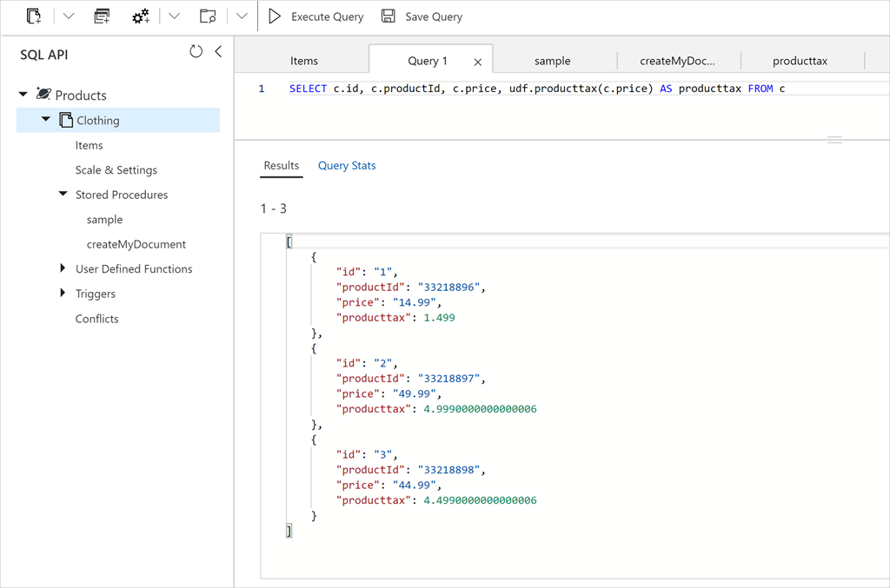

Let's start by creating a new stored procedure in the portal. The portal automatically populates a simple stored procedure that retrieves the first item in the container, so we'll run this stored procedure first.

1. Switch back to the Data Explorer window.

1. In the Data Explorer, select **New Stored Procedure** from the toolbar as shown in the following image.

    

    Data Explorer displays a new tab with a sample stored procedure.

1. In the **Stored Procedure Id** box, enter the name *sample*, and select **Save** to save the entry.

1. Select **Execute** to run the _sample_ stored procedure. This will open a sidebar on the right allowing you to supply parameters to the stored procedure.

1. In the **Input parameters** pane, use the following value for **Partition key value**.
   - **Type**: _String_
   - **Value**: _33218896_

    
1. Select **Execute**. Note that stored procedures work within a single partition.

    The **Result** pane displays the feed from the first document in the container.

    ```json
    {
      "prefix": null,
      "feed": {
         "id": "1",
         "productId": "33218896",
         "category": "Women's Clothing",
         "manufacturer": "Contoso Sport",
         "description": "Quick dry crew neck t-shirt", 
         "price": "14.99",
         "shipping": {
           "weight": 1,
           "dimensions": {
           "width": 6,
           "height": 8,
           "depth": 1
           }
        },
       "_rid": "hxoKANnJfPQBAAAAAAAAAA==",
       "_self": "dbs/hxoKAA==/colls/hxoKANnJfPQ=/docs/hxoKANnJfPQBAAAAAAAAAA==/",
       "_etag": "0b011de9-0000-0500-0000-5cdc96250000",
       "_attachments": "attachments",
       "_ts": "1557960229"
       }
     }
     ```

## Create a stored procedure that creates documents

Now, let's create a stored procedure that creates documents.

1. In the Data Explorer, click **New Stored Procedure**. Name this stored procedure *createMyDocument*.

1. Paste the following code into the **Stored Procedure Body** box and click **Save**.

    ```javascript
    function createMyDocument() {
        var context = getContext();
        var collection = context.getCollection();

        var doc = {
            "id": "3",
            "productId": "33218898",
            "description": "Contoso microfleece zip-up jacket",
            "price": "44.99"
        };

        var accepted = collection.createDocument(collection.getSelfLink(),
            doc,
            function (err, documentCreated) {
                if (err) throw new Error('Error' + err.message);
                context.getResponse().setBody(documentCreated)
            });
        if (!accepted) return;
    }
    ```
1. Select **Execute** to run the stored procedure.

1. In the **Input parameters** pane, use the following value for **Partition key value**.
   - **Type**: _String_
   - **Value**: _33218898_

1. Select **Execute**.

    Data Explorer displays the newly created document in the Result area.

    ```json
    {
        "id": "3",
        "productId": "33218898",
        "description": "Contoso microfleece zip-up jacket",
        "price": "44.99",
        "_rid": "hxoKANnJfPQDAAAAAAAAAA==",
        "_self": "dbs/hxoKAA==/colls/hxoKANnJfPQ=/docs/hxoKANnJfPQDAAAAAAAAAA==/",
        "_etag": "\"0b0145e9-0000-0500-0000-5cdc98340000\"",
        "_attachments": "attachments/"
    }
    ```

    You can go back to the Documents tab and click the **Refresh** button and see the new document as shown below.

    

## Create a user-defined function

Now, let's create a UDF in Data Explorer.

1. In the Data Explorer, click **New UDF**. You may need to click the down arrow next to **New Stored Procedure** to see **New UDF**.

    

1. Paste the following code into the window, name the UDF *producttax*, and then click **Save**.

    ```javascript
    function producttax(price) {
        if (price == undefined) 
            throw 'no input';
    
        var amount = parseFloat(price);
    
        if (amount < 1000) 
            return amount * 0.1;
        else if (amount < 10000) 
            return amount * 0.2;
        else
            return amount * 0.4;
    }
    ```

1. Switch to the **Query 1** tab in the Data Explorer.
1. Paste the following query into the query area to run the UDF.

    ```sql
    SELECT c.id, c.productId, c.price, udf.producttax(c.price) AS producttax FROM c
    ```

1. Select **Execute Query** to run the updated query using your new UDF.

   
