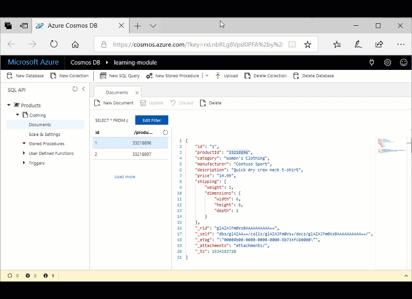

Multiple documents in your database frequently need to be updated at the same time. 

For your online retail application, when a user places an order and wants to use a coupon code, a credit, or a dividend (or all three at once), you need to query their account for those options, make updates to their account indicating they used them, update the order total, and process the order.

All of these actions need to happen at the same time, within a single transaction. If the user chooses to cancel the order, you want to roll back the changes and not modify their account information, so that their coupon codes, credits, and dividends are available for their next purchase.

The way to perform these transactions in Azure Cosmos DB is by using stored procedures and user-defined functions (UDFs). Stored procedures are the only way to ensure ACID (Atomicity, Consistency, Isolation, Durability) transactions because they are run on the server, and are thus referred to as server-side programming. UDFs are also stored on the server and are used during queries to perform computational logic on values or documents within the query. 

In this module, you'll learn about stored procedures and UDFs, and then run some in the portal.

## Stored procedure basics

Stored procedures perform complex transactions on documents and properties. Stored procedures are written in JavaScript and are stored in a collection on Azure Cosmos DB. By performing the stored procedures on the database engine and close to the data, you can improve performance over client-side programming.

Stored procedures are the only way to achieve atomic transactions within Azure Cosmos DB; the client-side SDKs do not support transactions.

Performing batch operations in stored procedures is also recommended because of the reduced need to create separate transactions.

## Stored procedure example

The following sample is a simple HelloWorld stored procedure that gets the current context and sends a response that displays "Hello, World".

```javascript
function helloWorld() {
    var context = getContext();
    var response = context.getResponse();

    response.setBody("Hello, World");
}
```

## User-defined function basics

UDFs are used to extend the Azure Cosmos DB SQL query language grammar and implement custom business logic, such as calculations on properties and documents. UDFs can be called only from inside queries and, unlike stored procedures, they do not have access to the context object, so they cannot read or write documents.

In an online commerce scenario, a UDF could be used to determine the sales tax to apply to an order total or a percentage discount to apply to products or orders.

## User-defined function example

The following sample creates a UDF to calculate tax on a product in a fictitious company based the product cost:

```javascript
function producttax(price) {
    if (price == undefined) 
        throw 'no input';

    var amount = parseFloat(price);

    if (amount < 1000) 
        return amount * 0.1;
    else if (amount < 10000) 
        return amount * 0.2;
    else
        return amount * 0.4;
}
```

## Create a stored procedure in the portal

Let's create a new stored procedure in the portal. The portal automatically populates a simple stored procedure that retrieves the first item in the collection, so we'll run this stored procedure first.

1. In the Data Explorer, click **New Stored Procedure**.

    Data Explorer displays a new tab with a sample stored procedure.

2. In the **Stored Procedure Id** box, enter the name *sample*, click **Save**, and then click **Execute**.


3. In the **Input parameters** box, type the name of a partition key, *33218896*, and then click **Execute**. Note that stored procedures work within a single partition.

    

    The **Result** pane displays the feed from the first document in the collection.

## Create a stored procedure that creates documents

Now, let's create a stored procedure that creates documents.

1. In the Data Explorer, click **New Stored Procedure**. Name this stored procedure *createMyDocument*, copy and paste the following code into the **Stored Procedure Body** box, click **Save**, and then click **Execute**.

    ```javascript
    function createMyDocument() {
        var context = getContext();
        var collection = context.getCollection();

        var doc = {
            "id": "3",
            "productId": "33218898",
            "description": "Contoso microfleece zip-up jacket",
            "price": "44.99"
        };

        var accepted = collection.createDocument(collection.getSelfLink(),
            doc,
            function (err, documentCreated) {
                if (err) throw new Error('Error' + err.message);
                context.getResponse().setBody(documentCreated)
            });
        if (!accepted) return;
    }
    ```

2. In the Input parameters box, enter a Partition Key Value of *33218898*, and then click **Execute**.

    Data Explorer displays the newly created document in the Result area.

    You can go back to the Documents tab, click the **Refresh** button and see the new document. 

## Create a user-defined function

Now, let's create a UDF in Data Explorer.

In the Data Explorer, click **New UDF**. You may need to click the down arrow next to **New Stored Prodedure** to see **New UDF**. Copy the following code into the window, name the UDF *producttax*, and then click **Save**.

```javascript
function producttax(price) {
    if (price == undefined) 
        throw 'no input';

    var amount = parseFloat(price);

    if (amount < 1000) 
        return amount * 0.1;
    else if (amount < 10000) 
        return amount * 0.2;
    else
        return amount * 0.4;
}
```

Once you have defined the UDF, go to the **Query 1** tab and copy and paste the following query into the query area to run the UDF.

```sql
SELECT c.id, c.productId, c.price, udf.producttax(c.price) AS producttax FROM c
```
