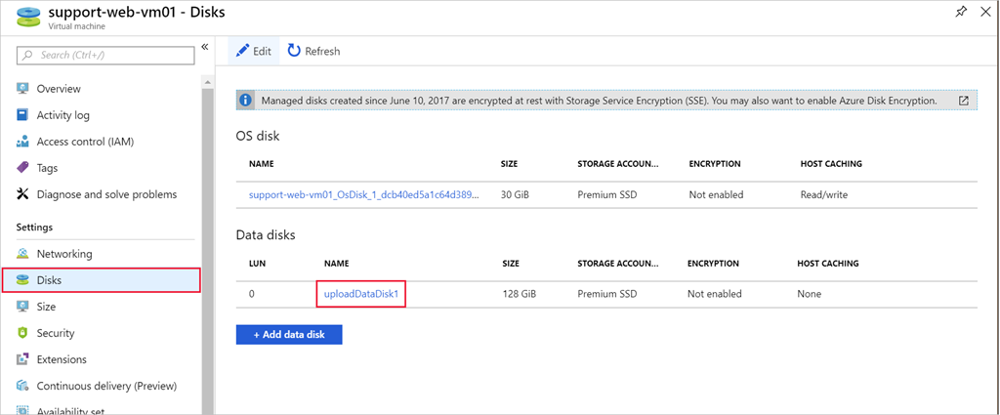
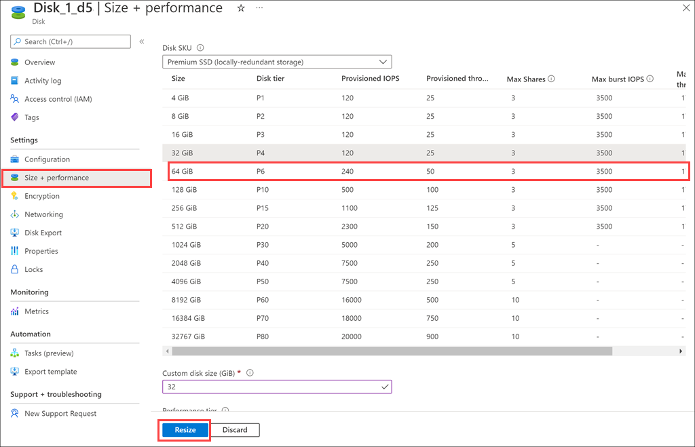

When you create the VM, it chooses a size for the OS disk. The specific size is based on the image you select. On Linux, it's often around 30 GB, and on Windows about 127 GB.

You can add data disks to provide for additional storage space, but you may also wish to expand an existing disk; perhaps a legacy application cannot split its data across drives, or you're migrating a physical PC's drive to Azure and need a larger OS drive.

> [!NOTE]
> Shrinking managed disks isn't supported. You can only resize a disk to a larger size.

Depending on how large the increase is, increasing the disk's size could also change the disk's performance tier (for example, from P10 to P20). Keep this in mind; this can be beneficial for performance upgrades, but will also cost more as you move up the premium tiers.

## VM size versus disk size

The VM size you choose when you create your VM determines how many resources it can allocate. For storage, the size controls the number of disks you can add to the VM and the maximum size of each disk.

As mentioned previously, some VM sizes support only Standard storage drives, which limits the I/O performance.

If you find that you need more storage than what your VM size allows for, you can change the VM size. We'll cover that topic in the [Introduction to Azure Virtual Machines](/training/modules/intro-to-azure-virtual-machines?azure-portal=true) module.

## Expand a disk using the Azure CLI

> [!WARNING]
> Always make sure that you back up your data before performing disk resize operations!

You can't perform operations on VHDs with the VM running. The first step is to stop and deallocate the VM with `az vm deallocate`, supplying the VM name and resource group name.

Deallocating a VM, unlike just *stopping* a VM, releases the associated computing resources and allows Azure to make configuration changes to the virtualized hardware.

> [!NOTE]
> Don't run these commands just yet. You'll practice the process in the next unit.

```azurecli
az vm deallocate \
  --resource-group <resource-group-name> \
  --name <vm-name>
```

Next, to resize a disk, you use `az disk update`, passing the disk name, resource group name, and newly requested size. When you expand a managed disk, the specified size is mapped to the nearest managed disk size.

```azurecli
az disk update \
  --resource-group <resource-group-name> \
  --name <disk-name> \
  --size-gb 200
```

Finally, you run `az vm start` to restart the VM.

```azurecli
az vm start \
  --resource-group <resource-group-name> \
  --name <vm-name>
```

## Expanding a disk using the Azure portal

You can also expand a disk through the Azure portal:

1. To stop the VM, on the **Overview** page for the VM, select **Stop** in the toolbar.

1. In the left menu pane, under **Settings**, select **Disks**.

1. Select the data disk you want to resize.

    

1. Select **Size + performance** under **Settings**. In the list, select a size *larger* than the current size. You can also change from Premium to Standard (or vice-versa) here. These settings will adjust your performance as shown in the predicted IOPS section.

    

1. Select **Resize** to save the changes.

1. Restart the VM.

### Expand the partition

Just like adding a new data disk, an expanded disk won't add any usable space until you expand the partition and filesystem. You must do this using the OS tools available to the VM.

On Windows, you might use the Disk Manager tool or the `diskpart` command line tool.

On Linux, you might use `parted` and `resize2fs`. You'll do that in the next unit.
