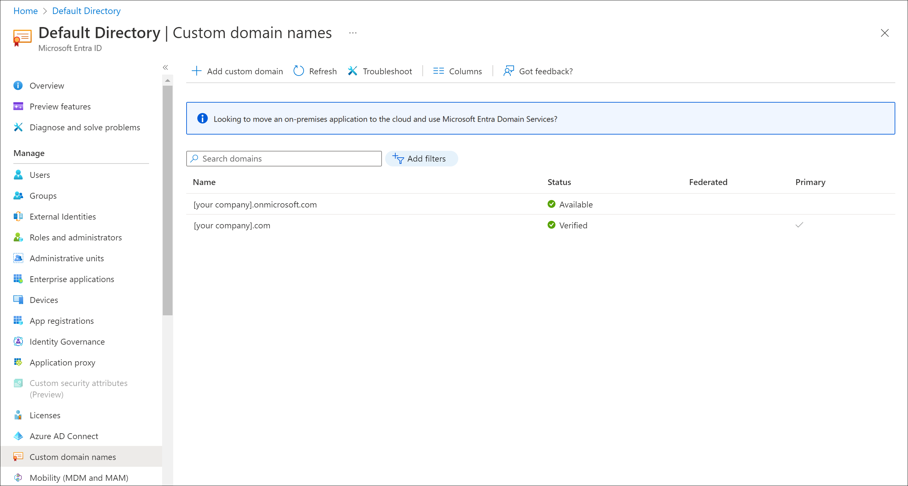

Domain names give you access to networked resources, with the most obvious being websites on the internet. You can also associate services like Exchange Server, Office 365, and Azure Active Directory (Azure AD), with a domain name.

Before you start to create and onboard employees to use company Azure apps, you want to see how Azure AD supports custom domain names.

In this unit, you'll explore how to use domain names in Azure AD and how subdomains are supported.

## What are custom domain names in Azure?

When you create an Azure subscription, you specify a default domain for the tenant. It's in the format of *something*.onmicrosoft.com like contoso.onmicrosoft.com.

The default domain name *onmicrosoft.com* is provided by Azure to all tenants. You are free to use it in your organization to create users and grant them access to resources. If your company chooses this approach, your users would sign in with *username*@*something.onmicrosoft.com*. 

You can associate a domain name that your company owns with Azure AD to make the sign-in name more memorable and identifiable for your organization. In Azure AD, you add your domain name as a custom domain name. For our scenario, let's say your company owns proseware.com. If you add that domain name as a custom domain in Azure AD, your users sign in by using the format *username*@*proseware.com*.

After the user signs in, Azure AD's access management features control their access to external Microsoft services like Office 365, and the Azure portal. Azure AD also allows users access to your companies internal resources such as intranets, and in-house developed cloud apps.

## Buy a domain name

You can buy a domain name by using Azure App Service domains or a third-party domain name registrar. App Service domains are top-level domains that are managed directly in Azure. They make it easy to manage custom domains for Azure App Service.

## Add a domain name to Azure

If your organization already added a custom domain for a Microsoft Office 365 subscription, you likely won't need to add it to Azure AD. The domain is listed and available to use as the primary domain.

If you have Microsoft Office 365 setup in a different directory from your Azure subscription or you want to use a different domain, you may need to add a custom domain to Azure AD.

You can add up to 900 managed domain names to your Azure AD directory.

## Add a subdomain

After you add the custom domain and it's verified, any subdomains you add, like www.proseware.com or sandbox.proseware.com, are automatically verified.

## Manage DNS records

Your domain name would be useless without the Domain Name System (DNS). This distributed system of computers provides a lookup database that associates a domain name with DNS records. One domain name can have alias records that point to:

- Web servers  by using **A**, **AAAA**, and **CNAME** records
- Email services by using **MX** records
- Name servers by using **NS** records 
- Proof of ownership by using **TXT** records

You can manage DNS records with the company that sold you the domain name. Or, you can switch the DNS provider by changing the name server associated with your domain. If you'd like to centralize DNS management with your other infrastructure, take a look at Azure DNS.
