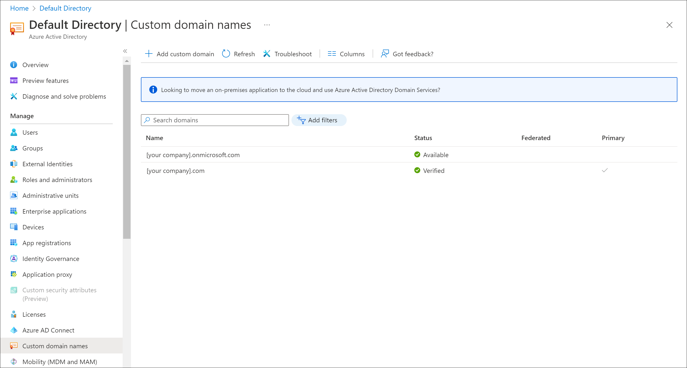

Domain names give you access to networked resources. The most obvious resources are websites on the internet. You can also associate services like Exchange Server, Microsoft 365, and Azure Active Directory (Azure AD) with a domain name.

Before you start to create company Azure apps and teach employees to use them, you want to see how Azure AD supports custom names.

In this unit, you'll explore how to use domain names in Azure AD and how subdomains are supported.

## What are custom domain names in Azure?

When you create an Azure subscription, you specify a default domain for your organization. The domain is in the format *something*.onmicrosoft.com. An example is contoso.onmicrosoft.com.

Azure provides the default domain name onmicrosoft.com to all Azure AD organizations. You're free to use it in your organization to create users and grant them access to resources. If your company chooses this approach, your users sign in with *username*@*something*.onmicrosoft.com.

You can associate a domain name that your company owns with Azure AD to make the sign-in names more memorable and identifiable for your organization. In Azure AD, you add your domain name as a custom domain name. For our scenario, let's say your company owns proseware.com. If you add that domain name as a custom domain in Azure AD, your users sign in with names in the format *username*@proseware.com.

After users sign in, Azure AD's access management features control their access to external Microsoft services. Such services include Microsoft 365 and the Azure portal. With Azure AD, users can also access your company's internal resources like intranets and cloud apps developed in-house.

## Buy a domain name

You can buy a domain name by using Azure App Service domains or another domain name registrar. App Service domains are top-level domains that Azure directly manages. They make it easy to manage custom domains for App Service.

## Add a domain name to Azure

If your organization already added a custom domain for a Microsoft 365 subscription, you likely don't need to add it to Azure AD. The domain is listed and available to use as the primary domain.

If you set up Microsoft 365 in an organization different than your Azure subscription, or if you want to use a different domain, you might need to add a custom domain to Azure AD.

You can add up to 900 managed domain names to your Azure AD organization.

## Add a subdomain

After you add the custom domain and it's verified, Azure AD automatically verifies any subdomains you add. The subdomains www.proseware.com and sandbox.proseware.com are examples.

## Manage DNS records

Your domain name would be useless without the Domain Name System (DNS). This distributed system of computers provides a lookup database that associates a domain name with DNS records. One domain name can have alias records that point to:

- Web servers by using A, AAAA, and CNAME records.
- Email services by using MX records.
- Name servers by using NS records.
- Proof of ownership by using TXT records.

You can manage DNS records with the company that sold you the domain name. Or you can switch the DNS provider by changing the name server associated with your domain. If you'd like to centralize DNS management with your other infrastructure, take a look at Azure DNS.
