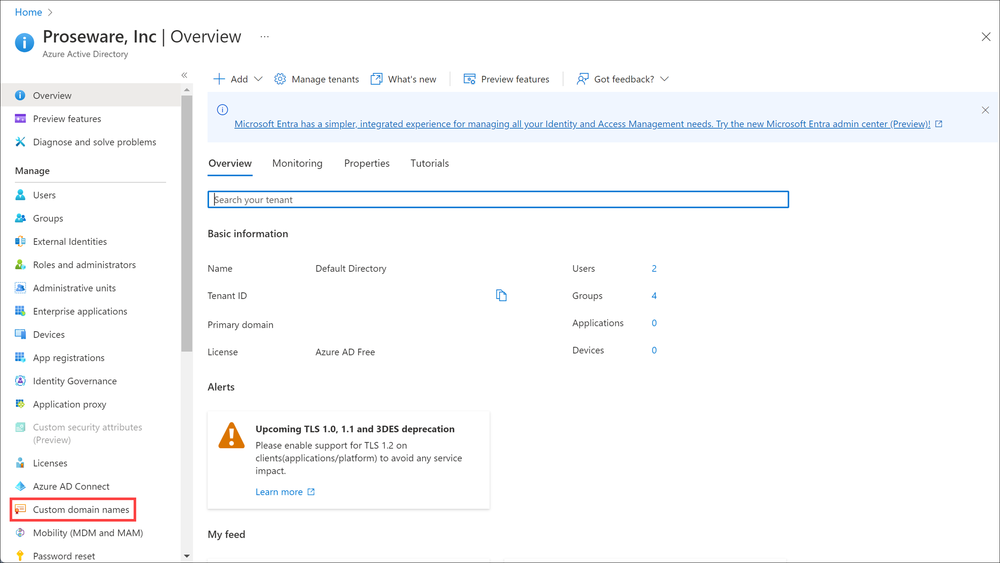
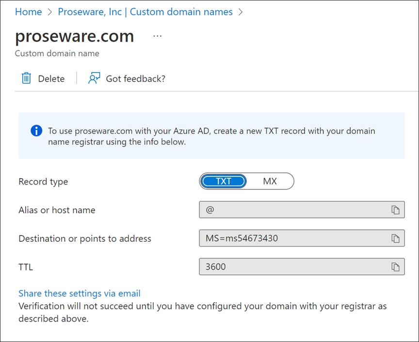
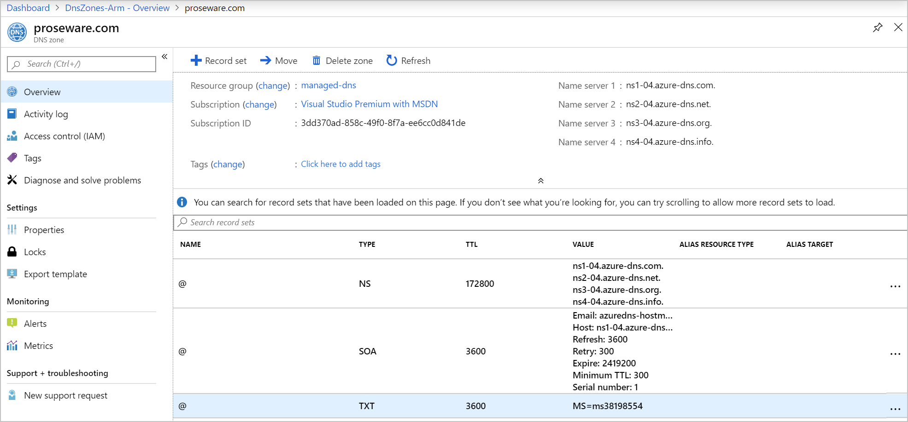
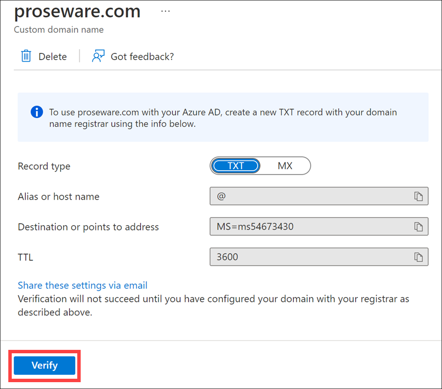
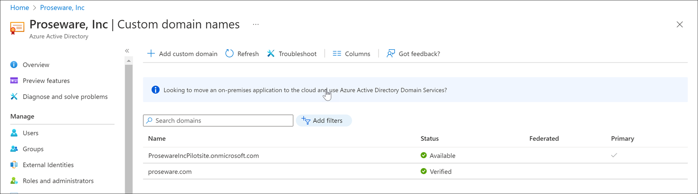
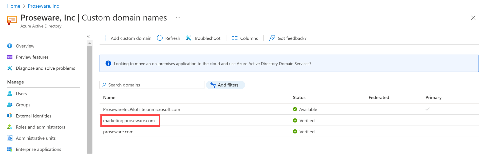
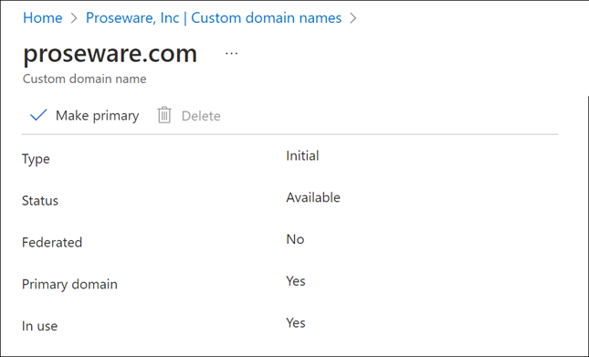
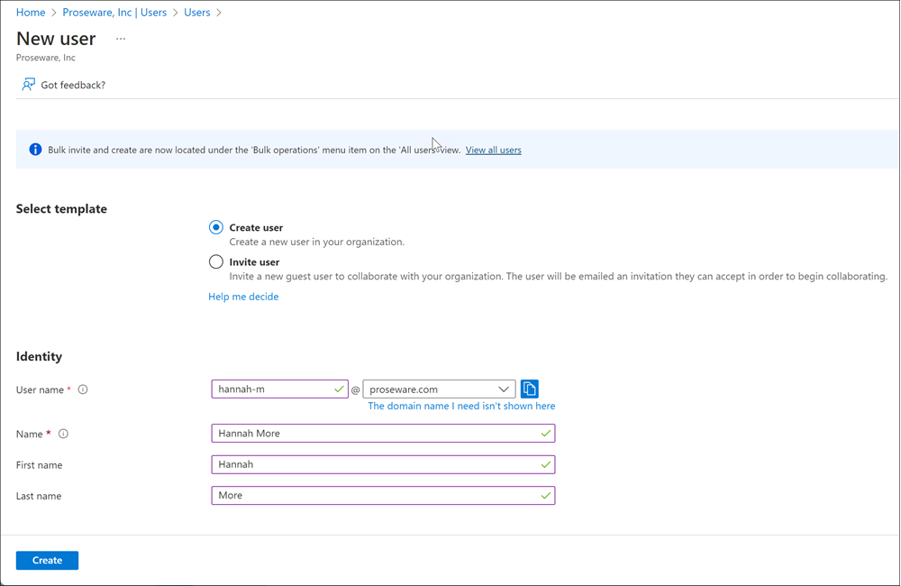

You can use Azure to add your organization's custom domain name and allow employees to create memorable usernames.

In this unit, you'll learn how to:

- Associate your custom domain with an existing Microsoft Entra organization.
- Set the custom domain to be the primary domain.
- Add users.

You can't complete this unit unless you've purchased a domain name and registered it with a Domain Name System (DNS) provider.

The following steps walk through the process to add a custom domain name to Azure. If you own an unused domain name, you can follow along in your own Microsoft Entra organization.

## Add a custom domain name to Microsoft Entra ID

In our scenario, your company has a Microsoft Entra organization where you can add the domain name.

1. In Microsoft Entra ID, under **Manage**, select **Custom domain names**.

    

1. Select **+ Add custom domain**.

1. For **Custom domain name**, enter the domain name **proseware.com**.

1. Select **Add domain**.

1. On the **proseware.com** page, copy the DNS information.

    

## Add your DNS information to the domain registrar

1. Go to your domain registrar.

1. Create records for your domain based on the DNS information you copied from Azure. The following screenshot shows a text record added to Azure DNS. Azure DNS is acting as the domain registrar.

    

1. Wait at least an hour for the DNS updates to propagate.

## Verify your custom domain in Azure

1. In Microsoft Entra ID, select **Custom domain names** under **Manage**.

1. Select your custom domain name.

1. Select **Verify**.

    

1. If Azure verifies that the correct record exists, the domain name status changes to "Verified."

    

1. To add a subdomain, select **+ Add domain name** and enter a subdomain name like **marketing.proseware.com**. You don't need to repeat the verification steps.

    

## Set the primary domain name

After you add the custom domain name and any subdomains, set one of the domain names as the primary.

1. Select **proseware.com** from the list of custom domain names.

1. Select **Make primary**.

    

1. Select **Yes**.

1. In the list of custom domain names, the **Primary** column is now checked for **proseware.com**.

## Manage custom domain names by using Azure PowerShell

You might prefer to manage your domain names by using [Microsoft Graph PowerShell](/powershell/microsoftgraph/overview).

- `New-MgDomain`: Creates a new domain. Use the parameter `-IsDefault` to set the domain name as the primary domain name.
- `Confirm-MgDomain`: Lets you try to validate the ownership of a domain.
- `Update-MgDomain`: Updates a domain name and can set the domain to the primary domain name.
- `Remove-MgDomain`: Deletes a domain from Microsoft Entra ID.

## Add a user

After you add a custom domain name and set it to be the primary domain, add users.

1. In the Azure portal, go to **Microsoft Entra ID**.

1. On the left side of the pane, select **Users** under **Manage**.

1. Select **+ New user**, then select **Create new user**.

   

1. For **User name** and **Name**, enter values for your pilot user. The primary domain name appears as part of the username.
