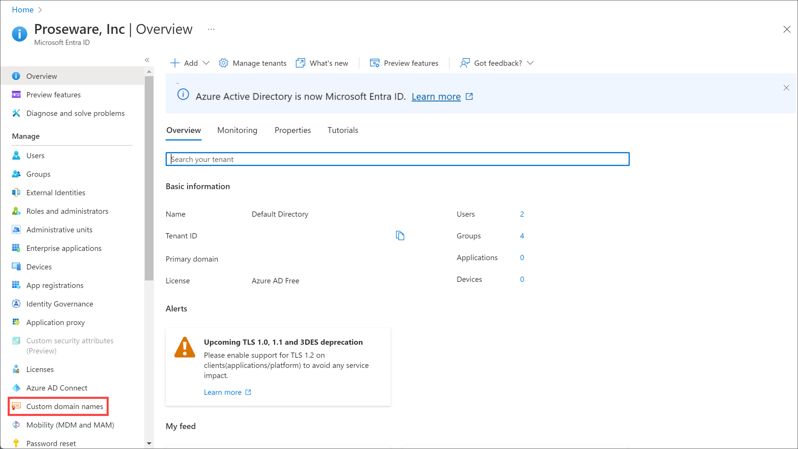
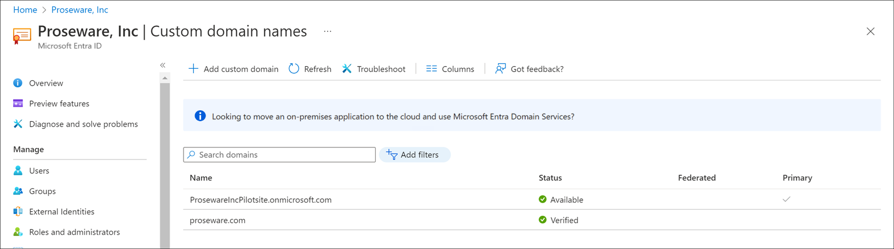
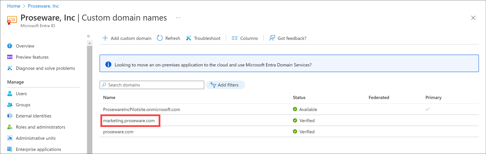

You use Azure to add your organization's custom domain name and allow employees to create memorable user names.

In this unit, you'll see how to associate your custom domain to an existing Azure Active Directory (Azure AD) organization, set it to be the primary domain, and then add users.

You won't be able to complete the steps in this unit unless you've purchased a domain name and registered it with a DNS provider. So the following steps walk through the process to add a custom domain name to Azure. If you do own a domain name that's not being  used, you can choose to follow along in your own Azure AD organization.

## Add custom domain name to Azure AD

In our scenario, the organization has an Azure AD organization where they can add the domain name.

1. In Azure AD, under **Manage** select **Custom domain name**.

    

1. Select **+ Add custom domain**
1. For **Custom domain name**, enter your domain name like proseware.com.
1. Select **Add domain**.
1. On the **proseware.com** page, copy the DNS information.

    

## Add your DNS information to the domain registrar

1. Go to your domain registrar.
1. Create records for your domain based on the DNS information you copied from Azure. For example, the following screenshot shows a text record added to Azure DNS. Azure DNS is acting as the domain registrar.

    

1. Wait at least an hour for the DNS updates to propagate.

## Verify your custom domain in Azure

1. In Azure AD, under **Manage** select **Custom domain name**.
1. Select your custom domain name.
1. Select **Verify**.

    

1. If Azure verifies that the correct record exists, the domain name status will be updated to "verified".

    

1. To add a subdomain, select **+ Add domain name** and enter the subdomain name such as marketing.proseware.com. You don't need to repeat the verification steps.

    

## Set the primary domain name

After you add the custom domain name and any subdomains, set one of domain names as the primary.

1. Select the **proseware.com** from the list of custom domain names.
1. Select  **Make primary**.

    

1. Select **Yes**.
1. On the list of custom domain names, you see the **Primary** column is now checked for **proseware.com**.

## Manage custom domain names by using Azure PowerShell

You might prefer to manage your domain names by using Azure PowerShell.

- `New-AzureADDomain`: Creates a new domain. Use the parameter `-IsDefault` to set the domain name as the primary domain name.
- `Confirm-AzureADDomain`: Allows you to try to validate the ownership of a domain.
- `Set-AzureADDomain`: Updates a domain name, and can be used to set the domain to the primary domain name.
- `Remove-AzureADDomain`: Deletes a domain from Azure AD.

## Add a user

After you add a custom domain name and set it to the primary domain, add users.

1. On the portal, go to the **Azure Active Directory**.
1. On the left, under **Manage**, select **Users**.
1. Select **+ New user**.

   

1. Enter the **User name** and **Name** for your pilot user. Notice that the primary domain name is shown as part of the user name.
