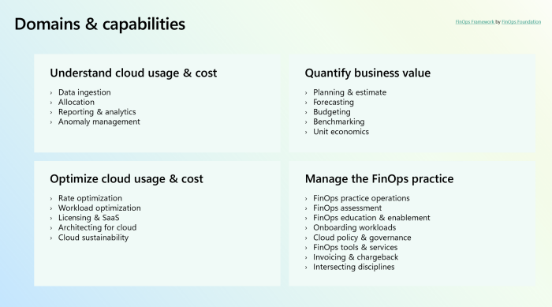

FinOps Domains represent spheres of activity or knowledge. Every organization adopting FinOps engages in activities across all FinOps domains. Each FinOps domain comprises FinOps capabilities, which outline functional activities that can be performed within that domain.

In the image below, you can see how domains and capabilities are grouped:

The units in this module are structured by each domain. Within each unit, we'll delve deeper to explore each capability and how you can get started to adopt and implement them in your organization. 

For more information, see [FinOps Domains](https://www.finops.org/framework/domains/) and [FinOps Capabilities](https://www.finops.org/framework/capabilities/) by the [FinOps Foundation](https://www.finops.org/).