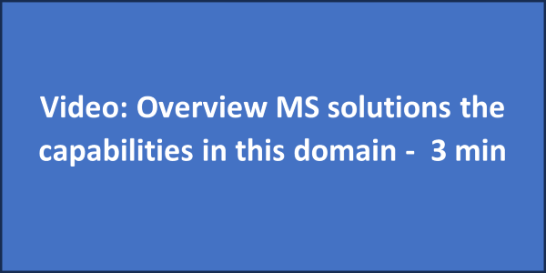

Understanding cloud usage and costs is important for effective cloud management and optimization. Gaining this understanding allows organizations to gain insight into how resources are being utilized, identify trends, and make informed decisions to optimize performance and cost efficiency. Data ingestion, allocation, reporting and analytics, and anomaly management play crucial roles in achieving this objective.

## Data ingestion

**Objective**:

- Collect, transfer, and normalize data from various sources for analysis, with a focus on understanding the usage and costs associated with an organization's cloud infrastructure.

## Allocation

**Objective**:

- Define strategies to assign and split shared cloud costs using accounts, tags, labels, and other metadata, creating accountability among teams and projects within an organization.

**Get started**:

- [FinOps Interactive Guide - Cost Allocation](https://mslearn.cloudguides.com/guides/FinOps%20on%20Azure%20Exercise%201%20-%20Cost%20allocation)
- [FinOps Interactive Guide - Manage Shared Costs](https://mslearn.cloudguides.com/guides/FinOps%20on%20Azure%20Exercise%203%20-%20Manage%20shared%20costs)

## Reporting + analytics

**Objective**:

- Examine and showback cloud data to gain insights into usage and spend patterns to identify cost optimization opportunities, improve cost efficiency, and make informed financial decisions regarding cloud resources.

**Get started**:

- [FinOps Interactive Guide - Data Analysis & Showback](https://mslearn.cloudguides.com/guides/FinOps%20on%20Azure%20Exercise%202%20-%20Data%20analysis%20and%20showback)

## Anomaly management

**Objective**:

- Detect, identify, alert, and manage unexpected cloud cost and usage irregularities in a timely manner to lower risk in cost-effective cloud operations.

**Get started**:

- [FinOps Interactive Guide - Manage Anomalies](https://mslearn.cloudguides.com/guides/FinOps%20on%20Azure%20Exercise%205%20-%20Manage%20anomalies)

----------

_Content attribution for this unit: [FinOps Domain: "Understand Cloud Usage & Cost"](https://www.finops.org/framework/domains/understand-cloud-usage-cost/) by [FinOps Foundation](https://www.finops.org/)_.
