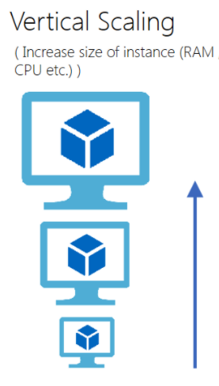
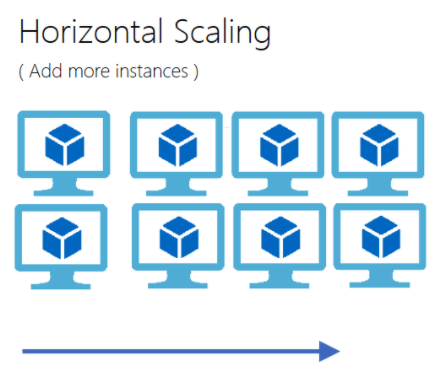

To start with the scalability project your company wants to achieve, you first need to understand what scalability is and how it is applied to Kubernetes itself and its applications.

In this chapter, you'll review some concepts of scalability.

## Scalability

Scalability is the word used to describe the ability of an application or system to handle an increasing amount of work by adding more resources to it. For example, in the case of this website, the amount of work being increased is the number of requests from the users, while the amount of resources added can be represented in two ways, *vertical scalability* and *horizontal scalability*.

### Vertical scalability

Vertical scalability is when a system is scaled by adding more physical resources to it, like memory or CPU power. For example, if the company's website is consuming too much memory, you could update your VM instance to include more memory while keeping the same underlying application.

In short, scaling vertically is increasing the VM size while keeping the number of applications the same. This approach is valuable when you're dealing with monolithic applications that require too much compute power but are too costly to break up into smaller parts, these applications are mostly hosted in VMs as opposed to distributed systems as Kubernetes.

Despite the cost being manageable, huge VMs can be too expensive because the cost of adding more compute power is bigger comparable to the cost of duplicating small VMs. Also, there's an upper limit to the number of resources you can add to a single VM, meaning that you'll eventually have to duplicate the VM once you reach the upper bound.

### Horizontal scalability

On the other hand, horizontal scalability is the most used type of scalability when you have distributed applications, such as those deployed in AKS. It consists in duplicating the whole application and balancing the load among them.

Scaling horizontally is called *scaling out*, it's widely used in stateless systems since you can spin up several containers with the same application in a single VM, this way you can extract most resources while paying a single instance instead of multiple VMs.

Since the company site is stateless, this is the best course of action, also because Kubernetes provides out-of-the-box a resource called *HorizontalPodAutoscaler* that allows you to scale out your deployments.

## Manual scalability on Kubernetes

Before getting into the HPA (*HorizontalPodAutoscaler*) resource, you must know that it's possible to manually scale deployments in Kubernetes.

Every deployment is bound to another resource called *ReplicaSet*, the latter is responsible for maintaining a "desired replica state" and scaling the real application in or out to keep the desired state the same as the real state.

You can control the number of replicas in a deployment through the `spec.replicas` key in the deployment specification, this setting will set the number of desired replicas in the underlying ReplicaSet and will force the replication controller to keep this amount of replicas at any given time.

You can also control the number of replicas in a deployment through the `kubectl scale deploy/contoso-website --replicas <number>` command. This will dynamically change the number of desired replicas in a deployment and scale the application in or out.

## HorizontalPodAutoscaler

The HPA is the native Kubernetes resource that provides horizontal scalability to pods in the cluster.

<!-- Add content from https://kubernetes.io/docs/tasks/run-application/horizontal-pod-autoscale/ -->
<!-- https://docs.microsoft.com/en-us/azure/aks/concepts-scale -->
