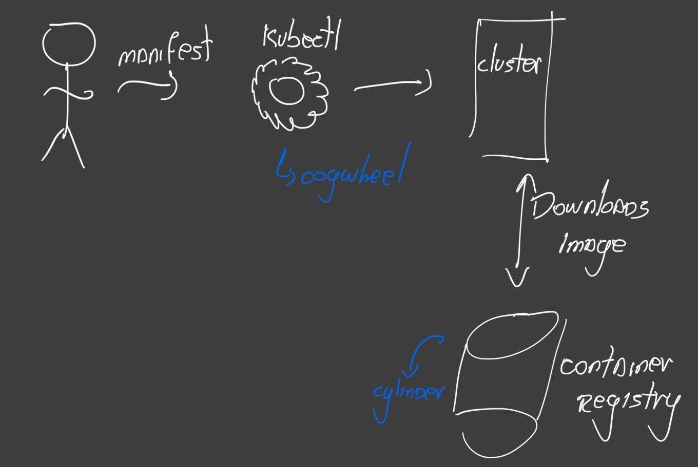
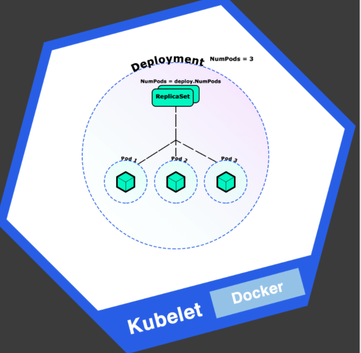

[//]: # (This first paragraph will pull your reader into the unit. Try and relate the intro to the scenario from the introduction unit.)

[//]: # (Do you need to tell the student what you're going to use to build the website with or even that there is code available? Think about what the student wants to now first. For example, how do you deploy a website without Kubernetes? You'll install your VM, configure your web server, write some code, and finally deploy the website. How does the deployment to Kubernetes compare to all of the previous?)

Here, you'll use a static web application built using Hugo, a static website generator written in Golang. This application is available [in this repository](https://github.com/MicrosoftDocs/mslearn-aks-deploy-container-app).

Here, we'll run through all the engineering aspects of a containerized application and discuss how you can create one, and what makes them different from other applications.

## Images

The first thing you'll notice is that there's a Dockerfile in the root of the repository. That's because you'll be using a Docker image to spin up your application.

Kubernetes is a **container** orchestrator, which means you'll use containers to build and run the application within an image and deploy this image to the AKS cluster. You'll typically use Docker containers.

## Container Registries

Container registries allow you to store your images safely in the cloud and download them later on.  You can think of the container registry as an archive that stores multiple versions of your container image. Each stored image has a tag assigned for identification.

For example, you may have the image `contoso-website:latest` which would be a different version of the image with the tag `contoso-website:v1.0.0`. 



Container registries may be public or private. Private registries require credentials to access and download images and will be the strategy you'll follow when storing container images.

Kubernetes only allows you to deploy images hosted in a container registry. Creating a private container registry will normally be part of your standard AKS deployment strategy.

## Kubernetes manifest files

[//]: # (I would suggest contrasting imperative vs. declarative a bit more. Why do you need to use declarative, why can't the user deploy directly to node three on node pool 5 for example?)

Instead of telling exactly what to do and how to create the resources, Kubernetes have manifest files. They allow you to describe your workloads in the YAML format. These manifest files contain everything that is needed to create and manage the workload it describes.

There are several types of workloads Kubernetes supports. Each one has its own uses and purposes, for this website we'll be using the **Deployment**, **Service**, and **Ingress** types.

[//]: # (Is a workload different to a resource? I would even consider moving the mention of Service and Ingress after to later in the unit. Discuss the manifest file for a deployment 1st.)

Manifest files can differ depending on the type of resource that it creates. But all manifest files have common instructions. The first lines of all files have two important keys `apiVersion` and `kind`.

First, we need to tell Kubernetes what kind of workload this file refers to using the `kind` key, and then the API endpoint refers to using the `apiVersion` key in the YAML file, like this:

    ```yml
    # deployment.yaml
    apiVersion: apps/v1 # Where in the API it resides
    kind: Deployment # The kind of workload we're creating
    ```

Other common keys for all the files are the `metadata` and `name` keys. All Kubernetes resources **must** have a name, and this name goes inside the `metadata` key.

    ```yml
    # deployment.yaml
    apiVersion: apps/v1
    kind: Deployment
    metadata:
      name: contoso-website # This will be the name of the deployment
    ```

[//]: # (What is the most basic deployment file that you can create to deploy a pod? Show that first, then show the more complex example below; however, before you show the example. Think about the following. Does your reader know what a "spec", "template", "selector", "label", "resource", "request", "limit" or "ports" are or even why they need to use them. These are all concepts that they need to know first.)

From this point on, all files have different structures based on what kind of resource we're telling Kubernetes to create for us. This is the example of a deployment manifest file:

    ```yml
    # deployment.yaml
    apiVersion: apps/v1
    kind: Deployment
    metadata:
      name: contoso-website
    spec:
      selector:
        matchLabels:
          app: contoso-website
    template:
        metadata:
          labels:
            app: contoso-website
        spec:
          containers:
            - image: registry.azurecr.io/contoso-website
              name: contoso-website
              resources:
                requests:
                  cpu: 100m
                  memory: 128Mi
                limits:
                  cpu: 250m
                  memory: 256Mi
              ports:
                - containerPort: 80
                  name: http
    ```

### Kubernetes Deployments

[//]: # (This section needs to be above your manifest file discussion. The following are all concepts that are described or used in the manifest file.)

Kubernetes groups containers and applications into logical structures called **Pods**. These pods have no intelligence and are composed of one or more application containers (Docker containers). Each one has its own IP address and network rules, and exposed ports.

Deployments are an evolution of pods. They wrap the Pods into an intelligent structure that allows them to _scale out_. That means you can easily duplicate and scale your application to support more load without the need to configure complex networking rules. To create this wrapping, deployments need a `label`. Labels are the way deployments find and group pods within their bounds.



Kubernetes can tag workloads with labels. These labels allow the system to query the cluster for workloads that have one or more labels. For example, if we wanted to search all workloads related to the `contoso-website`, we could query the cluster for everything with the label `app` and the value of that label being `contoso-website`. This can be seen in the `selector` key of our previous example:

    ```yml
    # deployment.yaml
    # ...
    spec:
      selector:
        matchLabels:
          app: contoso-website
    # ...
    ```

[//]: # (Be really careful here. With the introduction of the term rolling updates, you're opening up a completely new topic that warrants it's own unit or even module. Instead, explain how you can use the manifest file, make changes to it, and what the effect would be.) 

Deployments allow users to update applications just by changing the image tag without downtime. This aspect means any deployment can update the pods inside it with no visible effect in availability. This action is called **rolling update**.

