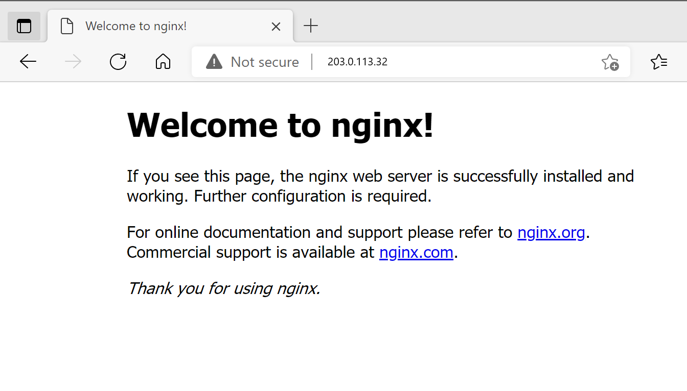
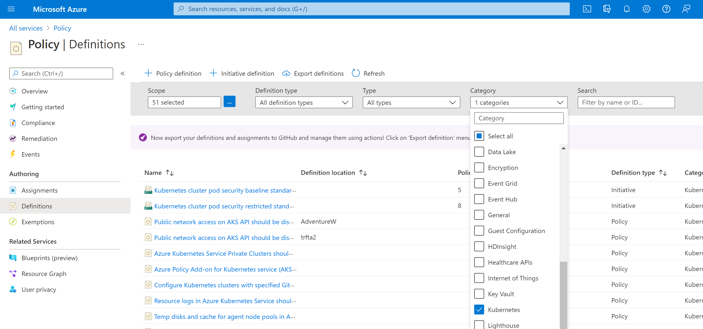
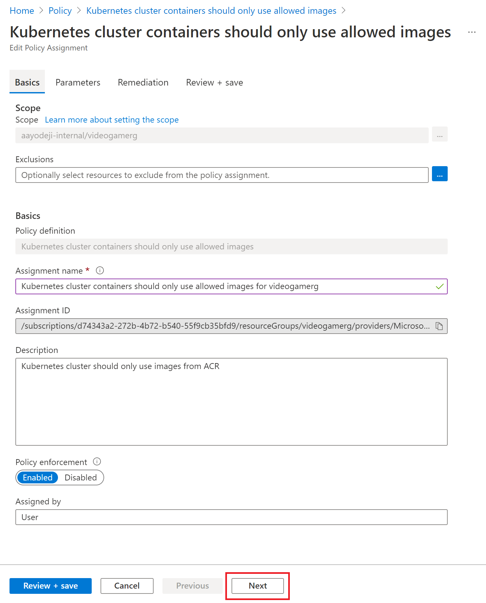
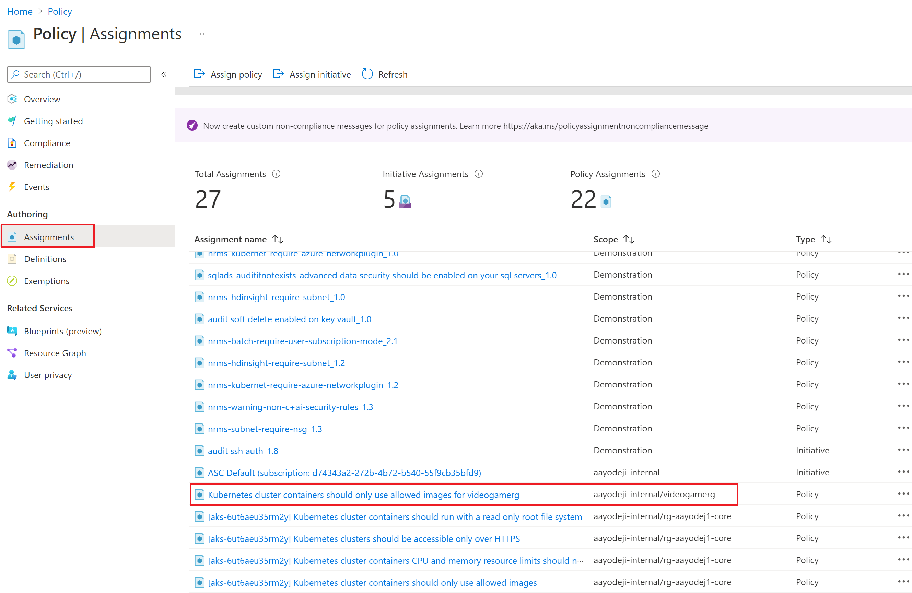
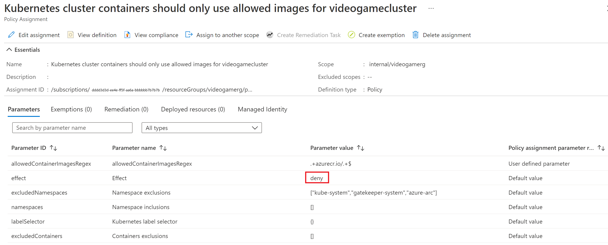
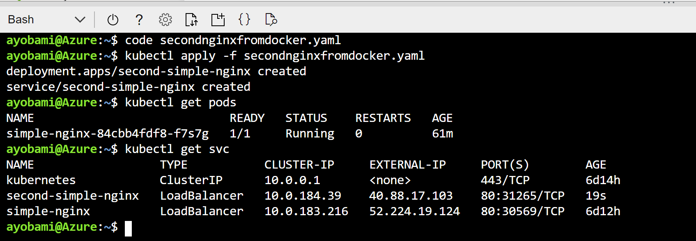
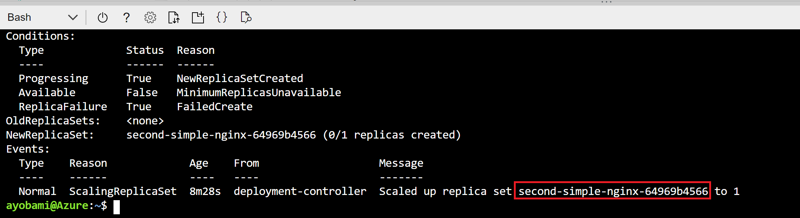
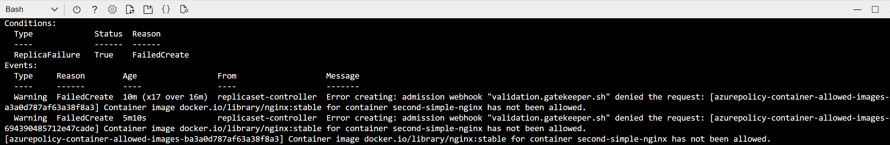
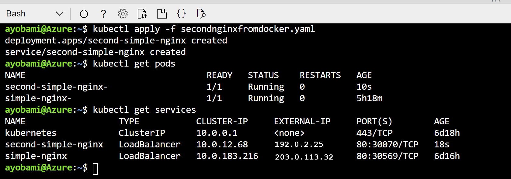
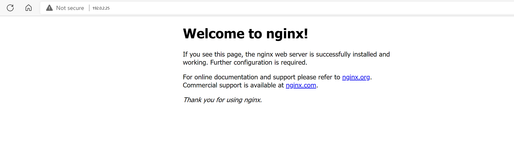

You are now ready to configure Azure policies and initiatives for your AKS cluster. 

In this unit, you'll deploy a non-compliant pod, apply an Azure Policy that enforces the use of only trusted registries and then deploy another non-compliant pod to see the effect of the policy. You will also troubleshoot steps to see why the pods are not being created and you will deploy the **Kubernetes cluster pod security restricted standards for Linux-based workloads** initiative.

## Deploy a non-compliant pod into the cluster

We begin by deploying an image from directly from Docker Hub into the cluster. The first step would be to log into the cluster.

1. In Cloud Shell, log into the AKS cluster

   ```Azure CLI
   az aks get-credentials -n videogamecluster -g videogamerg 
   ```

1. Run the following code to create a simple nginx pod from Docker Hub.

   ```bash
    cat <<EOF | kubectl apply -f -
    apiVersion: apps/v1
    kind: Deployment
    metadata:
      name: simple-nginx
      labels:
        app: nginx
    spec:
      selector:
        matchLabels:
          app: nginx
      template:
        metadata:
          labels:
            app: nginx
        spec:
          containers:
          - name: simple-nginx
            image: docker.io/library/nginx:stable
            resources:
              requests:
                cpu: 100m
                memory: 100Mi
              limits:
                cpu: 120m
                memory: 120Mi
            ports:
            - containerPort: 80
   EOF
   ```
   
1. Run the code below to deploy the service to expose the deployment

   ```
   cat <<EOF | kubectl create -f -
    apiVersion: v1
    kind: Service
    metadata:
      name: simple-nginx
      labels:
        app: nginx
    spec:
      type: LoadBalancer
      ports:
      - port: 80
      selector:
        app: nginx
   EOF
   ```

   

1. List all of the deployed services

   ``` bash
   kubectl get services
   ```

1. Copy the _External-IP_ of the **simple-nginx** service and paste it in your browser to see if the service runs as expected

   

## Add Azure Policy to the AKS cluster
You have successfully deployed your workload on a cluster that doesn't have any policy enforcement on it. Now you will add a policy to the cluster and see how that affects it.

### Create a policy

You'd like to ensure that only images from certain registries are allowed in the cluster. You'll need to create a new policy definition and then assign it to a scope; in this case the scope will be our **videogamerg** resource group. Policies can be created and assigned through the Azure portal, Azure PowerShell, or Azure CLI. This exercise takes you through creating a policy in the portal.

Find the built-in policy definitions for managing your cluster using the Azure portal with the following steps. In this case we will be applying the "only trusted registry" [policy]([Policy - Microsoft Azure](https://portal.azure.com/#blade/Microsoft_Azure_Policy/PolicyMenuBlade/Overview)).

1. Go to the [Policy](https://portal.azure.com/#blade/Microsoft_Azure_Policy/PolicyMenuBlade/Overview) page in **Azure Portal**.

1. In the left pane of the Azure Policy page, select Definitions.

1. From the Category dropdown list box, use Select all to clear the filter and then select Kubernetes.

   

1. Select the **Kubernetes cluster containers should only use allowed images** policy definition

1. Select the **Assign** button at the top left corner of the screen.

1. Set the Scope to the resource group of the Kubernetes cluster you just created, which in this case is the **videogamerg** resource group. Fill out the rest of the form as seen in the picture below and click **Next**.

   

1. Enter the following into the **Allowed container image regex** field and click the **Review + create** button

   ```
   .+\.azurecr\.io/.+$
   ```

1. Click on the **Create** button

Now that the new policy has been enabled, you can click on **Assignments** to see the assigned policy and select the policy assignment you just created.



Your policy assignment should look like the picture below. Note that effect is set to deny by default. This means that the cluster would not allow resources to be deployed from container registries other than those hosted on Azure Container Registry.



## Assign a Policy Initiative

Now that you have successfully assigned your policy, you will now assign an initiative before you test the policies so that you won't have to also wait for the initiative to take effect in the next unit. An Azure Policy initiative is a collection of Azure Policy definitions, or rules, that are grouped together towards a specific goal or purpose. Azure initiatives simplify management of your policies by grouping a set of policies together, logically, as a single item.

Initiatives can be assigned the same way policies are assigned. Follow the steps below to assign the  "[Kubernetes cluster pod security restricted standards for Linux-based workloads](https://docs.microsoft.com/azure/aks/policy-reference#initiatives)" initiative.

1. Return to the [Policy](https://portal.azure.com/#blade/Microsoft_Azure_Policy/PolicyMenuBlade/Overview) page in **Azure Portal**.
1. In the left pane of the Azure Policy page, select Definitions.
1. From the Category dropdown list box, use Select all to clear the filter and then select Kubernetes.
1. Select the **Kubernetes cluster pod security restricted standards for Linux-based workloads** initiative  definition. Take some time to review the various policies that are a part of the initiative.
1. Select the **Assign** button at the top left corner of the screen.
1. Set the Scope to the resource group of the Kubernetes cluster you just created, which in this case is the **videogamerg** resource group. Fill out the rest of the form as you did in the previous step and click **Next** to move on to the Parameters section
1. Click **Next** again to move on to the **Remediation** tab. Ensure **Create a Managed Identity** is not checked and click next again
1. Click **Next** then click **Create** at the bottom

Here you can find the policy assignment again by clicking on **Policy** and selecting **Assignments** in the left blade. Clicking on the policy assignment you just created will show that the effect was set to Audit in this case.

## Test the Azure Policy

Now that you have assigned the restricting policy to the cluster, you will now run a test to see if the policy works. To do this, you will create a new deployment and see if the deployment works. We begin by creating a new kubernetes manifest file and deploying it. 
> [!IMPORTANT]
> Please note that the policy assignment may take up to 30 minutes to take effect. Because of this delay, in the following steps the policy validation may succeed and the deployment will still not fail if you don't give enough time for the policy to take effect. If this happens, allow for additional time and retry your deployment.

1. Create another nginx deployment and service using the code below

   ```bash
    cat <<EOF | kubectl create -f -
    apiVersion: apps/v1
    kind: Deployment
    metadata:
      name: second-simple-nginx
      labels:
        app: second-nginx
    spec:
      selector:
        matchLabels:
          app: second-nginx
      template:
        metadata:
          labels:
            app: second-nginx
        spec:
          containers:
          - name: second-simple-nginx
            image: docker.io/library/nginx:stable
            resources:
              requests:
                cpu: 100m
                memory: 100Mi
              limits:
                cpu: 120m
                memory: 120Mi
            ports:
            - containerPort: 80
   EOF
   ```
   
1. Create the service

   ```
   cat <<EOF | kubectl create -f -
    apiVersion: v1
    kind: Service
    metadata:
      name: second-simple-nginx
      labels:
        app: second-nginx
    spec:
      type: LoadBalancer
      ports:
      - port: 80
      selector:
        app: second-nginx
   EOF
   ```
   
   
   
1. Now we can check to see if the pod was created

   ```bash
   kubectl get pods
   ```

As you can see in the picture below, even though it appeared the deployment was created, the pod was actually not created. The deployment was blocked by the policy you just created. The pod that was created before the policy was assigned was however not stopped. The policy also didn't prevent the service from getting created. If you try opening up the EXTERNAL-IP in a browser, you will get no response which further shows that the deployment was not successful. 




## Diagnose why the Pod was not deployed

In the previous section we noticed that the second pod was not deployed. In this section, we will use the command line to diagnose why.

1. First, let us describe the deployment. We see that the ReplicaSet was created but the replicas failed to create

   ```bash
   kubectl describe deployment second-simple-nginx
   ```

   

2. Next we will describe the failed ReplicaSet. Copy the name of the ReplicaSet highlighted in the picture above and replace the placeholder with the copied name. Run the command

   ```bash
   kubectl describe replicaset <ReplicaSet name>
   ```

3. Here you will see that the replicas failed because of the policy

   

Delete the deployment to prepare for the next step.

```
 cat <<EOF | kubectl delete -f -
 apiVersion: apps/v1
 kind: Deployment
 metadata:
   name: second-simple-nginx
   labels:
     app: second-nginx
 spec:
   selector:
     matchLabels:
       app: second-nginx
   template:
     metadata:
       labels:
         app: second-nginx
     spec:
       containers:
       - name: second-simple-nginx
         image: docker.io/library/nginx:stable
         resources:
           requests:
             cpu: 100m
             memory: 100Mi
           limits:
             cpu: 120m
             memory: 120Mi
         ports:
         - containerPort: 80
EOF
```

## Redeploying the pods using an Azure Container Registry Image

Now that you know that the policy prevents images from Dockerhub from being created in your cluster based on your policy, let us try redeploying the same workload using an image from ACR. In this section you will create an Azure Container Registry, copy the nginx image from Dockerhub to the new registry and attempt to redeploy the pod form your container registry. We will use Azure CLI to create the container registry.

1. Head back to **Cloud shell** on Azure Portal and enter the following commands to create a new container registry

   ```azurecli-interactive
   ACR_NAME=videogameacr$RANDOM
   az acr create --name $ACR_NAME \
                 --resource-group videogamerg \
                 --sku Premium
   ```

1. Import the image from Docker Hub to your new container registry

   ```azurecli-interactive
   az acr import --name $ACR_NAME --source docker.io/library/nginx:stable --image nginx:v1
   ```

1. Check to ensure the image was imported. You should see nginx in the list of results

   ```azurecli-interactive
   az acr repository list --name $ACR_NAME
   ```

1. Link your AKS cluster with the container registry you just created

   ```
   az aks update -n videogamecluster -g videogamerg --attach-acr $ACR_NAME
   ```

1. Get the name of the container registry and copy it. You will need it to modify the code below to redeploy the pods

   ```azurecli-interactive
   echo $ACR_NAME
   ```

1. Modify the code below by replacing `<acr name>` with the name of the Azure Container Registry your command above returned, then apply it to create the pod from your private registry.

   ```bash
    cat <<EOF | kubectl apply -f -
    apiVersion: apps/v1
    kind: Deployment
    metadata:
      name: second-simple-nginx
      labels:
        app: second-nginx
    spec:
      selector:
        matchLabels:
          app: second-nginx
      template:
        metadata:
          labels:
            app: second-nginx
        spec:
          containers:
          - name: second-simple-nginx
            image: videogameacr29230.azurecr.io/nginx:v1
            resources:
              requests:
                cpu: 100m
                memory: 100Mi
              limits:
                cpu: 120m
                memory: 120Mi
            ports:
            - containerPort: 80
   EOF
   ```
   
1. Get the **EXTERNAL-IP** so that you can test to see if the service is running in the cluster

   ```bash
   kubectl get pods
   kubectl get services
   ```

   

   You can also copy the external IP address and paste it in the browser and you will see that the page now loads

   

   

## Use policies to enforce standards

You've seen how you could use policies to ensure that your cluster only allows Images from Azure Container Registry to be deployed. You also saw how to add one of the build-in initiatives that can help easily govern your cluster and make it more secure. You however saw that the pod that was deployed before the policy was assigned is still running. In the next unit, we will see how we can check compliance of pods running on the cluster.