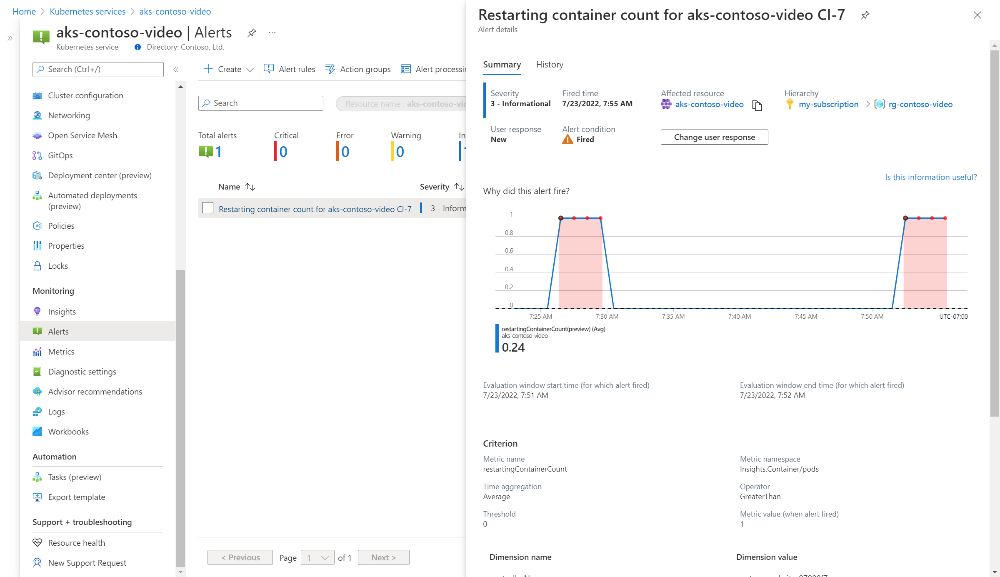

In this exercise, you’ll enable an alert rule and action group to send you a text message when the CPU for a node is running high. You’ll then enable an alert rule to detect when a pod restarts and then test that rule by simulating an error condition.

## Create alert rule for Node CPU

1. From your AKS cluster, select **Insights**.
1. At the top of the screen, select **Recommended alerts**. This displays a list of recommended alert rules. 
   
   :::image type="content" source="../media/image16.png" alt-text="Screenshot to select recommended alerts" border="true":::

2. Locate the alert with the **Rule Name** _Node CPU%_. Click the slider in the **Status** column to change its status to _Enabled_.
3. Click on the _Node CPU%_ name. This will allow you to view the details of the alert rule. 
4. Notice the **Condition** section. It contains a description of the details condition _Whenever the average cpuusagepercentage is greater than 80%_. This means that the alert will fire when the CPU of the node exceeds 80%. The alert will be resolved when the CPU drops below this value.
5. You can click on the condition to modify the threshold if you want, but we’ll leave it at the default. 

## Create action group

1. Click the message **No action group assigned** to create an action group and assign it to the rule that you just enabled.
1. Click **Create action group** to create a new one.
1. Provide an **Action group name** and **Display name** for the new action group and then click on the **Notifications** tab.
1. Select a **Notification type** of _Email/SMS message/Push/Voice_. 
1. Select **SMS** and then type in your phone number to receive the text message.
1. Provide a **Name** for the entry and then click **Review + create** to save the action group.
1. You should receive a text message confirming that your phone is included in the action group.
1. In the **Action Groups** list, select your new action group and select **Apply to rule**.

## Create alert rule for restarting container

The Node CPU alert will be difficult to simulate for a test application, so enable another alert rule that fires when a container is restarted which might be due to an unhandled fault in the application for example. You can use the same action group that you already created to apply to this alert rule.

1. Locate the alert with the **Rule Name** _Restarting container count_. Click the slider in the **Status** column to change its status to _Enabled_.

   :::image type="content" source="../media/image17.png" alt-text="Screenshot enable restarting container count alert rule"  border="true":::

1. Click the message **No action group assigned** to create an action group and assign it to the rule that you just enabled.
1. Select the action group that you created and click **Apply to rule**.

### Test alert

To test the alert rule, trigger a container restart by stopping the primary process in the deployment. Use _kubectl_ to run a shell command in the container to stop the process.

1. In the Azure portal, select the button to launch Cloud Shell.
1. Run the following command to get a command line:

   ```
   kubectl exec -it deploy/contoso-website -- /bin/sh
   ```

1. From the command line, run the following command:

   ```
   # kill 1
   ```

1. You should get output similar to the following:

   ```
   # command terminated with exit code 137
   ```
   :::image type="content" source="../media/image18.png" alt-text="Screenshot with output from " border="true":::

3. Within a minute or so, you should receive a text to the number you specified with a message similar to the following:

   ```
   aks-test:Fired:Sev3 Azure Monitor Alert Restarting container count for aks-contoso-video CI-7 on aks-contoso-video
   ```

4. Go to **Alerts** for your cluster to view the fired alert that should now be displayed.
5. Click on the alert to view its details.

   

6. Within a few minutes, you should receive a second text similar to the following. This is because the container restarted to repair the missing process. Azure Monitor then marked the alert as resolved. 

   ```
   aks-test:Resolved:Sev3 Azure Monitor Alert Restarting container count for aks-contoso-video CI-7 on aks-contoso-video
   ```

7. Go back to the **Alerts** view and note that the alert is no longer listed.
