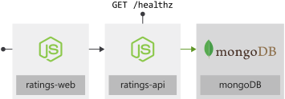

Imagine you're an IT engineer at Fruit Smoothies, a nationwide chain of smoothie shops. The company's development team developed a new website that allows users to rate the company's different smoothy flavors. Fruit Smoothies has outlets worldwide with a large follower base and the company expects many fans to visit the new website. You want to make sure when you deploy the ratings website, you can scale the site quickly when needed.

The ratings website consists of several components. There's a web frontend, a document database that stores captured data, and a RESTful API. The API allows the web frontend to communicate with the database. Since the ratings website may store sensitive data, an additional requirement is to protect the site with an HTTPS certificate.

Fruit Smoothies wants to use Kubernetes as their compute platform. The development teams already use containers for application development and deployment, and using an orchestration platform will introduce many benefits. Kubernetes is a portable, extensible, open-source platform for automating the deployment, scaling, and management of containerized workloads. Kubernetes abstracts away complex container management and provides declarative configuration to orchestrate containers in different compute environments. This orchestration platform give the same ease of use and flexibility as with Platform as a Service (PaaS) and Infrastructure as a Service (IaaS) offerings.

In this module, you'll go through tasks to deploy a multicontainer application to Kubernetes on Azure Kubernetes Service (AKS).

You'll use your Azure subscription to deploy the resources in this workshop. To estimate the expected costs for these resources, see the [preconfigured Azure Calculator estimate](https://aka.ms/aks-workshop-estimate?azure-portal=true) of the resources that you'll deploy.

## Learning objectives

In this module, you will:

- Create an Azure Kubernetes Service cluster
- Choose the best deployment options for your Pods
- Expose Pods to internal and external network users
- Configure SSL/TLS for Azure Kubernetes Service ingress
- Monitor the health of an Azure Kubernetes Service cluster
- Scale your application in an Azure Kubernetes Service cluster

## Prerequisites

- Familiarity with Kubernetes and its concepts. If you're new to Kubernetes, start with the [basics of Kubernetes](https://azure.microsoft.com/topic/what-is-kubernetes/?azure-portal=true).
- An Azure [subscription](https://azure.microsoft.com/free/services/kubernetes-service/?azure-portal=true) to deploy resources in.
- Familiarity with [Azure Cloud Shell](https://shell.azure.com?azure-portal=true).
- A [GitHub](https://github.com/join?azure-portal=true) account.

## Application architecture

Our goal is to deploy an Azure managed Kubernetes service, Azure Kubernetes Service (AKS), that runs the Fruit Smoothies ratings website in the following series of exercises.

:::image type="content" source="../media/02-arch.svg" border="false" alt-text="Diagram that shows the deployed resources on the Azure Kubernetes Service cluster.":::

There are several tasks that you'll complete to show how Kubernetes abstracts away complex container management and provides you with declarative configuration to orchestrate containers.

1. Use AKS to deploy a Kubernetes cluster.

1. Configure an Azure Container Registry to store application container images.

1. Deploy the three ratings application components.

    1. Deploy the Fruit Smoothies website document database using Helm 3.

    1. Deploy the Fruit smoothies RESTFul API using deployment manifests.

    1. Deploy the Fruit smoothies website frontend using deployment manifests.

1. Deploy Azure Kubernetes ingress using Helm 3.

1. Configure SSL/TLS on the controller using `cert-manager`.

1. Configure Azure Monitor for containers to monitor the Fruit Smoothies website deployment.

1. Configure cluster autoscaler and horizontal pod autoscaler for the Fruit Smoothies cluster.

## Source code

The application consists of two components: the API and the front end. Both components are written in Node.js. The API stores data in a MongoDB database.

| Component                | Link                                                                                                           |
|--------------------------|----------------------------------------------------------------------------------------------------------------|
| An API `ratings-api`     | [GitHub repo](https://github.com/MicrosoftDocs/mslearn-aks-workshop-ratings-api?azure-portal=true)             |
| A front end `ratings-web` | [GitHub repo](https://github.com/MicrosoftDocs/mslearn-aks-workshop-ratings-web?azure-portal=true)             |

