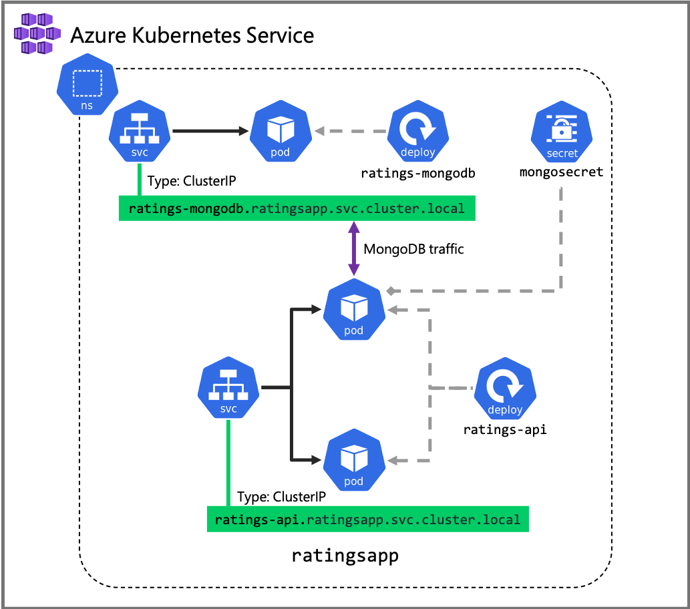

The [ratings API](https://github.com/MicrosoftDocs/mslearn-aks-workshop-ratings-api) is a Node.js application written using the Express framework. It stores and retrieves items and their ratings in a MongoDB.

In the [Create a private, highly available container registry](03-deploy-acr.md) unit, you used Azure Container Registry to build a Docker image of the API and store it in a repository.

In this exercise, you're going to deploy that Docker image of the API to the Azure Kubernetes Service (AKS) by creating a Kubernetes [deployment](https://docs.microsoft.com/en-us/azure/aks/concepts-clusters-workloads#deployments-and-yaml-manifests), and expose it through a load balancer by creating a Kubernetes [service](https://docs.microsoft.com/en-us/azure/aks/concepts-network#services). Additionally, you're going to configure the API to connect to the MongoDB created in the [Deploy MongoDB](05-deploy-mongodb.md) unit by attaching the Kubernetes [secret](https://docs.microsoft.com/en-us/azure/aks/concepts-security#kubernetes-secrets).

[!include[](../../../includes/azure-cloudshell-editor.md)]

## Create a Kubernetes deployment file for the ratings API

1. Sign into the [Azure portal](https://portal.azure.com/?azure-portal=true) with your Azure subscription.

1. Open the Azure Cloud Shell from the Azure portal using the Cloud Shell icon.

    

1. Create a file called `ratings-api-deployment.yaml` using the integrated editor.

    ```azurecli
    code ratings-api-deployment.yaml
    ```

    **Replicas and image**

    You will create a deployment with 2 replicas running the image you pushed in the [Create a private, highly available container registry](03-deploy-acr.md) unit, for example  **`acr4229.azurecr.io/ratings-api:v1`**. The container listens to port **3000**. The deployment and the pods are going to be labeled with **app=ratings-api**.

    > [!NOTE]
    > Make sure to update the `image` value with your own image name and Azure Container Registry repository name.

    **Environment variables and secrets**

    The ratings API expects to find the connection details to the MongoDB in an environment variable named **MONGODB_URI** . By using ``valueFrom`` and ``secretRef``, you can reference values stored in the Kubernetes secret **mongosecret** created when you [deployed MongoDB.](05-deploy-mongodb.md).

    **Resource requests and limits**

    Each container instance will be allocated a minimum **0.25 cores** and **64 Mb of memory**. The Kubernetes scheduler will look for a node with available capacity to schedule such pod. A Container may or may not be allowed to exceed its CPU limit for extended periods of time. However, it will not be killed for excessive CPU usage. If a container exceeds its memory limit, it could be terminated.

    **Readiness and liveness probes**

    The application exposes a health check endpoint at **/healthz**. If the API is unable to connect to MongoDB, the health check endpoint will return a failure. You can use this to configure Kubernetes to check whether the container is healthy and ready to receive traffic.

    ```yaml
    apiVersion: apps/v1
    kind: Deployment
    metadata:
      name: ratings-api
    spec:
      replicas: 2
      selector:
        matchLabels:
          app: ratings-api
      template:
        metadata:
          labels:
            app: ratings-api # the label for the pods and the deployments
        spec:
          containers:
          - name: ratings-api
            image: acr4229.azurecr.io/ratings-api:v1 # IMPORTANT: update with your own repository
            imagePullPolicy: Always
            ports:
            - containerPort: 3000 # the application listens to this port
            env:
            - name: MONGODB_URI # the application expects to find the MongoDB connection details in this environment variable
              valueFrom:
                secretKeyRef:
                  name: mongosecret # the name of the Kubernetes secret containing the data
                  key: MONGOCONNECTION # the key inside the Kubernetes secret containing the data
            resources:
              requests: # minimum resources required
                cpu: 250m
                memory: 64Mi
              limits: # maximum resources allocated
                cpu: 500m
                memory: 256Mi
            readinessProbe: # is the container ready to receive traffic?
              httpGet:
                port: 3000
                path: /healthz
            livenessProbe: # is the container healthy?
              httpGet:
                port: 3000
                path: /healthz
    ```

1. To save and close the editor, open the ``...`` action panel in the top right of the editor and select **Save**, then select **Close editor**.

## Apply the Kubernetes deployment file

1. Apply the configuration using the `kubectl apply` command. You'll be deploying this in the **ratingsapp** namespace.

    ```azurecli
    kubectl apply --namespace ratingsapp -f ratings-api-deployment.yaml
    ```

    You'll see an output like the below.

    ```output
    deployment.apps/ratings-api created
    ```

1. Watch the pods rolling out. You're querying for pods in the **ratingsapp** namespace which are labeled with **app=ratings-api**.

    ```azurecli
    kubectl get pods --namespace ratingsapp --label app=ratings-api -w
    ```

    In a few seconds, you should see the pods transition to the `Running` state. You can use `CTRL+C` to stop watching.

    ```output
    NAME                           READY   STATUS    RESTARTS   AGE
    ratings-api-564446d9c4-6rvvs   1/1     Running   0          42s
    ratings-api-564446d9c4-sz5vz   1/1     Running   0          24s
    ```

    > [!TIP]
    > If the pods are not starting, not ready or are crashing, you can view their logs using `kubectl logs <pod name> --namespace ratingsapp` and `kubectl describe pod <pod name> --namespace ratingsapp`.

1. Check the status of the deployment

    ```azurecli
    kubectl get deployment ratings-api --namespace ratingsapp
    ```

    The deployment should show 2 replicas are ready.

    ```output
    NAME          READY   UP-TO-DATE   AVAILABLE   AGE
    ratings-api   2/2     2            2           2m
    ```

## Create a Kubernetes service file for the ratings API service

To simplify the network configuration for application workloads, Kubernetes uses [Services](https://docs.microsoft.com/en-us/azure/aks/concepts-network#services) to logically group a set of pods together and provide network connectivity.

1. Create a file called `ratings-api-service.yaml` using the integrated editor.

    ```azurecli
    code ratings-api-service.yaml
    ```

    **Selector**

    The set of pods targeted by a service is determined by the selector. In the example below, Kubernetes will load balance traffic to pods that have the label `app: ratings-api`, which was defined when creating the deployment. The controller for the service continuously scans for pods matching that label to add them to the load balancer.

    **Ports**

    A service can map an incoming `port` to a `targetPort`. The incoming port is what the service would respond to, while the target port is what the pods are configured to listen to. For example, the service will be exposed internally within the cluster at `ratings-api.ratingsapp.svc.cluster.local:80` and will load balance the traffic to the ratings-api pods listening on port `3000`.

    **Type**

    A service of type **Cluster IP** creates an internal IP address for use within the cluster. Choosing this value makes the Service only reachable from within the cluster. This is the default service type.

    ```yaml
    apiVersion: v1
    kind: Service
    metadata:
      name: ratings-api
    spec:
      selector:
        app: ratings-api
      ports:
      - protocol: TCP
        port: 80
        targetPort: 3000
      type: ClusterIP
    ```

## Apply the Kubernetes service file to create a load balanced service

1. Apply the configuration using the `kubectl apply` command. You'll be deploying this in the **ratingsapp** namespace.

    ```azurecli
    kubectl apply --namespace ratingsapp -f ratings-api-service.yaml
    ```

    You'll see an output like the below.

    ```output
    service/ratings-api created
    ```

1. Check the status of the service

    ```azurecli
    kubectl get service ratings-api --namespace ratingsapp
    ```

    The service should show an internal IP where it would be accessible. By default, Kubernetes will create a DNS entry mapping to `[service name].[namespace].svc.cluster.local`, meaning this service will also be accessible at `ratings-api.ratingsapp.svc.cluster.local`.

    ```output
    NAME          TYPE        CLUSTER-IP   EXTERNAL-IP   PORT(S)   AGE
    ratings-api   ClusterIP   10.0.40.94   <none>        80/TCP    60s
    ```

1. Validate the endpoints

    Services load balance traffic to the pods through endpoints. The endpoint has the same name as the service. Validate that the service is pointing to 2 endpoints, corresponding to the 2 pods. As you add more replicas, or as pods come and go, Kubernetes automatically keeps the endpoints updated.

    ```azurecli
    kubectl get endpoints ratings-api --namespace ratingsapp
    ```

    You should get a similar output.

    ```output
    NAME          ENDPOINTS                         AGE
    ratings-api   10.244.1.5:3000,10.244.2.6:3000   1h
    ```

## Summary

In this exercise, you created a deployment of the **ratings-api** consisting of 2 replicas and exposed it as an internal (ClusterIP) service.

- **Deployment/ratings-api**. The API, running 2 replicas, which reads the MongoDB connection details by mounting the **mongosecret** as an environment variable.
- **Service/ratings-api**. The API will be exposed internally within the cluster at `ratings-api.ratingsapp.svc.cluster.local:80`.


