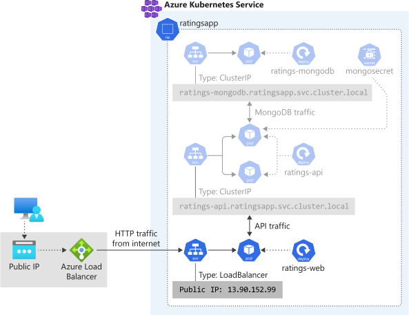

The ratings web frontend is a Node.js application. Recall that you've already created an Azure Container Registry and used it to build a Docker image of the frontend and store it in a repository.

In this exercise, you're going to deploy that Docker image of the frontend to the Azure Kubernetes Service (AKS) by creating a Kubernetes [deployment](https://docs.microsoft.com/azure/aks/concepts-clusters-workloads#deployments-and-yaml-manifests?azure-portal=true), and exposing it through a load balancer by creating a Kubernetes [service](https://docs.microsoft.com/azure/aks/concepts-network#services?azure-portal=true). Additionally, you're going to configure the frontend to connect to the ratings API you've already deployed.

By the end of this unit, you should have deployed the ratings web frontend and configured it to communicate with ratings API. The frontend will be exposed through a public IP.



## Create a Kubernetes deployment file for the ratings web frontend

1. Create a file called `ratings-web-deployment.yaml` using the integrated editor.

    ```bash
    code ratings-web-deployment.yaml
    ```

1. Paste the following text in the file:

    ```yaml
    apiVersion: apps/v1
    kind: Deployment
    metadata:
      name: ratings-web
    spec:
      replicas: 1
      selector:
        matchLabels:
          app: ratings-web
      template:
        metadata:
          labels:
            app: ratings-web # the label for the pods and the deployments
        spec:
          containers:
          - name: ratings-web
            image: <acrname>.azurecr.io/ratings-web:v1 # IMPORTANT: update with your own repository
            imagePullPolicy: Always
            ports:
            - containerPort: 8080 # the application listens to this port
            env:
            - name: API # the application expects to connect to the API at this endpoint
              value: http://ratings-api.ratingsapp.svc.cluster.local
            resources:
              requests: # minimum resources required
                cpu: 250m
                memory: 64Mi
              limits: # maximum resources allocated
                cpu: 500m
                memory: 512Mi
    ```

    In the `image` key update the value replacing `<acrname>` with the name of your Container Registry.

1. Review the file, and note the following points:

    - **Replicas and image**

    You will create a deployment running the image you pushed in Azure Container Registry you created earlier, for example `acr4229.azurecr.io/ratings-web:v1`. The container listens to port **8080**. The deployment and the pods are going to be labeled with **app=ratings-web**.

    - **Environment variables**

    The ratings frontend expects to connect to the API endpoint by configured in an `API` environment variable. If you used the defaults and deployed the ratings API service in the **ratingsapp** namespace, the value of that should be `http://ratings-api.ratingsapp.svc.cluster.local`.

    - **Resource requests and limits**

    Each container instance will be allocated a minimum **0.25 cores** and **64 Mb of memory**. The Kubernetes scheduler will look for a node with available capacity to schedule such pod. A Container may or may not be allowed to exceed its CPU limit for extended periods of time. However, it will not be killed for excessive CPU usage. If a container exceeds its memory limit, it could be terminated.

1. To save and close the editor, open the ``...`` action panel in the top right of the editor and select **Save**, then select **Close editor**. You an also use <kbd>Ctrl-s</kbd> to save, and <kbd>Ctrl-q</kbd> to close the editor.

## Apply the Kubernetes deployment file

1. Apply the configuration using the `kubectl apply` command. You'll be deploying this in the **ratingsapp** namespace.

    ```bash
    kubectl apply --namespace ratingsapp -f ratings-web-deployment.yaml
    ```

    You'll see an output like the below.

    ```output
    deployment.apps/ratings-web created
    ```

1. Watch the pods rolling out. You're querying for pods in the **ratingsapp** namespace which are labeled with **app=ratings-web**.

    ```bash
    kubectl get pods --namespace ratingsapp -l app=ratings-web -w
    ```

    In a few seconds, you should see the pods transition to the `Running` state. You can use `CTRL+C` to stop watching.

    ```output
    NAME                          READY   STATUS    RESTARTS   AGE
    ratings-web-fcc464b8d-vck96   1/1     Running   0          37s
    ```

    If the pods are not starting, not ready or are crashing, you can view their logs using `kubectl logs <pod name> --namespace ratingsapp` and `kubectl describe pod <pod name> --namespace ratingsapp`.

1. Check the status of the deployment

    ```bash
    kubectl get deployment ratings-web --namespace ratingsapp
    ```

    The deployment should show 1 replica is ready.

    ```output
    NAME          READY   UP-TO-DATE   AVAILABLE   AGE
    ratings-web   1/1     1            1           2m
    ```

## Create a Kubernetes service file for the ratings API service

To simplify the network configuration for application workloads, Kubernetes uses [Services](https://docs.microsoft.com/azure/aks/concepts-network#services?azure-portal=true) to logically group a set of pods together and provide network connectivity.

1. Create a file called `ratings-web-service.yaml` using the integrated editor.

    ```bash
    code ratings-web-service.yaml
    ```

1. Paste the following text in the file.

    ```yaml
    apiVersion: v1
    kind: Service
    metadata:
      name: ratings-web
    spec:
      selector:
        app: ratings-web
      ports:
      - protocol: TCP
        port: 80
        targetPort: 8080
      type: LoadBalancer
    ```

1. Review the file, and note the following points:

    - **Selector**

    The set of pods targeted by a service is determined by the selector. In the example below, Kubernetes will load balance traffic to pods that have the label `app: ratings-web`, which was defined when creating the deployment. The controller for the service continuously scans for pods matching that label to add them to the load balancer.

    - **Ports**

    A service can map an incoming `port` to a `targetPort`. The incoming port is what the service would respond to, while the target port is what the pods are configured to listen to. For example, the service will be exposed externally at port `80` and will load balance the traffic to the ratings-web pods listening on port `8080`.

    - **Type**

    A service of type **LoadBalancer** creates an public IP address in Azure and assigns it to the Azure Load Balancer. Choosing this value makes the Service  reachable from outside the cluster.

1. To save and close the editor, open the ``...`` action panel in the top right of the editor and select **Save**, then select **Close editor**. You an also use <kbd>Ctrl-s</kbd> to save, and <kbd>Ctrl-q</kbd> to close the editor.

## Apply the Kubernetes service file to create a load balanced service

1. Apply the configuration using the `kubectl apply` command. You'll be deploying this in the **ratingsapp** namespace.

    ```bash
    kubectl apply \
        --namespace ratingsapp \
        -f ratings-web-service.yaml
    ```

    You'll output similar to the following:

    ```output
    service/ratings-web created
    ```

1. Next, let's check the status of the service. It takes a few minutes for the service to acquire the public IP. Run the following command with a *watch* by adding the `-w` flag to see it updating in real time. You can use <kbd>Ctrl-c</kbd> to stop watching.

    ```bash
    kubectl get service ratings-web --namespace ratingsapp -w
    ```

    The service will show `EXTERNAL-IP` as `<pending>` for a while until it finally changes to an actual IP.

    ```output
    NAME          TYPE           CLUSTER-IP   EXTERNAL-IP    PORT(S)         AGE
    ratings-web   LoadBalancer   10.2.0.112   <pending>      80:32747/TCP    11s
    ratings-web   LoadBalancer   10.2.0.112   13.90.152.99   80:32747/TCP    5m
    ```

    Make note of that EXTERNAL-IP, for example 13.90.152.99, as you'll use it to access the application.

## Test the application

Now that the ratings-web service has a public IP, open that IP in your web browser, for example at **<http://13.90.152.99>** and you should be able to view and interact with the application.


In this exercise, you created a deployment of the **ratings-web** and exposed it to the internet through a LoadBalancer type service.

- **Deployment/ratings-web**. The web frontend.
- **Service/ratings-web**. The load balanced service, which is exposed on the Azure Load Balancer through a public IP.

