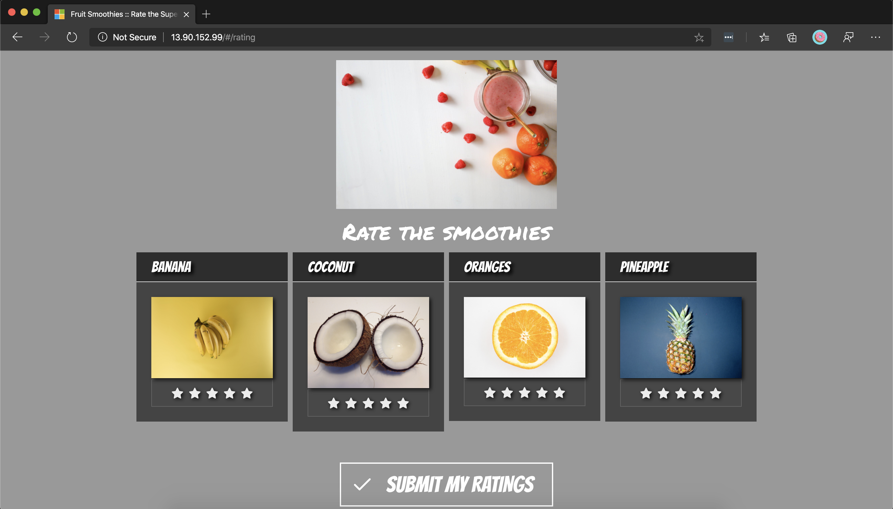

The ratings web front end is a Node.js application. Recall that you've already created an Azure Container Registry instance. You used it to build a Docker image of the front end and store it in a repository.

In this exercise, you deploy that Docker image of the front end to Azure Kubernetes Service (AKS) by creating a Kubernetes [deployment](/azure/aks/concepts-clusters-workloads?azure-portal=true#deployments-and-yaml-manifests). You then expose it through a load balancer by creating a Kubernetes [service](/azure/aks/concepts-network?azure-portal=true#services). Additionally, you configure the front end to connect to the ratings API that you already deployed.

By the end of this unit, you should have deployed the ratings web front end and configured it to communicate with the ratings API. The front end is exposed through a public IP.


## Create a Kubernetes deployment file for the ratings web front end

1. Create a file called `ratings-web-deployment.yaml` by using the integrated editor.

    ```bash
    code ratings-web-deployment.yaml
    ```

1. Paste the following text in the file.

    ```yaml
    apiVersion: apps/v1
    kind: Deployment
    metadata:
      name: ratings-web
    spec:
      selector:
        matchLabels:
          app: ratings-web
      template:
        metadata:
          labels:
            app: ratings-web # the label for the pods and the deployments
        spec:
          containers:
          - name: ratings-web
            image: <acrname>.azurecr.io/ratings-web:v1 # IMPORTANT: update with your own repository
            imagePullPolicy: Always
            ports:
            - containerPort: 8080 # the application listens to this port
            env:
            - name: API # the application expects to connect to the API at this endpoint
              value: http://ratings-api.ratingsapp.svc.cluster.local
            resources:
              requests: # minimum resources required
                cpu: 250m
                memory: 64Mi
              limits: # maximum resources allocated
                cpu: 500m
                memory: 512Mi
    ```

    In the `image` key update, the value replaces `<acrname>` with the name of your Container Registry instance.

1. Review the file, and note the following points:

    - **Image**

       You'll create a deployment running the image you pushed in the Container Registry instance you created earlier, for example, `acr4229.azurecr.io/ratings-web:v1`. The container listens to port `8080`. The deployment and the pods are labeled with `app=ratings-web`.

    - **Environment variables**

       The ratings front end expects to connect to the API endpoint configured in an `API` environment variable. If you used the defaults and deployed the ratings API service in the `ratingsapp` namespace, the value of that should be `http://ratings-api.ratingsapp.svc.cluster.local`.

    - **Resource requests and limits**

       Each container instance is allocated a minimum of 0.25 cores and 64 Mb of memory. The Kubernetes scheduler looks for a node with available capacity to schedule such a pod. A container might or might not be allowed to exceed its CPU limit for extended periods. But it won't be killed for excessive CPU usage. If a container exceeds its memory limit, it could be terminated.

1. To save the file, select <kbd>Ctrl+S</kbd>. To close the editor, select <kbd>Ctrl+Q</kbd>.

## Apply the Kubernetes deployment file

1. Apply the configuration by using the `kubectl apply` command. You'll deploy the application in the `ratingsapp` namespace.

    ```bash
    kubectl apply \
    --namespace ratingsapp \
    -f ratings-web-deployment.yaml
    ```

    You'll see an output like this example.

    ```output
    deployment.apps/ratings-web created
    ```

1. Watch the pods rolling out. You'll query for pods in the `ratingsapp` namespace that are labeled with `app=ratings-web`.

    ```bash
    kubectl get pods --namespace ratingsapp -l app=ratings-web -w
    ```

    In a few seconds, you'll see the pods transition to the `Running` state. Select `CTRL+C` to stop watching.

    ```output
    NAME                          READY   STATUS    RESTARTS   AGE
    ratings-web-fcc464b8d-vck96   1/1     Running   0          37s
    ```

    If the pods aren't starting, aren't ready, or are crashing, you can view their logs by using `kubectl logs <pod name> --namespace ratingsapp` and `kubectl describe pod <pod name> --namespace ratingsapp`.

1. Check the status of the deployment.

    ```bash
    kubectl get deployment ratings-web --namespace ratingsapp
    ```

    The deployment should show that one replica is ready.

    ```output
    NAME          READY   UP-TO-DATE   AVAILABLE   AGE
    ratings-web   1/1     1            1           2m
    ```

## Create a Kubernetes service file for the ratings API service

To simplify the network configuration for application workloads, Kubernetes uses [services](/azure/aks/concepts-network?azure-portal=true#services) to logically group a set of pods together and provide network connectivity.

1. Create a file called `ratings-web-service.yaml` by using the integrated editor.

    ```bash
    code ratings-web-service.yaml
    ```

1. Paste the following text in the file.

    ```yaml
    apiVersion: v1
    kind: Service
    metadata:
      name: ratings-web
    spec:
      selector:
        app: ratings-web
      ports:
      - protocol: TCP
        port: 80
        targetPort: 8080
      type: LoadBalancer
    ```

1. Review the file, and note the following points:

    - **Selector**

       The set of pods targeted by a service is determined by the selector. In the following example, Kubernetes load balances traffic to pods that have the label `app: ratings-web`. The label was defined when you created the deployment. The controller for the service continuously scans for pods that match that label to add them to the load balancer.

    - **Ports**

       A service can map an incoming `port` to `targetPort`. The incoming port is what the service responds to. The target port is what the pods are configured to listen to. For example, the service is exposed externally at port `80` and load balances the traffic to the ratings-web pods listening on port `8080`.

    - **Type**

       A service of type **LoadBalancer** creates a public IP address in Azure and assigns it to Azure Load Balancer. Choosing this value makes the service reachable from outside the cluster.

1. To save the file, select <kbd>Ctrl+S</kbd>. To close the editor, select <kbd>Ctrl+Q</kbd>.

## Apply the Kubernetes service file to create a load-balanced service

1. Apply the configuration by using the `kubectl apply` command. Deploy the service in the `ratingsapp` namespace.

    ```bash
    kubectl apply \
        --namespace ratingsapp \
        -f ratings-web-service.yaml
    ```

    You'll see an output like this example.

    ```output
    service/ratings-web created
    ```

1. Next, let's check the status of the service. It takes a few minutes for the service to acquire the public IP. Run the following command with a *watch* by adding the `-w` flag to see it update in real time. Select <kbd>Ctrl+C</kbd> to stop watching.

    ```bash
    kubectl get service ratings-web --namespace ratingsapp -w
    ```

    The service shows `EXTERNAL-IP` as `<pending>` for a while until it finally changes to an actual IP.

    ```output
    NAME          TYPE           CLUSTER-IP   EXTERNAL-IP    PORT(S)         AGE
    ratings-web   LoadBalancer   10.2.0.112   <pending>      80:32747/TCP    11s
    ratings-web   LoadBalancer   10.2.0.112   13.90.152.99   80:32747/TCP    5m
    ```

    Make note of that EXTERNAL-IP, for example, `13.90.152.99`. You'll use the address to access the application.

## Test the application

Now that the ratings-web service has a public IP, open the IP in a web browser, for example, at <http://13.90.152.99>, to view and interact with the application.



In this exercise, you created a deployment of **ratings-web** and exposed it to the internet through a LoadBalancer type service.

- **Deployment/ratings-web**: The web front end.
- **Service/ratings-web**: The load-balanced service, which is exposed on Azure Load Balancer through a public IP.
