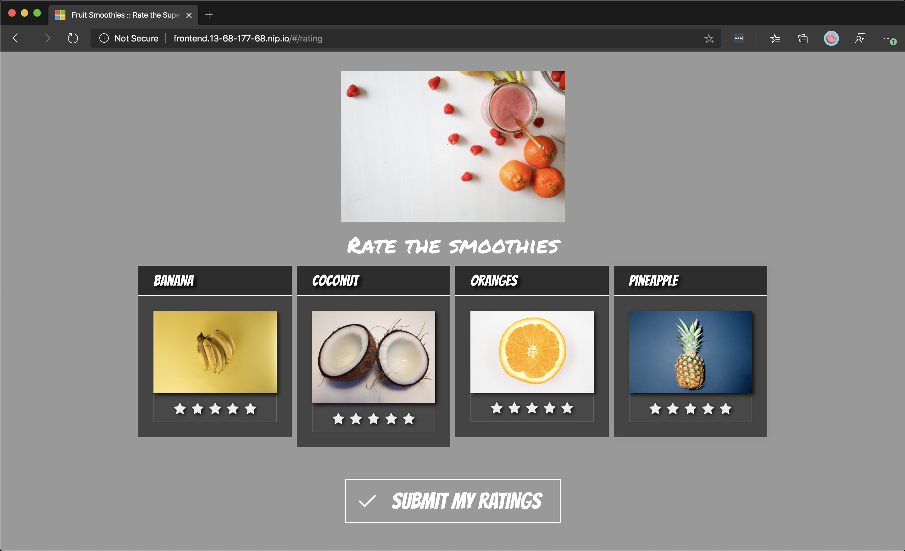

In the previous units, we exposed the Fruit Smoothies' ratings website and RESTfull API in two different ways for allowing access to each instance. The API is exposed via a ratings-api service using a *ClusterIP* that creates an internal IP address for use within the cluster. Recall, choosing this value makes the service reachable only from within the cluster. The website is exposed via a ratings-web service using a *LoadBalancer* that creates a public IP address in Azure and assigns it to Azure Load Balancer. Recall, choosing this value makes the service reachable from outside the cluster.

Even though the load balancer exposes the ratings website via a publicly accessible IP, there are limitations that we need to consider.

Let's assume the Fruit Smoothies' development team decides to extend the project by adding a video upload website. Fans of Fruit Smoothies can submit videos of how they're enjoying their smoothies at home, at the beach, or work. The current ratings website responds at `FruitSmoothies.com`. When we deploy the new video site, we want the new site to respond at `fruitsmoothies.com/videos` and the ratings site at `fruitsmoothies.com/ratings`.

If we continue to use the load balancer solution, we'll need to deploy a separate load balancer on the cluster and map its IP address to a new Fully Qualified Domain Name (FQDN), for example, `videos.fruitsmoothies.com`. To implement the required URL-based routing configuration, we'll need to install additional software outside of our cluster.

The extra effort is that a Kubernetes load balancer service is a Layer 4 load balancer. Layer 4 load balancers only deal with routing decisions between IPs addresses, TCP, and UDP ports. Kubernetes provides us with an option to simplify the above configuration by using an ingress controller.

:::image type="content" source="../media/07-arch-4.svg" border="false" alt-text="Diagram that shows the deployed resources on the Azure Kubernetes Service cluster.":::

In this exercise, we'll use an ingress controller and ingress rules that allow a single IP address to route traffic to multiple services in a Kubernetes cluster.

Before we start with the exercise steps, let's define some of the items mentioned.

### What is Kubernetes ingress?

A Kubernetes ingress controller is a piece of software that provides layer 7 load balancer features. Features such as reverse proxy, configurable traffic routing, and TLS termination for Kubernetes services. We install the ingress controller and configure it to replace our load balancer. With the ingress controller, we can now do all load balancing, authentication, TSL/SSL, and URL-based routing configuration without the need for extra software outside of the cluster.

:::image type="content" source="../media/07-ratings-web-ingress.png" alt-text="Screenshot of the ratings-web application." loc-scope="other"::: <!-- no-loc -->

There are several options for running Kubernetes ingress on Azure Kubernetes Service (AKS), such as Azure Application Gateway, Ambassador, HAProxy, Kong, NGINX, and Traefik. The ingress controllers are exposed to the internet by using a Kubernetes service of type LoadBalancer. The ingress controller watches and implements Kubernetes ingress resources, which create routes to application endpoints. Here, we'll deploy a basic Kubernetes ingress controller by using NGINX. Then we'll configure the ratings front-end service to use that ingress for traffic.

## Deploy the NGINX ingress controller with Helm

NGINX ingress controller is deployed as any other deployment in Kubernetes. We can either use a Deployment manifest file and specify the NGINX ingress controller image or we can use a nginx-ingress Helm chart. The NGINX helm chart simplifies the deployment configuration required for the ingress controller. For example, we don't need to define a configuration mapping or configure a service account for the NGINX deployment. Here, we'll use a Helm chart to install the ingress controller on our cluster.

1. Start by creating a namespace for the ingress.

    ```bash
    kubectl create namespace ingress
    ```

1. Next, install the NGINX ingress controller. NGINX ingress is part of the stable Helm repository we configured earlier when we installed MongoDB. We'll install two replicas of the NGINX ingress controllers are deployed with the `--set controller.replicaCount` parameter for added redundancy. Make sure to schedule the controller only on Linux nodes as Windows Server nodes shouldn't run the ingress controller. We specify a node selector by using the `--set nodeSelector` parameter to tell the Kubernetes scheduler to run the NGINX ingress controller only on Linux-based nodes.

    ```bash
    helm install nginx-ingress stable/nginx-ingress \
        --namespace ingress \
        --set controller.replicaCount=2 \
        --set controller.nodeSelector."beta\.kubernetes\.io/os"=linux \
        --set defaultBackend.nodeSelector."beta\.kubernetes\.io/os"=linux
    ```

1. After the installation is finished, we'll see an output similar to this example.

    ```output
    NAME: nginx-ingress
    LAST DEPLOYED: Mon Jan  6 15:18:42 2020
    NAMESPACE: ingress
    STATUS: deployed
    REVISION: 1
    TEST SUITE: None
    NOTES:
    The nginx-ingress controller has been installed.
    It may take a few minutes for the LoadBalancer IP to be available.
    You can watch the status by running 'kubectl --namespace ingress get services -o wide -w nginx-ingress-controller'
    ```

1. Next, let's check the public IP of the ingress service. It takes a few minutes for the service to acquire the public IP. Run the following command with a *watch* by adding the `-w` flag to see it update in real time. Select <kbd>Ctrl+C</kbd> to stop watching.

    ```bash
    kubectl get service nginx-ingress-controller --namespace ingress -w
    ```

    The service shows `EXTERNAL-IP` as `<pending>` for a while until it finally changes to an actual IP.

    ```output
    NAME                       TYPE           CLUSTER-IP    EXTERNAL-IP      PORT(S)                      AGE
    nginx-ingress-controller   LoadBalancer   10.2.0.162    13.68.177.68     80:32010/TCP,443:30245/TCP   3m30s
    ```

    Make a note of that EXTERNAL-IP, for example, 13.68.177.68.

## Edit the Kubernetes service file for the ratings web service

There's no need to use a public IP for the service because we're going to expose the deployment by using an ingress. That's why we can set the type of service to be `ClusterIP` instead of `LoadBalancer`.

1. Edit the file called `ratings-web-service.yaml` by using the integrated editor.

    ```bash
    code ratings-web-service.yaml
    ```

1. Replace the existing content in the file with the following text. Note the change of the service `type` to `ClusterIP`.

    ```yaml
    apiVersion: v1
    kind: Service
    metadata:
      name: ratings-web
    spec:
      selector:
        app: ratings-web
      ports:
      - protocol: TCP
        port: 80
        targetPort: 8080
      type: ClusterIP
    ```

1. To save the file, select <kbd>Ctrl+S</kbd>. To close the editor, select <kbd>Ctrl+Q</kbd>.

1. We can't change the value of `type` on a deployed service isn't allowed. We have to delete the service and re-create it with the changed configuration.

    Run the following command to delete the service.

    ```bash
    kubectl delete service \
        --namespace ratingsapp \
        ratings-web
    ```

    Then, run the following command to re-create the service.

    ```bash
    kubectl apply \
        --namespace ratingsapp \
        -f ratings-web-service.yaml
    ```

## Create an ingress route file for the ratings web service

1. Edit the file called `ratings-web-ingress.yaml` by using the integrated editor.

    ```bash
    code ratings-web-ingress.yaml
    ```

1. Paste the following text in the file.

    ```yaml
    apiVersion: networking.k8s.io/v1beta1
    kind: Ingress
    metadata:
      name: ratings-web-ingress
      annotations:
        kubernetes.io/ingress.class: nginx
    spec:
      rules:
      - host: frontend.<ingress ip>.nip.io # IMPORTANT: update <ingress ip> with the dashed public IP of your ingress, for example frontend.13-68-177-68.nip.io
        http:
          paths:
          - backend:
              serviceName: ratings-web
              servicePort: 80
            path: /
    ```

    In this file, update the `<ingress ip>` value in the `host` key with the *dashed* public IP of our ingress that we retrieved earlier, for example, `frontend.13-68-177-68.nip.io`. This value allows us to access the ingress via a host name instead of an IP address. In the next unit, we'll configure SSL/TLS on that host name.

    > [!NOTE]
    > In this example, we use [nip.io](https://nip.io), which is a free service that provides wildcard DNS. We can use alternatives such as [xip.io](http://xip.io) or [sslip.io](https://sslip.io). Alternatively, ew can use our own domain name and set up the proper DNS records.

1. To save the file, select <kbd>Ctrl+S</kbd>. To close the editor, select <kbd>Ctrl+Q</kbd>.

## Apply the Kubernetes ingress route file to create a load-balanced service

1. Apply the configuration by using the `kubectl apply` command. We'll deploy the ingress route file in the `ratingsapp` namespace.

    ```bash
    kubectl apply \
        --namespace ratingsapp \
        -f ratings-web-ingress.yaml
    ```

    We'll see an output similar to this example.

    ```output
    ingress.networking.k8s.io/ratings-web-ingress created
    ```

## Test the application

Open the host name we configured on the ingress in a web browser to view and interact with the application. For example, at http:\//frontend.13-68-177-68.nip.io.



In this exercise, we deployed an NGINX ingress controller and updated the **ratings-web** service to be accessible only from within the cluster. We then created an ingress route to reverse proxy the deployment of the **ratings-web** service through a host name.
