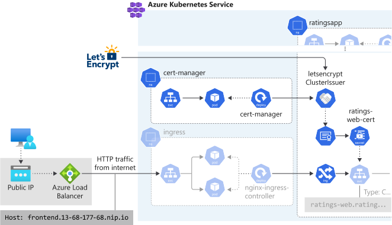
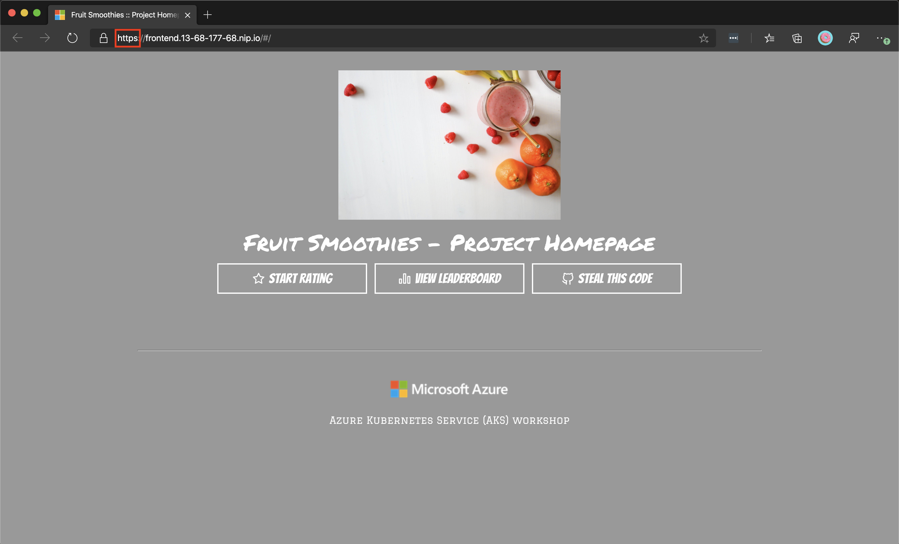
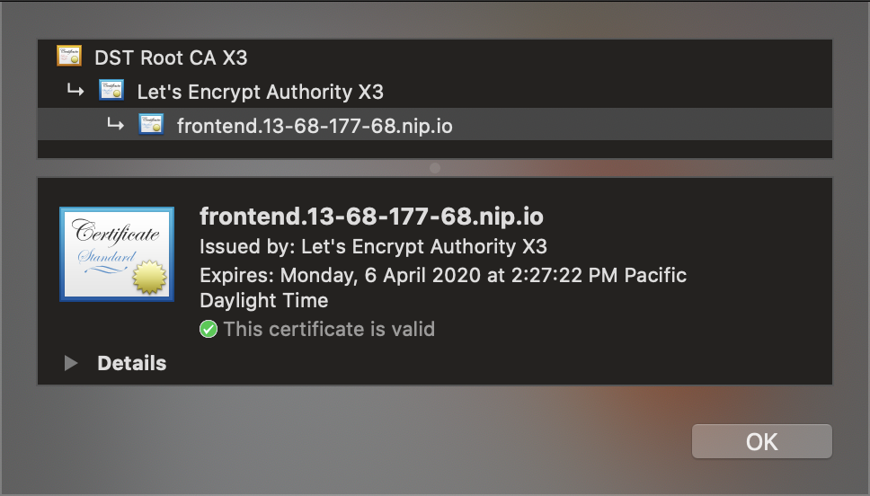

The NGINX ingress controller supports TLS termination. There are several ways to retrieve and configure certificates for HTTPS. This unit demonstrates using [cert-manager](https://github.com/jetstack/cert-manager), which provides automatic [Let's Encrypt](https://letsencrypt.org/) certificate generation and management functionality.

In this exercise, you're going to deploy cert-manager, configure it to automatically issue Let's Encrypt certificates and configure the ingress created before to serve encrypted SSL/TLS traffic through the generated certificates.



## Install cert-manager

Install cert-manager using Helm and configure it to use Let's Encrypt as the certificate issuer.

1. Create a namespace for the cert-manager.

    ```bash
    kubectl create namespace cert-manager
    ```

1. cert-manager is available in the Jetstack Helm repository. Add the Jetstack Helm repository.

    ```bash
    helm repo add jetstack https://charts.jetstack.io
    helm repo update
    ```

1. We can now go ahead and install cert-manager. Install the cert-manager Custom Resource Definition (CRD).

    ```bash
    kubectl apply --validate=false -f https://raw.githubusercontent.com/jetstack/cert-manager/release-0.13/deploy/manifests/00-crds.yaml
    ```

1. Install the cert-manager Helm chart

    ```bash
    helm install cert-manager \
        --namespace cert-manager \
        --version v0.13.0 \
        jetstack/cert-manager
    ```

1. Once released, you should get an output similar to this.

    ```output
    NAME: cert-manager
    LAST DEPLOYED: Tue Jan  7 13:11:19 2020
    NAMESPACE: cert-manager
    STATUS: deployed
    REVISION: 1
    TEST SUITE: None
    NOTES:
    cert-manager has been deployed successfully!
    ```

1. Verify the installation by checking the `cert-manager` namespace for running pods.

    ```bash
    kubectl get pods --namespace cert-manager
    ```

    You should see the `cert-manager`, `cert-manager-cainjector`, and `cert-manager-webhook` pod in a **Running** state. It may take a minute or so for the TLS assets required for the webhook to function to be provisioned.

    ```output
    NAME                                       READY   STATUS    RESTARTS   AGE
    cert-manager-5c6866597-zw7kh               1/1     Running   0          2m
    cert-manager-cainjector-577f6d9fd7-tr77l   1/1     Running   0          2m
    cert-manager-webhook-787858fcdb-nlzsq      1/1     Running   0          2m
    ```
    
## Create a Kubernetes configuration file for ClusterIssuer with Let's Encrypt

In order to begin issuing certificates, you will need to set up a ClusterIssuer. The cluster issuer acts as an interface to a certificate issuing service, for example to Let's Encrypt.

1. Edit the file called `cluster-issuer.yaml` using the integrated editor.

    ```bash
    code cluster-issuer.yaml
    ```

1. Replace the existing content in the file with the following text. Note the change of the service `type` to `ClusterIP`.

    ```yaml
    apiVersion: cert-manager.io/v1alpha2
    kind: ClusterIssuer
    metadata:
      name: letsencrypt
    spec:
      acme:
        server: https://acme-v02.api.letsencrypt.org/directory
        email: <your email> # IMPORTANT: Replace with a valid email from your organization
        privateKeySecretRef:
          name: letsencrypt
        solvers:
        - http01:
            ingress:
              class: nginx
    ```

    In the `email` key update the value replacing `<your email>` with a valid email from your organization.

1. To save and close the editor, open the ``...`` action panel in the top right of the editor and select **Save**, then select **Close editor**. You an also use <kbd>Ctrl-s</kbd> to save, and <kbd>Ctrl-q</kbd> to close the editor.

## Apply the cluster issuer configuration to create a cluster issuer

1. Apply the configuration using the `kubectl apply` command. You'll be deploying this in the **ratingsapp** namespace.

    ```bash
    kubectl apply \
        --namespace ratingsapp \
        -f cluster-issuer.yaml
    ```

    You'll output similar to the following:

    ```output
    clusterissuer.cert-manager.io/letsencrypt created
    ```

## Edit the Kubernetes ingress file for the ratings web service to enable SSL/TLS

1. Edit the file called `ratings-web-ingress.yaml` using the integrated editor.

    ```bash
    code ratings-web-ingress.yaml
    ```

1. Replace the existing content in the file with the following text. Note the addition of the `cert-manager.io/issuer` annotation and the new `tls` section.

    ```yaml
    apiVersion: networking.k8s.io/v1beta1
    kind: Ingress
    metadata:
      name: ratings-web-ingress
      annotations:
        kubernetes.io/ingress.class: nginx
        cert-manager.io/cluster-issuer: letsencrypt
    spec:
      tls:
        - hosts:
          - frontend.<ingress ip>.nip.io # IMPORTANT: update <ingress ip> with the dashed public IP of your ingress, for example frontend.13-68-177-68.nip.io
          secretName: ratings-web-cert
      rules:
      - host: frontend.<ingress ip>.nip.io # IMPORTANT: update <ingress ip> with the dashed public IP of your ingress, for example frontend.13-68-177-68.nip.io
        http:
          paths:
          - backend:
              serviceName: ratings-web
              servicePort: 80
            path: /
    ```

    In this file, update the `<ingress ip>` value in the `host` key with the *dashed* public IP of your ingress that you retrieved earlier. For example, **frontend.13-68-177-68.nip.io**. This will allow you to access the ingress via a hostname instead of an IP address.

1. To save and close the editor, open the ``...`` action panel in the top right of the editor and select **Save**, then select **Close editor**. You an also use <kbd>Ctrl-s</kbd> to save, and <kbd>Ctrl-q</kbd> to close the editor.

## Apply the updated Kubernetes ingress file

1. Apply the configuration using the `kubectl apply` command. You'll be deploying this in the **ratingsapp** namespace.

    ```bash
    kubectl apply \
        --namespace ratingsapp \
        -f ratings-web-ingress.yaml
    ```

    You'll see an output like the below.

    ```output
    ingress.networking.k8s.io/ratings-web-ingress configured
    ```

1. Verify that the certificate has been issued.

    ```bash
    kubectl describe cert ratings-web-cert --namespace ratingsapp
    ```

    You should get an output similar to the this.

    ```output
    Name:         ratings-web-cert
    Namespace:    ratingsapp
    API Version:  cert-manager.io/v1alpha2
    Kind:         Certificate

    [..]

    Spec:
      Dns Names:
        frontend.13-68-177-68.nip.io
      Issuer Ref:
        Group:      cert-manager.io
        Kind:       ClusterIssuer
        Name:       letsencrypt
      Secret Name:  ratings-web-cert
    Status:
      Conditions:
        Last Transition Time:  2020-01-07T22:27:23Z
        Message:               Certificate is up to date and has not expired
        Reason:                Ready
        Status:                True
        Type:                  Ready
      Not After:               2020-04-06T21:27:22Z
    Events:
      Type    Reason        Age   From          Message
      ----    ------        ----  ----          -------
      Normal  GeneratedKey  36s   cert-manager  Generated a new private key
      Normal  Requested     36s   cert-manager  Created new CertificateRequest resource "ratings-web-cert-1603291776"
      Normal  Issued        34s   cert-manager  Certificate issued successfully
    ```

## Test the application

You should be able to open the hostname you configured on the ingress in your web browser over SSL/TLS, for example at **<https://frontend.13-68-177-68.nip.io>** to view and interact with the application.



Verify that the frontend is accessible over HTTPS and that the certificate is valid.

<!--  -->


In this exercise, you deployed cert-manager, configured it to automatically issue Let's Encrypt certificates and configured the ingress created before to serve encrypted SSL/TLS traffic through the generated certificates.
