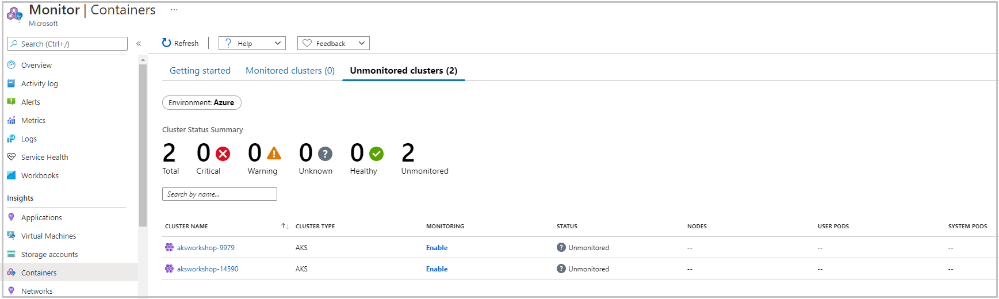
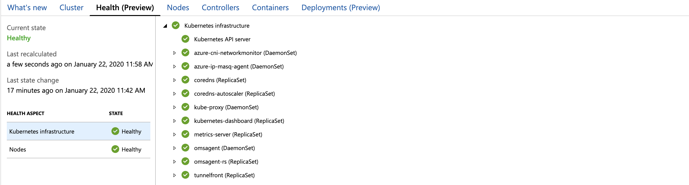
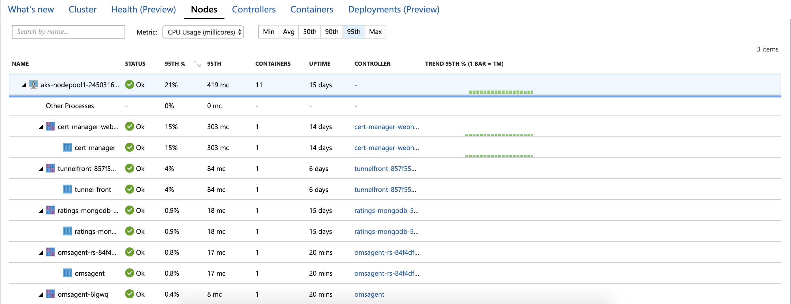
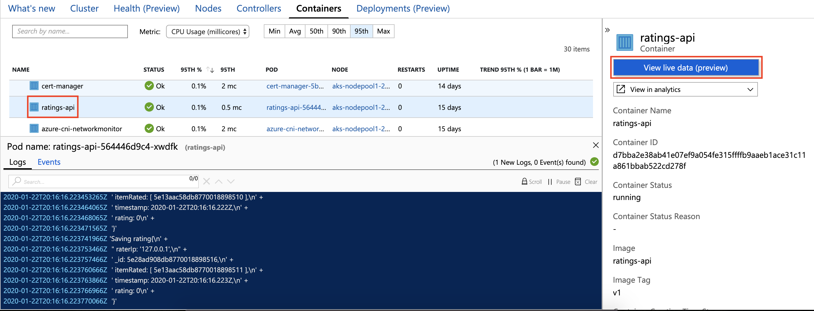

The ongoing performance of our cluster relies on the fact that we can monitor the different components in our application, view logs, and get alerts whenever our application goes down or some parts of it fail. We can use a combination of available tools to set up alerting capabilities for our application.  

In this exercise, we'll explore some of these tools. First, we'll create a Log Analytics workspace and enable Azure Monitor for containers. We'll then inspect the Kubernetes event logs and monitor our cluster's health.

Before we start with the exercise steps, let's define some of the items we've mentioned.

### What is Azure Monitor for containers?

[Azure Monitor for containers](https://docs.microsoft.com/azure/azure-monitor/insights/container-insights-overview?azure-portal=true) is a comprehensive monitoring solution for Kubernetes. This solution gives us insight into the performance of our cluster by collecting memory and processor metrics from controllers, nodes, and containers.

### What is a Log Analytics workspace?

A [Log Analytics workspace](https://docs.microsoft.com/azure/azure-monitor/learn/quick-create-workspace?azure-portal=true) is a container that includes data and configuration information and is used by [Azure Monitor](https://docs.microsoft.com/azure/azure-monitor/overview?azure-portal=true) to store log data. We also use our workspace to manage access to the data logged.

## Create a Log Analytics workspace

We'll use Azure Monitor's Log Analytics to store monitoring data, events, and metrics from our Kubernetes cluster and the applications. We'll pre-create the Log Analytics workspace in our assigned environment resource group

1. Let's sign into the [Azure Cloud Shell](https://shell.azure.com/?azure-portal=true) with our Azure account.

1. Run the following command to create the workspace. We'll name the workspace **aksworkshop-workspace** and use the same resource group and region as our Azure Kubernetes Service (AKS) cluster, for example, **aksworkshop** in **East US**.

    ```bash
    az resource create --resource-type Microsoft.OperationalInsights/workspaces \
            --name aksworkshop-workspace \
            --resource-group aksworkshop \
            --location eastus \
            --properties '{}' -o table
    ```

## Enable the monitoring addon

Once our workspace is ready, we can integrate the Azure Monitor for containers monitoring addon into it.

1. We need the **resource id** of our workspace to enable the addon. Run the following command to retrieve and store it in a Bash variable named `WORKSPACE_ID`.

    ```azurecli
    WORKSPACE_ID=$(az resource show --resource-type Microsoft.OperationalInsights/workspaces \
        --resource-group aksworkshop \
        --name aksworkshop-workspace \
        --query "id" -o tsv)
    ```

1. Next, enable the monitoring addon by running the command below.

    ```bash
    az aks enable-addons \
        --resource-group aksworkshop \
        --name $AKS_CLUSTER_NAME \
        --addons monitoring \
        --workspace-resource-id $WORKSPACE_ID
    ```

    > [!NOTE]
    > It may take some time to establish monitoring data flow for newly created clusters. Please allow at least 5-10 minutes for data to appear for our cluster.

## Inspect the Kubernetes event or logs and monitor cluster health

We can view utilization reports and charts for our cluster in the Azure portal using Azure Monitor. Azure monitor gives us a global perspective of all containers deployed across our subscriptions and resource groups. From here, we can track containers that are monitored and those containers that aren't and inspect each container's statistics individually.

1. Switch to the [Azure portal](https://portal.azure.com?azure-portal=true).

1. Select **Azure Monitor** from the left pane in the Azure portal.

1. Under the **Insights** section, select **Containers** to see a list of all clusters that we have access to.

1. Select the **Cluster** tab at the top of the view to check the cluster utilization. Notice how this view is again a high-level view that provides us a view on the cluster, nodes, controllers, and containers.

    [](../media/09-clusterutilization.png#lightbox)

1. Select the **Health** tab at the top of the view to get view on how the Kubernetes infrastructure services of the cluster are doing.

    [](../media/09-clusterhealth.png#lightbox)

1. Select the **Nodes** tab at the top of the view to get a detailed view of our nodes' health and pods in the cluster.

    [](../media/09-podmetrics.png#lightbox)

## View the live container logs and Kubernetes events

In addition to the high-level overview of our cluster's health, we can also view live log data of specific containers.

To enable and set permissions for the agent to collect the data, we'll first create a *Role* that has access to pod logs and events. Then we'll assign permissions to users using a *RoleBinding*.

In our exercise, we want to set up *Roles* and *RoleBindings that aren't limited to a specific namespace. We can configure Roles* and *RoleBindings* to grant permissions and bind roles to users across the entire cluster or to cluster resources outside a given namespace.

1. Create a file called `logreader-rbac.yaml` using the integrated editor.

    ```bash
    code logreader-rbac.yaml
    ```

1. Paste the following text in the file.

    ```yaml
    apiVersion: rbac.authorization.k8s.io/v1
    kind: ClusterRole
    metadata:
        name: containerHealth-log-reader
    rules:
        - apiGroups: ["", "metrics.k8s.io", "extensions", "apps"]
          resources:
             - "pods/log"
             - "events"
             - "nodes"
             - "pods"
             - "deployments"
             - "replicasets"
          verbs: ["get", "list"]
    ---
    apiVersion: rbac.authorization.k8s.io/v1
    kind: ClusterRoleBinding
    metadata:
        name: containerHealth-read-logs-global
    roleRef:
        kind: ClusterRole
        name: containerHealth-log-reader
        apiGroup: rbac.authorization.k8s.io
    subjects:
    - kind: User
      name: clusterUser
      apiGroup: rbac.authorization.k8s.io
    ```

1. To save and close the editor, open the ``...`` action panel in the top right of the editor and select **Save**, then select **Close editor**. We can also use <kbd>Ctrl-s</kbd> to save, and <kbd>Ctrl-q</kbd> to close the editor.

1. Apply the configuration using the `kubectl apply` command.

    ```bash
    kubectl apply \
        -f logreader-rbac.yaml
    ```

1. Switch back to the AKS cluster on the Azure portal.

1. Select **Insights** under **Monitoring**

1. Select the **Controllers** tab and pick a container to view its live logs or event logs.For example, pick the **ratings-api** container. The new view will allow us to debug the status of the container.

    [](../media/09-livelogs.png#lightbox)
