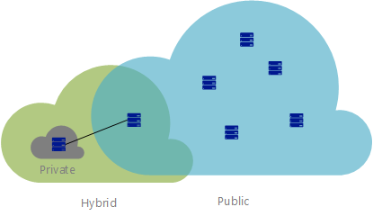

Imagine you work at a healthcare company. You have legacy systems, line-of-business systems, and future plans for new systems. You've heard there are advantages to using cloud computing. How do you choose the best deployment model for different solutions: public, private, or hybrid cloud?

## What's cloud computing?

Cloud computing is the provisioning of services and applications on demand over the internet. Servers, applications, data, and other resources are provided as a service.

To the user, the details of the services are abstracted. You can quickly provision computing resources and use the service with minimal management. You shouldn't think of cloud computing as a datacenter available through the internet. Cloud computing uses virtualization, commodity hardware, and automated processes to provide a self-service user experience to customers, similar to a public utility.

There are three deployment models for cloud computing: public cloud, private cloud, and hybrid cloud. The following illustration shows an overview of these deployment models:

### Public versus Private versus Hybrid

> [!VIDEO https://www.microsoft.com/videoplayer/embed/RE2yEv7]

## Public cloud

Public clouds are the most common way of deploying cloud computing. Services are offered over the public internet and available to anyone who wants to purchase them. The cloud resources, such as servers and storage, are owned and operated by a third-party cloud service provider and delivered over the internet. Services may be free or sold on demand, allowing customers to pay only per usage for the CPU cycles, storage, or bandwidth they consume. Microsoft Azure is an example of a public cloud.

Let's imagine your healthcare company needs an enrollment website. The site needs to scale and be responsive during peak enrollment at various times during the year. Your customers access the site from global locations. You can use the public cloud to automatically scale up to meet demand at peak enrollment. When site traffic is low, your site can scale down to save costs. Your site is responsive at peak demand, and you only pay for more resources when needed. You can also deploy your website in multiple geographic regions to increase reliability and responsiveness.

During your website's development, developers want to create multiple development environments to speed their development process. Developers can use the public cloud to quickly provision virtual machines for sandboxed environments to develop a solution. When the developers no longer need an environment, they can delete it.

### Why public cloud?

Public clouds can be deployed faster than on-premises infrastructures and with an almost infinitely scalable platform. Every employee of a company can use the same application from any office or branch, using their device of choice, as long as they can access the internet.

Examples of why you'd use public cloud:

- **Service consumption through on-demand or subscription model**: The on-demand or subscription model allows you to pay for the portion of CPU, storage, and other resources that you use or reserve.
- **No up-front investment in hardware**: No requirement to purchase, manage, and maintain on-premises hardware and application infrastructure. The cloud service provider is held responsible for all management and maintenance of the system.
- **Automation**: Quickly provision infrastructure resources using a web portal, scripts, or automation.
- **Geographic dispersion**: Store data near your users or in desired locations without having to maintain your own datacenters.
- **Reduced hardware maintenance**: The service provider is responsible for hardware maintenance.

## Private cloud

A private cloud consists of computing resources used exclusively by users from one business or organization. It can be physically located at your organization’s on-site datacenter, or it can be hosted by a third-party service provider. The term private cloud should not be considered a rebranding of traditional on-premises datacenters. A private cloud uses on-premises infrastructure and services to provide similar benefits of the public cloud. It uses an abstraction platform to provide *cloud-like* services such as Kubernetes clusters, or a complete cloud environment like Azure Stack. The organization is responsible for purchasing, configuring, and maintaining the hardware. Communication between the systems is usually on the network infrastructure that the business owns and maintains; for example, a private internal network or a dedicated fiber-optic connection between buildings.

Imagine you work at a healthcare company and you have an application that's in use at one of your datacenters. The operating environment can't be replicated in the public cloud. You have a new requirement to access data at another one of your datacenters. The database containing the data needs to remain at the other site because of regulatory compliance. This scenario is a private cloud. You have two datacenters your organization owns. You could use a public-cloud VPN over the internet to connect the datacenters. However, the scenario would be considered a private cloud, since the solution is private to the organization.

### Why private cloud?

A private cloud can provide more flexibility to an organization. Your organization can customize its cloud environment to meet specific business needs. Since resources are not shared with others, high levels of control and security are possible. Also, private clouds can provide a level of scalability and efficiency.

Examples of why you'd use private cloud:

- **Pre-existing environment**: An existing operating environment that can't be replicated in the public cloud. A large investment in hardware and employees with solution expertise. A large organization may choose to commoditize their computing resources.
- **Legacy applications**: Business-critical legacy applications that can't easily be physically relocated.
- **Data sovereignty and security**: Political borders and legal requirements may dictate where data can physically exist.
- **Regulatory compliance / certification**:  PCI or HIPAA compliance. Certified on-premises datacenter.

## Hybrid cloud

A hybrid cloud is a computing environment that combines a public cloud and a private cloud by allowing data and applications to be shared between them. When computing and processing demand fluctuates, hybrid-cloud computing gives businesses the ability to seamlessly scale their on-premises infrastructure up to the public cloud to handle any overflow without giving third-party datacenters access to the entirety of their data. Organizations gain the flexibility and computing power of the public cloud for basic and non-sensitive computing tasks, while keeping business-critical applications and data on-premises safely behind a company firewall.

Using a hybrid cloud helps eliminate the need to make up-front capital expenditures to handle short-term spikes in demand. It also has the flexibility to manage which resources are local versus resources in the cloud. Companies pay only for resources they temporarily use instead of having to purchase, program, and maintain additional resources and equipment that could remain idle over long periods of time. Integration is generally through a secure VPN between cloud providers like Azure and on-premises datacenters.

Imagine you work at a healthcare company and you have an application where customers can access their healthcare information. A regulation requires that the data needs to remain at a physical location. The customer website needs to be responsive to its many global users. As a solution, the database could be hosted in an on-premises datacenter, and the website could be hosted in the public cloud. You could use a VPN between the on-premises datacenter and the public cloud. This scenario would be considered a hybrid cloud.

### Why hybrid cloud?

A hybrid cloud allows your organization to control and maintain a private infrastructure for sensitive assets. It also gives you the flexibility to take advantage of additional resources in the public cloud when you need them. With the ability to scale to the public cloud, you pay for extra computing power only when needed. It can also ease transitioning to the cloud. You can migrate gradually by phasing in workloads over time.

Examples of why you'd use hybrid cloud:

- **Existing hardware investment**: Business reasons require that you use an existing operating environment and hardware.
- **Regulatory requirements**: Regulation requires that the data needs to remain at a physical location.
- **Unique operating environment**: Public cloud can't replicate a legacy operating environment.
- **Migration**: Move workloads to the cloud over time.
