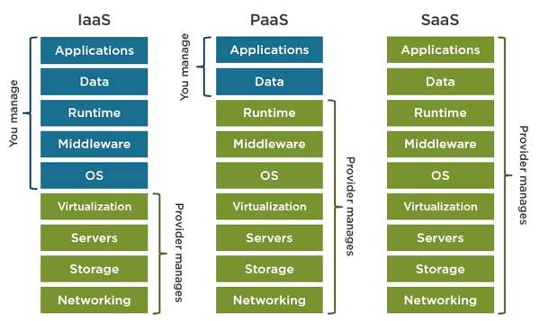

Cloud computing resources are delivered using three different service models:

- **Infrastructure as a service (IaaS)** provides instant computing infrastructure that you can provision and manage over the Internet.
- **Platform as a service (PaaS)** provides ready-made development and deployment environments that you can use to deliver your own cloud services.
- **Software as a service (SaaS)** delivers applications over the internet as web-based services.

#### IaaS versus SaaS versus PaaS

> [!VIDEO https://www.microsoft.com/videoplayer/embed/RE2yEbs]

When choosing a service model, consider which party should be responsible for the computing resource. Based on your scenario, you can decide how much shared management responsibility you want. The following illustration shows a list of resources that you manage and that your service provider manages in each cloud service category.

