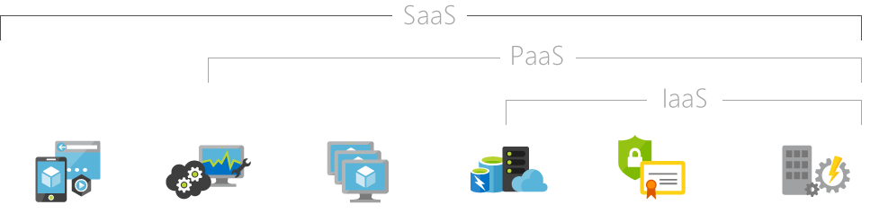

Cloud computing resources are delivered using three different service models.

- Infrastructure-as-a-service (IaaS) provides instant computing infrastructure that you can provision and managed over the Internet.
- Platform as a service (PaaS) provides ready-made development and deployment environments that you can use to deliver your own cloud services.
- Software as a service (or SaaS) delivers applications over the Internet as a web-based service.

When choosing a service model, consider which party should be responsible for the computing resource. Based on your scenario, you can decide how much shared management responsibility you want.

- You manage: Private cloud own your own datacenter
- Shared between you and provider: IaaS, you outsource Network, Servers, most physical / foundational layers
- Shared but provider manages more: Paas: outsourcing to cloud provider some responsibility for software: OS, middleware, runtime engines.
- Provider managed: Saas: You are simply a consumer of an internet-based service. Entire responsibility for managing service is outsourced: OneDrive, Outlook, Movie streaming sites are examples.

## IaaS

Infrastructure as a service (IaaS) is an instant computing infrastructure, provisioned and managed over the Internet. IaaS enables you to quickly scale resources to meet demand and only pay for what you use. IaaS helps you avoid the expense and complexity of buying and managing your own physical servers and other datacenter infrastructure. Each resource is offered as a separate service component, and you only need to rent a particular one for as long as you need it. IaaS is very flexible. You can provision common infrastructure such as VMs, storage, virtual subnets, firewalls, and VPN's to build your solution. You don't need to manage physical servers and appliances. However, you are responsible for direct management configuring and managing the components. For example, configuring firewalls, updating VM OS's, updating DBMS's, and runtimes.

### Common scenarios

You work at company where "event" which creates "problem"

- Creating several VMs in a subnet, accessing Azure Files, and connects over VPN to your on-prem datacenter would be leveraging all IaaS
- Should make a scenario out of this. Maybe hospital-based scenario where the Azure files are x-rays and the VMs are load balanced PMS or EMR 

Typical things businesses do with IaaS include:
Test and development. Teams can quickly set up and dismantle test and development environments, bringing new applications to market faster. IaaS makes it quick and economical to scale up dev-test environments up and down.
Website hosting. Running websites using IaaS can be less expensive than traditional web hosting.
Storage, backup, and recovery. Organizations avoid the capital outlay for storage and complexity of storage management, which typically requires a skilled staff to manage data and meet legal and compliance requirements. IaaS is useful for handling unpredictable demand and steadily growing storage needs. It can also simplify planning and management of backup and recovery systems.
Web apps. IaaS provides all the infrastructure to support web apps, including storage, web and application servers, and networking resources. Organizations can quickly deploy web apps on IaaS and easily scale infrastructure up and down when demand for the apps is unpredictable.
High-performance computing. High-performance computing (HPC) on supercomputers, computer grids, or computer clusters helps solve complex problems involving millions of variables or calculations. Examples include earthquake and protein folding simulations, climate and weather predictions, financial modeling, and evaluating product designs.
Big data analysis. Big data is a popular term for massive data sets that contain potentially valuable patterns, trends, and associations. Mining data sets to locate or tease out these hidden patterns requires a huge amount of processing power, which IaaS economically provides.

### Advantages

Eliminates capital expense and reduces ongoing cost. IaaS sidesteps the upfront expense of setting up and managing an on-site datacenter, making it an economical option for start-ups and businesses testing new ideas.
Improves business continuity and disaster recovery. Achieving high availability, business continuity, and disaster recovery is expensive, since it requires a significant amount of technology and staff. But with the right service level agreement (SLA) in place, IaaS can reduce this cost and access applications and data as usual during a disaster or outage.
Innovate rapidly. As soon as you’ve decided to launch a new product or initiative, the necessary computing infrastructure can be ready in minutes or hours, rather than the days or weeks—and sometimes months—it could take to set up internally.
Respond quicker to shifting business conditions. IaaS enables you to quickly scale up resources to accommodate spikes in demand for your application— during the holidays, for example—then scale resources back down again when activity decreases to save money.
Focus on your core business. IaaS frees up your team to focus on your organization’s core business rather than on IT infrastructure.
Increase stability, reliability, and supportability. With IaaS there’s no need to maintain and upgrade software and hardware or troubleshoot equipment problems. With the appropriate agreement in place, the service provider assures that your infrastructure is reliable and meets SLAs.
Better security. With the appropriate service agreement, a cloud service provider can provide security for your applications and data that may be better than what you can attain in-house.
Gets new apps to users faster. Because you don’t need to first set up the infrastructure before you can develop and deliver apps, you can get them to users faster with IaaS.

- Almost always using *some* IaaS services in any cloud architecture

    Explain that combining can be very powerful, setting up a secure subnet with firewalls and VPN connection, but then using PaaS offerings like Web Apps and Azure Sql inside the subnet, means giving you a dial you can turn blending power and ease of use however you want

    show scenario(s), simple suggestion: VPN Connection between web app and on-prem datacenter. VPN is web app is PaaS, VPN is IaaS

- Where you need more control or where an appropriate PaaS offering doesn't exist, some possible examples:

    Need a VM that runs a single seat of some desktop software

- Where you have a significant sunk cost investment in the skills or infrastructure to manage your VM's and Network.

## PaaS

Platform as a service (PaaS) is a complete development and deployment environment in the cloud, with resources that enable you to deliver everything from simple cloud-based apps to sophisticated, cloud-enabled enterprise applications. You purchase the resources you need from a cloud service provider on a pay-as-you-go basis and access them over a secure Internet connection. Like IaaS, PaaS includes infrastructure such as servers, storage, and networking. In addition, it also includes middleware, development tools, and other services. PaaS is designed to support the complete web application lifecycle: building, testing, deploying, managing, and updating.
PaaS allows you to avoid the expense and complexity of buying and managing software licenses, the underlying application infrastructure and middleware or the development tools and other resources. You manage the applications and services you develop, and the cloud service provider typically manages everything else.

### Common scenarios

You work at company where "event" which creates "problem"

1. Development framework. PaaS provides a framework that developers can build upon to develop or customize cloud-based applications. Similar to the way you create an Excel macro, PaaS lets developers create applications using built-in software components. Cloud features such as scalability, high-availability, and multi-tenant capability are included, reducing the amount of coding that developers must do.
2. Analytics or business intelligence. Tools provided as a service with PaaS allow organizations to analyze and mine their data, finding insights and patterns and predicting outcomes to improve forecasting, product design decisions, investment returns, and other business decisions.
3. Additional services. PaaS providers may offer other services that enhance applications, such as workflow, directory, security, and scheduling.

Define some example services, make it clear they are examples, (feel free to use examples other than what is listed here): 
    Web App: If you want a "PHP web site", not only do you not need to create your VM, install a server, install PHP, etc. Instead you just run a command to "create a web app", you needed even care or know what OS it runs on, let alone what physical hardware. 
        From there just add a .php file (for instance via FTP) and you have a running website (maybe link out to a quickstart like this if we have one)

    Database: Azure supports a huge set options for databases, but Azure Sql is a common choice: With azure Sql you can create databases with a couple commands. You can then connect from your web apps, or SSMS, or any other way you use Sql Server, but you don't worry about Updates, or Security patches, or optimizing physical storage for Reads / Writes

### Advantages

By delivering infrastructure as a service, PaaS offers the same advantages as IaaS. But its additional features—middleware, development tools, and other business tools—give you more advantages:

**Reduce development time**
PaaS development tools can cut the time it takes to code new apps with pre-coded application components built into the platform, such as workflow, directory services, security features, search, and so on.
Add development capabilities without adding staff. Platform as a Service components can give your development team new capabilities without you needing to add staff having the required skills.

**Develop for multiple platforms—including mobile—more easily**
Some service providers give you development options for multiple platforms, such as computers, mobile devices, and browsers making cross-platform apps quicker and easier to develop.

**Use sophisticated tools affordably:**
A pay-as-you-go model makes it possible for individuals or organizations to use sophisticated development software and business intelligence and analytics tools that they could not afford to purchase outright.

**Support geographically distributed development teams**
Because the development environment is accessed over the Internet, development teams can work together on projects even when team members are in remote locations.

**Efficiently manage the application lifecycle**
PaaS provides all of the capabilities that you need to support the complete web application lifecycle: building, testing, deploying, managing, and updating within the same integrated environment.

## SaaS

Software as a service (SaaS) allows users to connect to and use cloud-based apps over the Internet. Common examples are email, calendaring, and office tools (such as Microsoft Office 365). SaaS provides a complete software solution that you purchase on a pay-as-you-go basis from a cloud service provider. You rent the use of an application for your organization, and your users connect to it over the Internet, usually with a web browser. All of the underlying infrastructure, middleware, app software, and app data are located in the service provider’s data center. The service provider manages the hardware and software, and with the appropriate service agreement, will ensure the availability and the security of the app and your data as well. SaaS allows your organization to get quickly up and running with an app at minimal upfront cost.

### Common scenarios

You work at company where "event" which creates "problem"

If you’ve used a web-based email service such as Outlook, Hotmail, or Yahoo! Mail, then you’ve already used a form of SaaS. With these services, you log into your account over the Internet, often from a web browser. The email software is located on the service provider’s network, and your messages are stored there as well. You can access your email and stored messages from a web browser on any computer or Internet-connected device.
The previous examples are free services for personal use. For organizational use, you can rent productivity apps, such as email, collaboration, and calendaring; and sophisticated business applications such as customer relationship management (CRM), enterprise resource planning (ERP), and document management. You pay for the use of these apps by subscription or according to the level of use.

### Advantages

**Gain access to sophisticated applications**
To provide SaaS apps to users, you don’t need to purchase, install, update, or maintain any hardware, middleware, or software. SaaS makes even sophisticated enterprise applications, such as ERP and CRM, affordable for organizations that lack the resources to buy, deploy, and manage the required infrastructure and software themselves.
Pay only for what you use. You also save money because the SaaS service automatically scales up and down according to the level of usage.

**Use free client software**
Users can run most SaaS apps directly from their web browser without needing to download and install any software, although some apps require plugins. This means that you don’t need to purchase and install special software for your users.

**Mobilize your workforce easily**
SaaS makes it easy to “mobilize” your workforce because users can access SaaS apps and data from any Internet-connected computer or mobile device. You don’t need to worry about developing apps to run on different types of computers and devices because the service provider has already done so. In addition, you don’t need to bring special expertise onboard to manage the security issues inherent in mobile computing. A carefully chosen service provider will ensure the security of your data, regardless of the type of device consuming it.

**Access app data from anywhere**
With data stored in the cloud, users can access their information from any Internet-connected computer or mobile device. And when app data is stored in the cloud, no data is lost if a user’s computer or device fails.

Just software
- Office 365, Sharepoint, Outlook
- Anything any website does for you
- An example or two along the line of: If you create a X you are offering X as a service could get into what Multitenancy is and that software that is offered "as a service" is multi-tenant, but it's a hard thing to be pithy about and no need to spend a lot of time on this one
