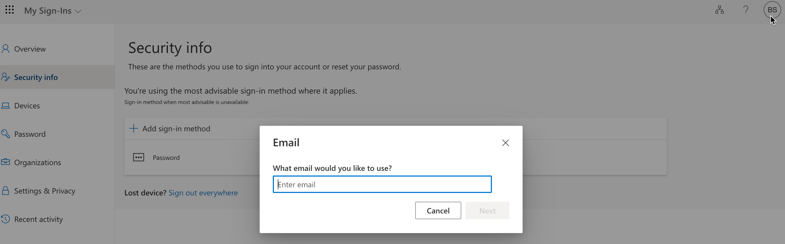

In this unit, you'll configure and test self-service password reset (SSPR) by using your email. You'll need to use your email to complete the password-reset process in this exercise.

## Create a group

You want to roll out SSPR to a limited set of users first to make sure your SSPR configuration works as expected. Let's begin by creating a security group for the limited rollout.

1. In the Microsoft Entra organization you created, under **Manage**, select **Groups**.
1. Select **New Group**.
1. Enter the following values:

    | Setting | Value |
    | --- | --- |
    | Group type | Security |
    | Group name | SSPRTesters |
    | Group description | Members are testing the rollout of SSPR |
    | Membership type | Assigned |
    | | |

1. Select **Create**.

    

## Create a user account

To test your configuration, create an account that's not associated with an administrator role. You'll also assign the account to the group you created.

1. In your Microsoft Entra organization, under **Manage**, select **Users**.
1. Select **+ New user**, select **Create new user** in the drop-down, and use the following values:

    | Setting | Value |
    | --- | --- |
    | User principal name | balas |
    | Display name | Bala Sandhu |
    | Password | Select the **Copy** icon next to the autogenerated password, then paste the password to a text editor like Notepad. |

1. Select the **Assignments** tab.

1. Select **Add group**, check the box for the **SSPRTesters** group, and then the **Select** button.

1. Select **Review + create** and then select **Create**.

## Enable SSPR

Now, you're ready to enable SSPR for the group.

1. In your Microsoft Entra organization, under **Manage**, select **Password reset**.
1. On the **Properties** page, select **Selected**. Select the link under **Select Group**, select the box next to the **SSPRTesters** group, and then the **Select** button.
1. Select **Save**.

    

1. Under **Manage**, select the **Authentication methods**, **Registration**, and **Notifications** pages to review the default values. Ensure **Authentication methods** has **Email** selected.
1. Select **Customization**.
1. Select **Yes**, and then in the **Custom helpdesk email or URL** text box, enter **admin@organization-domain-name.onmicrosoft.com**. Replace "organization-domain-name" with the domain name of the Microsoft Entra organization you created. If you've forgotten the domain name, hover over your profile in the Azure portal.
1. Select **Save**.

## Register for SSPR

Now that the SSPR configuration is complete, register an email for the user you created.

> [!NOTE]
> If you get a message that says "The administrator has not enabled this feature," use private/incognito mode in your web browser.

1. In a new browser window, go to https://aka.ms/ssprsetup.
1. Sign in with the user name **balas@organization-domain-name.onmicrosoft.com** and the password that you noted earlier. Remember to replace "organization-domain-name" with the domain name of the Microsoft Entra organization you created.
1. If you're asked to update your password, enter a new password of your choice. Make sure you note the new password.
1. Select the **Security info** tab, and then select **+ Add sign-in method**.
1. In the **Add a method** box, select **Email**.
1. Enter your email details.

    

1. When you receive the code in your email, enter the code in the text box and select **Next**.

## Test SSPR

Now, let's test whether the user can reset their password.

1. In a new browser window, go to https://aka.ms/sspr.
1. For **User ID**, type **balas@organization-domain-name.onmicrosoft.com**. Replace "organization-domain-name" with the domain you used for your Microsoft Entra organization.

    
1. Complete the CAPTCHA and select **Next**.
1. The **Email my alternate email** radio button is selected. Select **Email**.
1. When the email arrives, in the **Enter your verification code** text box, enter the code you were sent. Select **Next**.
1. Enter a new password, and then select **Finish**. Make sure you note the new password.
1. Close the browser window.
