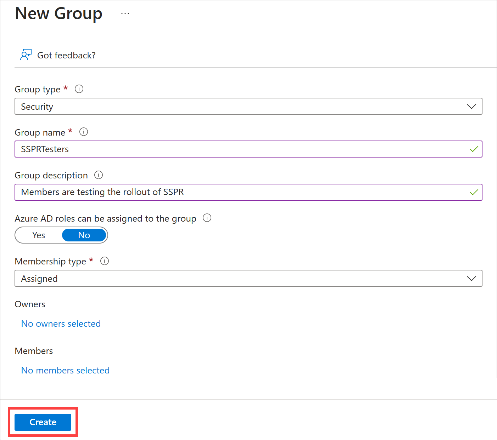
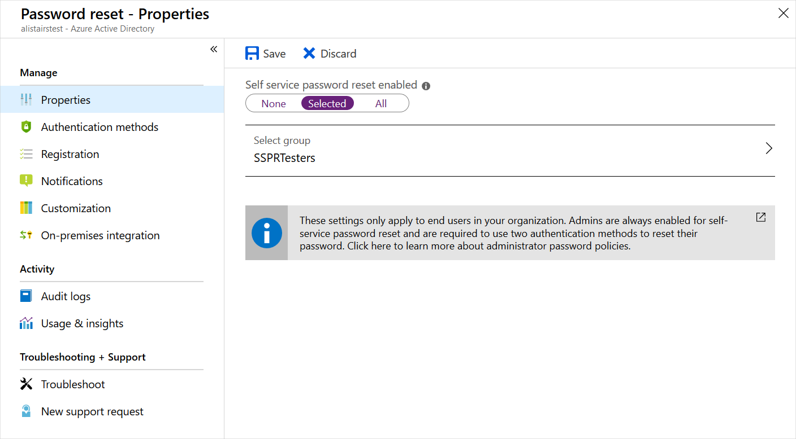
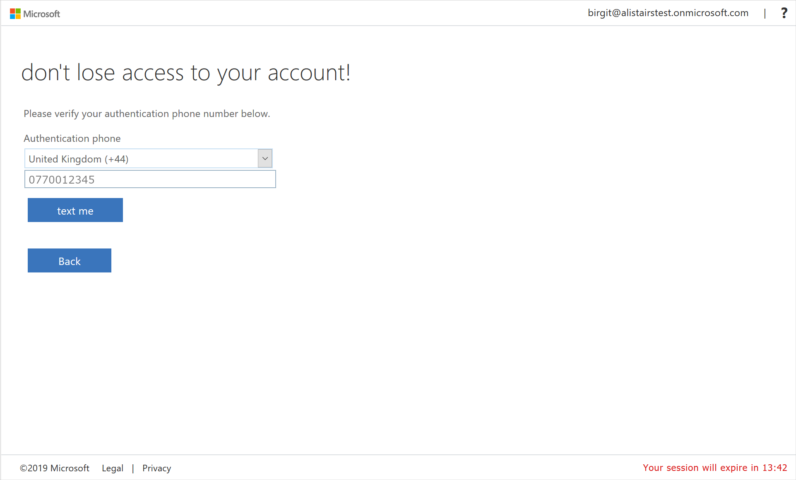
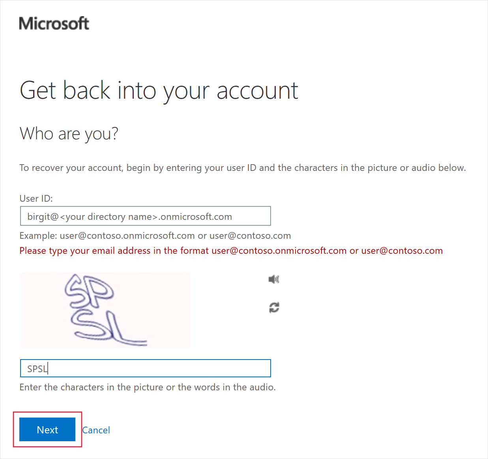

In this unit, you'll configure and test self-service password reset (SSPR) by using your mobile phone. You'll need to use your mobile phone to complete the password-reset process in this exercise.

## Create an Azure AD organization

For this step, you'll want to create a new directory and sign up for trial Premium subscription for Azure AD.

1. Sign in to the [Azure portal](https://portal.azure.com/).
1. Select **Create a resource** > **Identity** > **Azure Active Directory**.

   
1. Select **Azure Active Directory**, then select **Next : Configuration**.

1. On the **Create tenant** page, use these values, select **Review + Create**, then select **Create**.

    | Property | Value |
    | --- | --- |
    | Organization name | Choose any organization name. |
    | Initial domain name | Choose a domain name that's unique within **.onmicrosoft.com**. Make a note of the domain you choose. |
    | Country or region | United States. |
    | | |

1. Complete the captcha, then select **Submit**.
1. After you create the organization, select the F5 key to refresh the page. In the upper-right corner, select your user account, then select **Switch directory**.
1. Select the organization you just created.

## Create an Azure AD Premium P2 trial subscription

Now activate a trial Premium subscription for the organization so that you can test SSPR.

1. Go to **Azure Active Directory** > **Password reset**.
1. Select **Get a free Premium trial to use this feature**.
1. Under **AZURE AD PREMIUM P2**, expand **Free trial**, and select **Activate**.
1. Refresh the browser to see the **Password reset - Properties** page. You might need to refresh a few times.

## Create a group

You want to roll out SSPR to a limited set of users first to make sure your SSPR configuration works as expected. Let's begin by creating a security group for the limited rollout.

1. In the Azure AD organization you created, under **Manage**, select **Groups**.
1. Select **New Group**.
1. Enter the following values:

    | Setting | Value |
    | --- | --- |
    | Group type | Security |
    | Group name | SSPRTesters |
    | Group description | Members are testing the rollout of SSPR |
    | Membership type | Assigned |
    | | |

1. Select **Create**.

    

## Create a user account

To test your configuration, create an account that's not associated with an administrator role. You'll also assign the account to the group you created.

1. In your Azure AD organization, under **Manage**, select **Users**.
1. Select **+ New user**, select **Create new user** in the drop-down, and use the following values:

    | Setting | Value |
    | --- | --- |
    | User name | balas |
    | Name | Bala Sandhu |
    | Password | Select the **Copy** icon next to the autogenerated password, then paste the password to a text editor like Notepad. |

1. Select the **Assignments** tab.

1. Select **Add group**, check the box for the **SSPRTesters** group, then select the **Select** button.

1. Select **Review + create**, then select **Create**.

## Enable SSPR

Now, you're ready to enable SSPR for the group.

1. In your Azure AD organization, under **Manage**, select **Password reset**.
1. If the **Password reset** page still displays the message **Get a free Premium trial to use this feature**, wait for a few minutes and then refresh the page.
1. On the **Properties** page, select **Selected**. Select the **No groups selected** link, select the box next to the **SSPRTesters** group, and then select the **Select** button.
1. Select **Save**.

    

1. Under **Manage**, select the **Authentication methods**, **Registration**, and **Notifications** pages to review the default values.
1. Select **Customization**.
1. Select **Yes**, and then in the **Custom helpdesk email or URL** text box, enter **admin@organization-domain-name.onmicrosoft.com**. Replace "organization-domain-name" with the domain name of the Azure AD organization you created. If you've forgotten the domain name, hover over your profile in the upper-right corner of the Azure portal.
1. Select **Save**.

## Register for SSPR

Now that the SSPR configuration is complete, register a mobile phone number for the user you created.

> [!NOTE]
> If you get a message that says "The administrator has not enabled this feature," use private/incognito mode in your web browser.

1. In a new browser window, go to https://aka.ms/ssprsetup. 
1. Sign in with the user name balas@organization-domain-name.onmicrosoft.com and the password that you noted earlier. Remember to replace "organization-domain-name" with the domain name of the Azure AD organization you created.
1. If you're asked to update your password, enter a new password of your choice. Make sure you note the new password.
1. Select the **Security info** tab on the left, then select **+ Add sign-in method**.
1. In the **Add a method** box, select **Phone**.
1. Enter your mobile phone details.

    

1. Select the **Text me a code** radio button, then select **Next**.
1. When you receive the code on your mobile phone, enter the code in the text box and select **Next**.
1. Select **Done**.

## Test SSPR

Now, let's test whether the user can reset their password.

1. In a new browser window, go to https://aka.ms/sspr.
1. For **User ID**, type balas@organization-domain-name.onmicrosoft.com. Replace "organization-domain-name" with the domain you used for your Azure AD organization.

    
1. Complete the captcha and select **Next**.
1. Enter your mobile phone number, then select **Text**.
1. When the text arrives, in the **Enter your verification code** text box, enter the code you were sent. Select **Next**.
1. Enter a new password, then select **Finish**. Make sure you note the new password.
1. Close the browser window.
