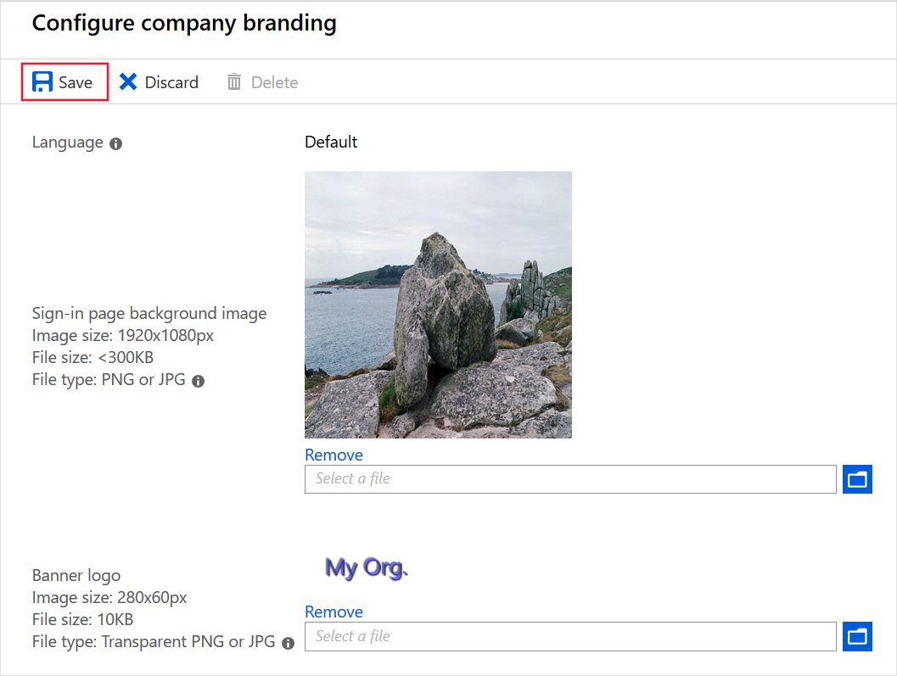
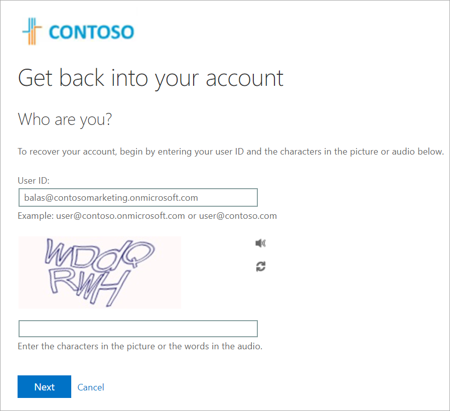

Suppose you've been asked to display your retail organization's branding on the Azure sign-in page to reassure users that they're passing credentials to a legitimate system.

Here, you'll learn how to configure this custom branding.

To complete this exercise, you must have two image files:

- A page background image. This must be a PNG or JPG file, 1920 x 1080 pixels, and smaller than 300 KB.
- A company logo image. This must be a PNG or JPG file, 32 x 32 pixels, and smaller than 5 KB.

## Customize Azure AD organization branding

Let's use Azure Active Directory (Azure AD) to set up the custom branding.

1. Sign in to the [Azure portal](https://portal.azure.com/).
1. Go to your Azure AD organization by selecting **Azure Active Directory**. If you're not in the right Azure AD organization, go to your Azure profile in the upper-right corner and select **Switch directory** to find your organization.
1. Under **Manage**, select **Company branding** > **Customize**.
1. Next to **Favicon**, select **Browse**. Select your logo image.
1. Next to **Background image**, select **Browse**. Select your page background image.
1. Select a Page Background color or accept the default.

    
1. Select **Review + Create**, then select **Create**.

## Test the organization's branding

Now, let's use the account that we created in the last exercise to test the branding.

1. In a new browser window, go to https://login.microsoft.com.
1. Select the account for **Bala Sandhu**. Your custom branding is displayed.

    
1. Select **Forgot my password**.

    
