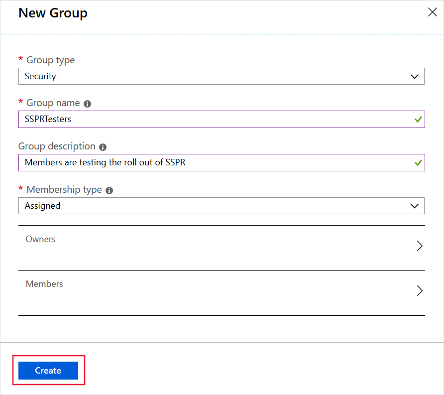

An administrator must configure Self-Service Password Reset (SSPR) before users can register for it and reset passwords.

Suppose that you have decided to enable SSPR in your retail organization so that users can recover from forgotten passwords for their Azure Active Directory account. You've been asked to configure the system to support SSPR for a small group of pilot users and you want to test the configuration using your mobile phone.

Here, you will configure and test SSPR.

> [!NOTE]
> You will need to use your mobile phone to complete the password reset process in this exercise.

## Create a Directory

The default directory in the Azure Sandbox does not support SSPR. So in this exercise, let's create a second directory and switch to it:

<!-- NOTE: SSPR is not available to the default directory in the sandbox. When you create a new directory, it is available but only if you choose "Get a Premium trial to use this feature".  According to the following page, you won't be able to delete this directory until 30 days after if has been disabled. https://docs.microsoft.com/azure/active-directory/users-groups-roles/directory-delete-howto -->

1. In the [Azure portal](https://portal.azure.com/learn.docs.microsoft.com?azure-portal=true), click **+ Create a resource**.
1. In the **Search the Marketplace** textbox, type **Directory**, and then press Enter
1. Click **Azure Active Directory** and then click **Create**. 
1. In the **Create directory** page, use these values, and then click **Create**:

    | Property | Value |
    | --- | --- |
    | Organization name | Choose any organization name |
    | Initial domain name | Choose a domain name that is unique within **.onmicrosoft.com**. Make a note of the domain you choose. |
    | Country or region | United States |
    | | |

1. When the directory has been created press F5 to refresh the page, then in the top-right, click your user account, and then click **Switch directory**.
1. Click the directory you just created.

## Create an Azure AD Premium P2 trial subscription

Now, we must obtain a trial Premium subscription for the directory, to test SSPR:

1. In the navigation on the left, click **Azure Active Directory** and then click **Password reset**.
1. Click **Get a free Premium trial to use this feature**.
1. Under **AZURE AD PREMIUM P2**, expand **Free trial** and then click **Activate**.

## Create a group 

You want to roll out SSPR to a limited set of users in the first instance. They will test the system. When you're happy that everything works as intended, you will enable SSPR for everybody. Let's begin by creating a security group for the limited roll-out:

1. In the [Azure portal](https://portal.azure.com/learn.docs.microsoft.com?azure-portal=true), in the navigation on the left, click **Azure Active Directory**, and then under **Manage**, click **Groups**.
1. Click **+ New Group**, use the following values, and then click **Create**:

    | Setting | Value |
    | --- | --- |
    | Group type | Security |
    | Group name | SSPRTesters |
    | Group description | Members are testing the roll out of SSPR |
    | Membership type | Assigned |
    | | |

    

## Create a user account

Remember that administrators have different SSPR requirements applied that overrule the configuration you select for standard user accounts. To test your configuration, therefore, you must use a non-administrative user account. We'll create that account now:

1. In the [Azure portal](https://portal.azure.com/learn.docs.microsoft.com?azure-portal=true), in the navigation on the left, click **Azure Active Directory**, and then under **Manage**, click **Users**.
1. Click **+ New user**, use the following values, and then click **Create**:

    | Setting | Value |
    | --- | --- |
    | Name | Birgit Allen |
    | User name | birgit@<your directory name>.onmicrosoft.com |
    | Profile | Not configured |
    | Properties | Default |
    | Groups | Select SSPRTesters |
    | Directory role | User |
    | Password | Click **Show Password** and make a note of the password |
    | | |

    

## Enable SSPR

Now, you're ready to enable SSPR for the group:

1. In the [Azure portal](https://portal.azure.com/learn.docs.microsoft.com?azure-portal=true), in the navigation on the left, click **Azure Active Directory**, and then under **Manage** click **Password reset**. 

    > [!NOTE]
    > You can only enable SSPR approximately five or more minutes after you created Premium P2 trial subscription. If the **Password reset** page still displays the message **Get a free Premium trial to use this feature**, wait for a few minutes and then refresh the page.

1. On the **Properties** page, click **Selected**, select the **SSPRTesters** group, and then click **Save**.

    

1. Click the **Authentication methods** page and make a note of the default values. 
1. Click the **Registration** page and make a note of the default values.
1. Click the **Notifications** page and make a note of the default values.
1. Click the **Customization** page, click **Yes**, and then in the **Custom helpdesk email or URL** textbox, type **admin@<your directory name>.onmicrosoft.com**.
1. Click **Save**.

## Register for SSPR

Now that the SSPR configuration is complete, we can register a mobile phone number for the user you created:

1. In a new browser window, navigate to **https://aka.ms/ssprsetup**.
1. Sign in with the username **birgit@<your directory name>.onmicrosoft.com** and the password that you noted earlier.
1. If you are asked to replace your password, assign a new password of your choice. Make sure you note the new password.
1. Next to **Authentication phone is not configured** click **Set it up now**.
1. Enter your mobile phone details and then click **text me**.

    

1. When you receive the code on your mobile phone, enter the code in the text box.
1. Click **verify** and then click **Finish**.

## Test SSPR

Now let's test whether the user can reset their password:

1. In a new browser window, navigate to **https://aka.ms/sspr**.
1. In the **Get back into your account** page, in the **User ID** textbox, type **birgit@<your directory name>.onmicrosoft.com**.
1. Complete the Captcha, and then click **Next**.

    

1. Enter your mobile phone number and then click **Text**.
1. When the text arrives, in the **Enter your verification code** textbox, type the code you were sent, and then click **Next**.
1. Assign a new password of your choice and then click **Finish**. Make sure you note the new password.
1. Sign out of the account **birgit@<your directory name>.onmicrosoft.com**.