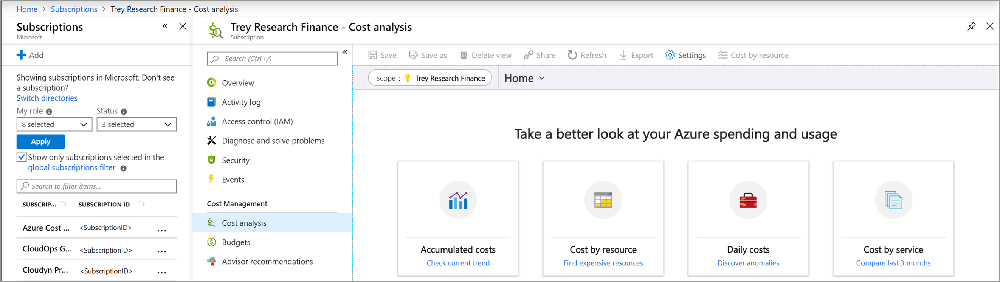
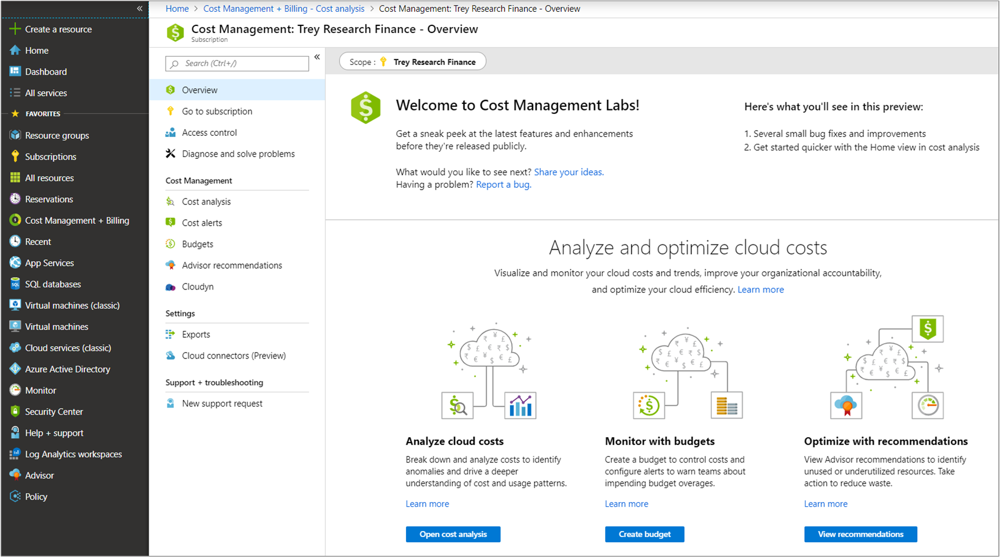

Microsoft Cost Management gives you the tools to plan for, analyze, and reduce your spending to maximize your cloud investment. Azure makes it easy to build and deploy cloud solutions. However, it's important that those solutions are optimized to minimize the cost to your organization.

## Principles

When beginning your Cost Management journey, make sure to adhere to the following principles to best align yourself and your organization for success.

### Planning

Comprehensive, up-front planning lets you tailor cloud usage to your specific business requirements. Before creating any new resources, ask yourself:

- What business problem am I solving?
- What usage patterns do I expect from my resources?

Your answers help you select the offerings that are right for you. They determine the infrastructure to use and how to use it to maximize your Azure efficiency.

### Visibility

When structured well, Cost Management helps you to inform people about the Azure costs for which they're responsible or for the money they spend. Microsoft Cost Management has a tool called Cost Analysis, which you learn to use in this lesson. It's designed to give you insight into where your money is spent. Take advantage of this tool. It can help you identify key cost drivers and trends within your environments.

### Accountability

Attribute costs in your organization to make sure that the people responsible are accountable for their team's spending. To fully understand your organization's Azure spending, you should organize your resources to maximize insight into cost attribution. Good organization helps to manage and reduce costs and hold people accountable for efficient spending in your organization. Once properly organized, you can begin creating budgets in Cost Management to track and alert on your spending. In this lesson, you learn how to use our budgets tool to make sure that your teams are held responsible for the costs that they accrue.

### Optimization

Act to reduce your spending. Make the most of your spending based on the findings gathered through planning and increasing cost visibility. You might consider purchase and licensing optimizations, or infrastructure deployment changes based on your findings in the Cost Analysis tool.

### Iteration

Everyone in your organization must engage in the cost-management lifecycle. They need to stay involved on an ongoing basis to optimize costs. Be rigorous about this iterative process, and make it a key tenet of responsible cloud governance in your organization.

## Where to find Cost Management

You can access the Cost Management tools from various locations in the Azure portal:

- Subscription and resource group windows

  

- Cost Management + Billing window

  
