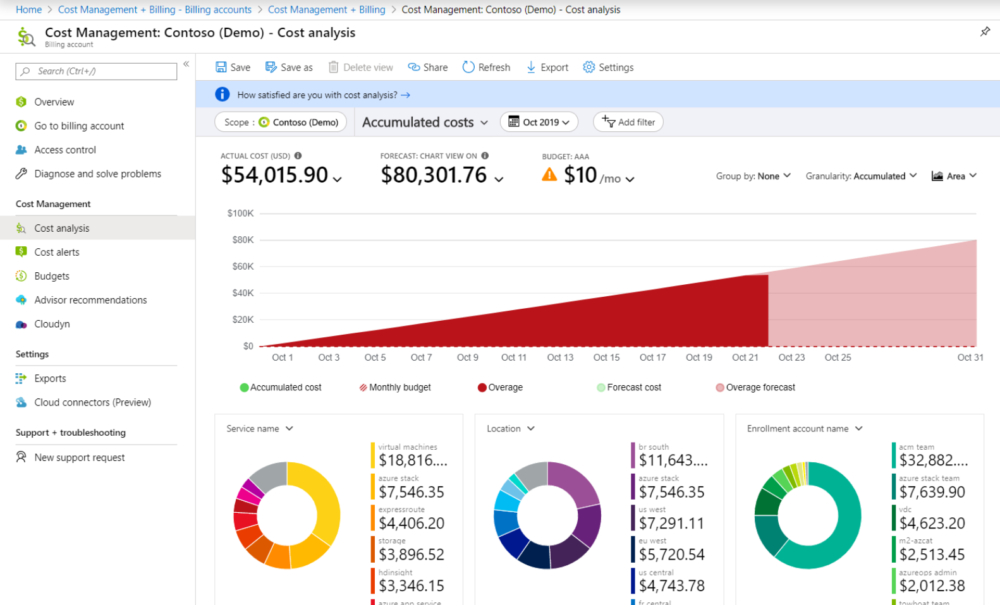
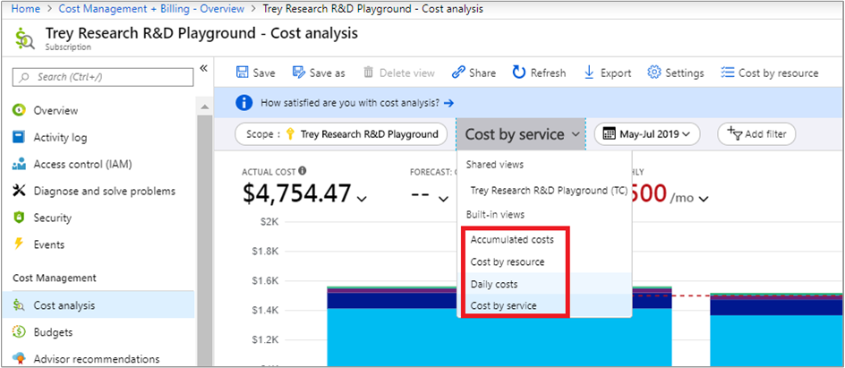
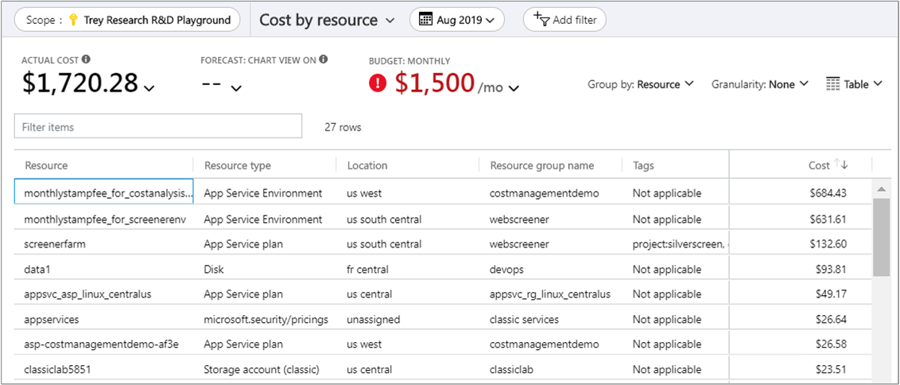
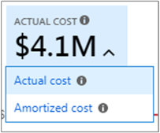
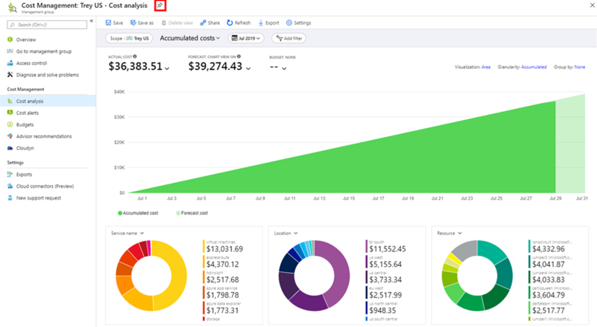
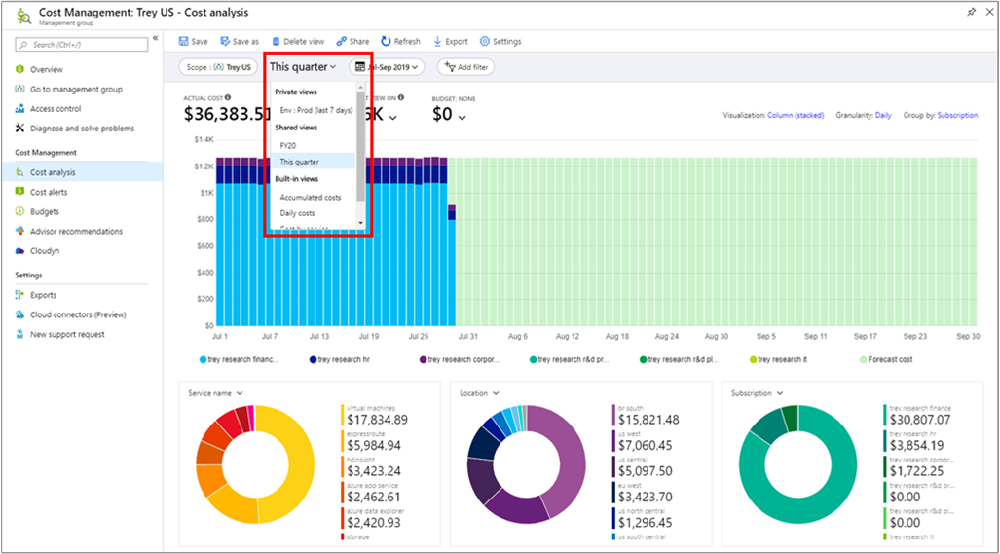
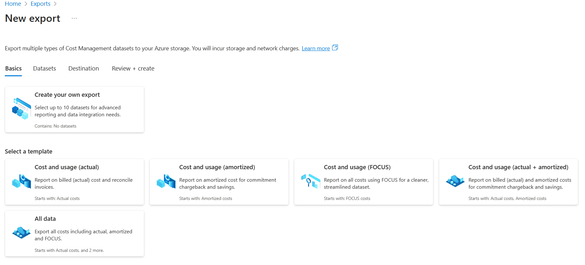
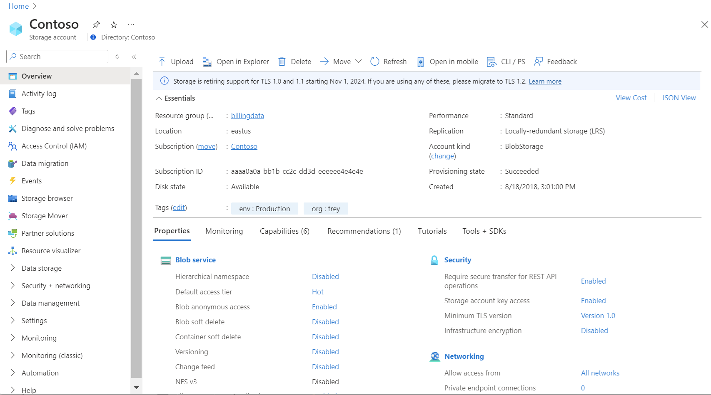

This unit describes how you can use cost analysis, with several different default ways to view cost and usage information. There are also many ways you can customize cost views for deeper analysis. This unit also covers how to save and share cost-analysis views. Lastly, you learn how to export data from cost analysis for use elsewhere.

**Accumulated cost view:** This view represents the predefined cost analysis view configuration. Each view includes date range, granularity, group by, and filter settings. The default view shows accumulated costs for the current billing period, but you can change to other built-in views. This view answers questions like: How much have I spent so far this month? Will I stay within my budget?

**Actual cost:** This view shows the total usage and purchase costs for the current month as they're accrued, and show on your bill.

**Forecast:** This view shows the total forecasted costs for the period you choose. Use the forecast chart view to identify potential budget breaches. When there's a potential budget breach, projected overspending is shown as a red area. An indicator symbol is also shown in the chart. Hovering over the symbol shows the estimated date of the budget breach.

**Budget:** This view shows the planned spending limit for the selected scope, if available.

**Pivot (donut) charts:** This view provides dynamic pivots, breaking down the total cost by a common set of standard properties. They show the largest to smallest costs for the current month. You can change pivot charts at any time by selecting a different pivot. Costs are categorized by service (meter category), location (region), and child scope by default. For example, enrollment accounts are under billing accounts, resource groups are under subscriptions, and resources are under resource groups.

## Customized cost views

Let's look at each cost view in more detail.

**Accumulated costs:** By default, cost analysis shows data for the current month. You can use the date selector to switch to common date ranges quickly. Examples include the last seven days, the last month, the current year, or a custom date range. Pay-as-you-go subscriptions also include date ranges based on your billing period (which isn't bound to the calendar month), like the current billing period or last invoice. Use the **PREVIOUS** and **NEXT** links at the top of the menu to jump to the previous or next period, respectively. For example, **PREVIOUS** switches from the **Last 7 days** to **8-14 days ago** or **15-21 days ago**.

Cost analysis shows **accumulated** costs by default. Accumulated costs include all costs for each day plus the previous days, for a constantly growing view of your daily aggregate costs. This view is optimized to show how you're trending against a budget for the selected time range.

**Cost by resource:** The cost by resource view shows a table of grouped resources sorted by highest cost.

This view answers the question: Which resources cost the most so far this month?

**Daily costs:** This view shows the costs for each day. The daily view doesn't show a growth trend. The view is designed to show irregularities as cost spikes or dips from day to day. If you've selected a budget, the daily view also shows an estimate of your daily budget.

When your daily costs are consistently above the estimated daily budget, you can expect to surpass your monthly budget. The estimated daily budget is a means to help you visualize your budget at a lower level. If you have fluctuations in daily costs, then the estimated daily budget comparison to your monthly budget is less precise.

Here's a daily view of recent spending.

This view answers the question: Have there been any increases in the costs per day for the last 30 days?

**Cost by service:** By default, this view shows the last three months of spending on services shown in bar charts. Donut charts show spending for the same period by service name, resource location, and resource group name.

This view answers the question: How has my monthly usage varied over the past three invoices?

## Group by and filtering

Cost Management has many grouping and filtering options. In this module's summary, there's a link to view all available group and filter options.

## Actual versus amortized cost

Let's look at Azure service costs for the current month. You should see a graph like the following example:

By default, cost analysis shows all usage and purchase costs as they're accrued. This cost shows on your invoice, and is also known as **Actual cost**. Viewing actual cost is ideal for reconciling your invoice. However, purchase spikes in cost can be alarming when you're keeping an eye out for spending anomalies and other changes in cost. To flatten out spikes caused by reservation purchase costs, switch to **Amortized cost**.

Amortized cost breaks down reservation purchases into daily chunks and spreads them over the duration of the reservation term. For example, instead of seeing a USD 365.00 purchase on January 1, you'll see a USD 1.00 purchase every day from January 1 to December 31. In addition to basic amortization, these costs are also reallocated and associated by using the specific resources that used the reservation. For example, if the USD 1.00 daily charge was split between two virtual machines, you'd see two USD 0.50 charges for the day. If part of the reservation isn't used for the day, you'd see one USD 0.50 charge associated with the applicable virtual machine, and another USD 0.50 charge with a charge type of UnusedReservation. You can only see unused reservation costs when viewing amortized cost.

Due to the change in how costs are represented, it's important to note that actual cost and amortized cost views show different total numbers. In general, the total cost of months with a reservation purchase decreases when viewing amortized costs, and months following a reservation purchase increase. Amortization is available only for reservation purchases, and doesn't currently apply to Azure Marketplace purchases.

## Save and share views

Customizing a view in cost analysis is easy. Just pick the date range you need, group the data to see a breakdown, and then choose the visualization that you want. **Pin** your view to a dashboard for quick access, and then share the dashboard with your team so everyone can track costs from a single place.

You can also share a direct link to your customized view so others can copy and personalize it for themselves. To share a link to a view, select **Share**.

Both sharing options offer flexibility, but you need something more convenient. You can save customized views and share them with others, directly from within cost analysis. In the view, select **Save**.

People with Cost Management Contributor (or greater) access can create shared views. You can create up to 50 shared views per scope.

Anyone can save up to 50 private views, even if they only have read access. You can't share these views with others directly in cost analysis, but you can pin them to a dashboard or share them via URL so others can save a copy.

You can access all views from the view menu. You see your private views first, then views shared across the scope, and lastly the built-in views that are always available.

Do you need to share your view outside of the portal? You can download the charts as an image and copy that image into an email or presentation to share it with your team, for example. There's a slightly redesigned **Download** menu that offers a **PNG** option when viewing charts. You can't download the table view as an image.

The filter bar shows both the:

- Scope pill with the scope name for added clarity
- View menu that is based on its growing importance with saved views

## Export data

Let's start by creating a daily export of your cost and usage data.

Go to **Subscriptions**, select a subscription from the list, and in the menu pane under **Cost Management**, select **Cost analysis**. At the top of the Cost analysis pane, select **Configure subscription**. On the **Configuration** pane, select **Exports**, and then select an export option. For example, select  **Schedule export**.

Besides subscriptions, you can create exports on resource groups, accounts, departments, and enrollments.

Enter a name for the export, and for **Export type** setting, select **Daily export of month-to-date costs**. Select a start date.

Specify the subscription for your Azure storage account, and then select your storage account. Specify the storage account, storage container, and the directory path to which you'd like the export file to go. You can also create a new resource group and storage account, and select the storage account region. Select **Create**.

Your new export appears in the list of exports. By default, new exports are enabled. If you want to disable or delete a scheduled export, select any item in the list, and then select either **Disable**  or **Delete**.

Initially, it can take 12-24 hours before the export runs. However, it can take longer before data is shown in exported files.

### Export schedule

The time and day of week that you initially create the export, affects the schedule of the exports. When you create a scheduled export, the export runs at the same frequency for each subsequent export occurrence. For example, for a daily export of month-to-date costs export set at a daily frequency, the export runs daily. Similarly for a weekly export, the export runs every week on the same day as it's scheduled. The exact delivery time of the export isn't guaranteed, and the exported data is available within four hours of run time.

Each export creates a new file, so older exports aren't overwritten.

Select an export option:

- **Daily export of month-to-date costs:** Provides a new export file daily for your month-to-date costs. The latest data is aggregated from previous daily exports.
- **Weekly export of cost for the last 7 days:** Creates a weekly export of your costs for the past seven days from the selected start date of your export.  
- **Monthly export of last month's costs:** Provides you with an export of your last month's costs compared to the current month in which you create the export. As you move forward, the schedule runs an export on the fifth day of every new month with your previous months costs.  
- **One-time export:** Allows you to select a date range for historical data to export to Azure Blob Storage. You can export a maximum of 90 days of historical costs from the day you select. This export runs immediately, and is available in your storage account within two hours.  

### Verify that data is collected

You can easily verify that your Cost Management data is being collected, and view the exported CSV file using Azure Storage Explorer.

In the export list, select the storage account name. On the storage account page, select **Open in Explorer**. If you see a confirmation box, select **Yes** to open the file in Azure Storage Explorer.

In Storage Explorer, navigate to the container that you want to open and select the folder corresponding to the current month. A list of CSV files appears. Select one, then select **Open**.

The file opens with the program or application you've set to open CSV file extensions. Here's an example in Excel:

