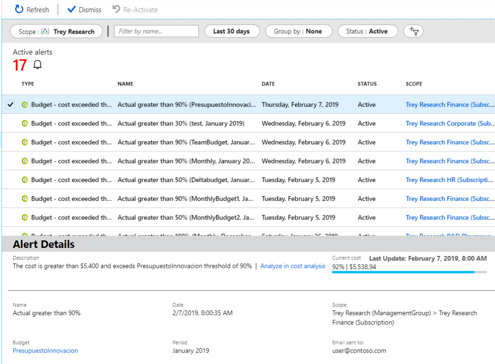

You can create an Azure subscription budget for a monthly, quarterly, or annual period. Your navigational context in the Azure portal determines whether you create a budget for a subscription or for a management group.

To create or view a budget, open the desired scope in the Azure portal and select **Budgets** in the menu. For example, navigate to **Subscriptions**, select a subscription from the list, and then select **Budgets** in the menu. Use the **Scope** pill to switch to a different scope, like a management group, in Budgets.

After you create budgets, they show a simple view of your current spending against them.

## Create a budget

Let's create a budget. Select **Add**.

In the **Create budget** window, make sure that the scope shown is correct. Select any filters that you want to add. Filters allow you to create budgets on specific costs, such as resource groups in a subscription or a service like virtual machines. You can apply any filter you can use in cost analysis to a budget.

After you've identified your scope and filters, enter a budget name, then select a monthly, quarterly, or annual budget reset period. This reset period determines the time window that the budget analyzes. The cost evaluated by the budget starts at zero at the beginning of each new period. When you create a quarterly budget, it works in the same way as a monthly budget. The difference is that the budget amount for the quarter is evenly divided among the three months of the quarter. An annual budget amount is evenly divided among all 12 months of the calendar year.

If you have a Pay-As-You-Go, MSDN, or Visual Studio subscription, your invoice billing period might not align to the calendar month. For those subscription types and resource groups, you can create a budget that's aligned to your invoice period or to calendar months. To create a budget aligned to your invoice period, select a reset period of **Billing month**, **Billing quarter**, or **Billing year**. To create a budget aligned to the calendar month, select a reset period of  **Monthly**, **Quarterly**, or **Annually**.

Next, identify the expiration date when the budget becomes invalid and stops evaluating your costs.

Based on the fields you've selected in the budget so far, a graph appears to help you select a threshold to use for your budget. The suggested budget is based on the highest forecasted cost that you might incur in future periods. You can change the budget amount.

## Email and alert configuration

After you configure the budget amount, select **Next** to configure budget alerts. Budgets require at least one cost threshold (% of budget) and a corresponding email address. You can optionally include up to five thresholds and five email addresses in a single budget. When a budget threshold is met, email notifications are normally received in less than eight hours.

Set an alert condition when 90% of the budget is reached.

After you create a budget, it appears in cost analysis. Viewing your budget in relation to your spending trend is one of the first steps when you start to analyze your costs and spending, as described in **Unit 3 – Evaluate your costs using Cost Analysis**.

In the preceding example, you created a budget for a subscription. However, you can also create a budget for a resource group. If you want to create a budget for a resource group, go to **Cost Management + Billing** > **Subscriptions** > select a subscription > **Resource groups** > select a resource group > **Budgets** > and then **Add** a budget.

## Action groups for budgets

When you create or edit a budget for a subscription or resource group scope, you can configure it to call an action group. The action group can perform various different actions when your budget threshold is met. In this module's summary, there's a link for more information about action groups for budgets.

## Cost alerts

Previously, you created a budget alert by setting an alert condition for the budget. Cost Management also supports other types of alerts, and all active Cost Management and Billing alerts appear together in one place. Cost Management generates alerts when your consumption reaches a given threshold. There are three types of cost alerts:

- Budget alerts
- Credit alerts
- Department spending quota alerts

### Budget alerts

Budget alerts notify you when spending, based on usage or cost, reaches or exceeds the amount defined in the alert condition of the budget. You can create Cost Management budgets by using the Azure portal or the Azure Consumption API.

In the Azure portal, you define your budgets by cost. When Using the Azure Consumption API, you define your budgets by cost or by consumption usage. Budget alerts support both cost-based and usage-based budgets. Budget alerts are generated automatically whenever the budget alert conditions are met. You can view all cost alerts in the Azure portal. Whenever an alert is generated, it appears in cost alerts. An alert email is also sent to the people in the alert recipients list of the budget.

### Credit alerts

Credit alerts notify you when your Azure credit monetary commitments are consumed. Monetary commitments are for organizations with Enterprise Agreements (EAs). Credit alerts are generated automatically at 90% and at 100% of your Azure credit balance. Whenever an alert is generated, it's reflected in cost alerts and in the email sent to the account owners.

### Department spending quota alerts

Department spending quota alerts notify you when department spending reaches a fixed threshold of the quota. Spending quotas are configured in the EA portal. Whenever a threshold is met, it generates an email to department owners and appears in cost alerts. For example, you can configure alerts for 50% or 75% of the quota.

### Supported alert features by offer categories

Support for alert types depends on the type of Azure account that you have (Microsoft offer). The following table shows the alert features supported by various Microsoft offers.

| **Alert type** | **Enterprise Agreement** | **Microsoft Customer Agreement** | **Web direct/Pay-As-You-Go** |
| --- | --- | --- | --- |
| Budget | ✔ | ✔ | ✔ |
| Credit | ✔ | ✘ | ✘ |
| Department spending quota | ✔ | ✘ | ✘ |

### View cost alerts

To view cost alerts, open the desired scope in the Azure portal and select **Budgets** in the menu. Use the **Scope** pill to switch to a different scope. Select **Cost alerts** in the menu.

The total number of active and dismissed alerts appears on the cost alerts page.

All alerts show the alert type. A budget alert shows the reason it was generated and the name of the budget to which it applies. Each alert shows the date it was generated, its status, and the scope (subscription or management group) to which the alert applies.

Possible statuses include **Active** and **Dismissed**. Active status indicates that the alert is still relevant. Dismissed status indicates that someone has marked the alert to set it as no longer relevant.

Select an alert from the list to view its details. Alert details show more information about the alert. Budget alerts include a link to the budget. If a recommendation is available for a budget alert, then a link to the recommendation also appears. Budget, credit, and department spending quota alerts have a link to analyze in cost analysis, where you can explore costs for the alert's scope.

When you view the details of a dismissed alert, you can **Reactivate** it if manual action is needed.
