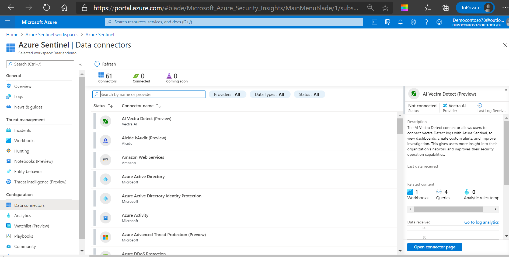

This exercise is optional. To complete it, you need access to an Azure subscription where you can create Azure resources. If you don't have an Azure subscription, create a [free account](https://azure.microsoft.com/free/?azure-portal=true) before you begin.

To deploy the prerequisites for the exercise, perform the following steps.

1. Click the link below.

2. You will be promted to sign in your Azure subscription.
3. In the **Custom deployment** page provide the following information:

|||
| --- | --- |
| **Subscription** | Select your Azure subscription |
| **Resource Group*** | Select **Create new** and provide name for the resource group, for example **azure-sentinel-rg** .|
| **Locations*** | From the drop-down menu select the location where you deployng the Azure Sentinel. |
| **Workspace name***  | Provide unique name for the Azure Sentinel Workspace, for example ***yourname*-sentinel**. |
| **Location** | Accept the default value **[resourceGroup().location]**. |
| **Simplevm Name** | Accept the default value **simple-vm**.|
| **Simplevm WIndows OS Version** | Accept the default value **2016-Datacenter**.|

4. Select the checkbox for **I agree to the terms and conditions stated above** and then select **Purchase**

> [!Note]

> Wait for the deployment to complete. The deployment should take less than 5 minute.

**Task 2: Configure Azure Sentinel Connectors**

In this task, you will deploy Azure Sentinel connector to Azure Activity.

1. In the Azure portal, search for and select Azure Sentinel and select the previously created Sentinel workspace.
2. In the **Azure Sentinel** page, on the left side in the menu bar, in the **Configuration** section, select **Data connectors.**
3. In the **Data connectors** pane, search for and select **Azure Activity.** In the detailed pane on the right site click on **Open connector page.**
4. In the **Azure Activity** pane, click on the link **Configure Azure Activity logs**.
5. Click on your subscription and then click **Connect.**
6. When you receive status **Connected** , you can close all open blades to return on **Azure Sentinel| Data connector** blade.

> [!Note]

> The connector for Azure Activity could take 15 minutes until shows some date in the Azure Sentinel.

## Check resources created

1. In the Azure portal, search for **Resource groups**.
1. Select **azure-sentinel-rg**.
1. Sort the list of resources by **Type**.
1. The resource group should contain the resources shown in this table.

    | Name  | Type  | Description |
    |---|---|---|
    | ***yourname*-sentinel** | Log Analytics Workspace | Log Analytics workspace used by Azure Sentinel |
    | **SecurityInsights(*yourname*-sentinel** | Solution | Security insights for Azure Sentinel |
    | **simple-vm**| Virtual machine | Virtual machine used in the demonstration |
    | **simple-vmNetworkInterface** | Network interface | Network interface for the  VM. |
    | **st1*xxxxx*** | Storage account | Storage account used by the virtual machine. |
    | **vnet1** | Virtual network | Virtual network for the VM. |

