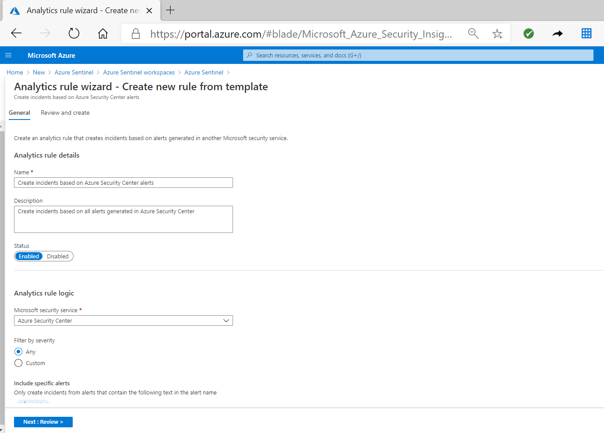

Azure Sentinel Analytics contains rule templates that are pre-loaded from Azure Sentinel GitHub repository. You can use these templates to create a rule to detect security threats. Some of these templates allows you to create a single rule, others templates can be used to create multiple rules with different customization options. Templates that are in use will have visible indication **IN USE** in the template page as displayed in the following screenshot.

## Exploring the existing rule templates

By selecting one of the rules in the **Rule Template** tab, you can observe the properties of the rule. For each rule you can view:

- Severity level – Indicates the importance of the alert. There are 4 severity levels,
  - High
  - Medium
  - Low
  - Informational
- Name of the rule – Provide meaningful name of the alert rule
- Rule type – Define the type of the rule:
  - Fusion
  - Microsoft Security
  - ML Behavior Analytics
  - Scheduled
- Data Source – Specify the data source connector that generate the alert
- Tactics – Specify techniques and methodologies in MITRE ATT&amp;CK model used by different kinds of malware

> [!NOTE]

> MITRE ATT&amp;CK is a globally accessible knowledge base of adversary tactics and techniques based on real-world observations. The ATT&amp;CK knowledge base is used as a foundation for the development of specific threat models and methodologies in the private sector, in government, and in the cybersecurity product and service community.

When you select a rule name on the template page, the details pane on the right of the selected rule provides more information for the rule. Depending on the type of the rule that you select, the details pane can contain different fields of information. For Fusion and ML behavior analytics rules, Microsoft does not provide any additional information. However for scheduled rule, you can view the query rule used in the threat detection.

## Creating an analytic rule from rule template

When you select a predefined rule template, in the detailed pane, you will have a button **Create rule.** By clicking this button, you start the creation of the analytics rule from that template. The composition of the analytic rules from template depends on the rule type that you select.

By default Azure Sentinel Analytics creates an alert rule using Fusion rule template. For Machine Learning Behavior Analytics, you can only create a rule as enabled or disabled, and you do not have the option to further customize the rule.

Creation of the rule from Microsoft security templates consist of the following elements:

- **Name** – Prepopulated from the name of the rule template
- **Description** – Explain more details on the creation of the alerts
- **Status** – Whether the analytic rule is enabled or disabled
- **Analytic rule logic** – Indicate the source of the alert from one of the Microsoft security services
- **Filter by severity** – You can tune alerts from the source based on the severity level: High, Medium, Low, Informational
- **Include specific alerts** – You can filter the alerts that contains specific text in the name
- **Exclude specific alerts** - You can filter the alerts that do not contains specific text in the name

For example the following screenshot present how to create an incident from alerts generated by Azure Security Center.

Creating of the analytics rule from the scheduled template rule type will be explained in the next unit Creating an Analytics rule from the wizard.

> [!NOTE]

> For some rule templates, the button **Create rule** will be grayed out, that indicates that you cannot create a rule from selected template due to missing data source.
