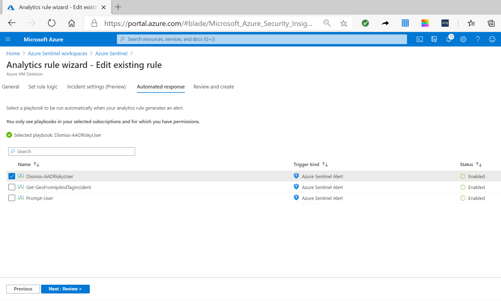

You can connect several data sources to Azure Sentinel, which can rapidly generate many security alerts. To adjust the noise and filter the important threat detection, you should manage the analytics rules on an ongoing basis. This will help ensure that your rules remain useful and efficient in detecting potential security threats.

You can perform the following four action on existing active rules:

- Edit
- Disable
- Duplicate
- Delete

## Edit rules

You can modify existing rules, by selecting **Edit** in the details pane. To edit a rule, you navigate the same pages that you did in creating the rule. The previous inputs that you used to create the rule are preserved. You can change any properties of the rule to further tune the result of the threat detection.

A typical modification that you might want to implement is to attach an automated response to an already detected threat. To do this, in the **Automated Response** page you can select one of the existing playbooks, that defines the automated activity that will run if the threat is detected.
For example, your analytics rule might be detecting an incident that has already been resolved, and you want to reduce further alerts if similar activity occur. By attaching a playbook that contains automated activity, you can change the incident status or add comments when a similar incident is detected.  

## Disable

You can disable the rule while you are doing some activity that can trigger the rule alert. Disabled rules retain their configuration, and you can enable them again at a later time.

## Duplicate

When you duplicate the rule, you have startup configuration provided from the original rule. You can further modify the configuration based on your requirements. Do not forget to change the name of the duplicated rule, because by default, the duplicate rule has the same name as the original rule with the string **Copy** appended to it.

## Delete

Deleting the rule will prompts you for confirmation before Azure Sentinel Analytics removes from the set of active rules. For example, you can delete a rule about a service or a resource that is not any more in use, and eliminates the need for the rule. Be aware that the deletion of the rule is permanent and there is no undo feature. Therefore, as a recommended practice, you should first disable the rule for a period of time until you can be sure that you don't need that rule.
