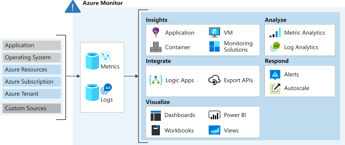
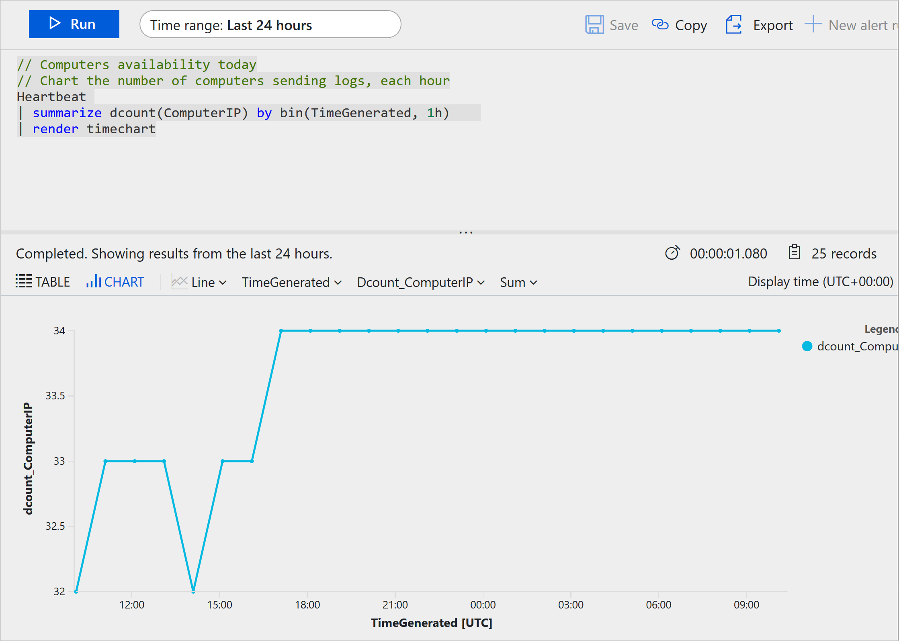

Azure Monitor is a service for collecting and analyzing telemetry. It helps you get maximum performance and availability for your cloud applications, and for your on-premises resources and applications. It shows how your applications are performing and identifies any issues with them.

## Data collection in Azure Monitor

Azure Monitor collects two fundamental types of data: metrics and logs. Metrics tell you how the resource is performing, and the other resources that it's consuming. Logs contain records that show when resources are created or modified.

The following diagram gives a high-level view of Azure Monitor. On the left are the sources of monitoring data: Azure, operating systems, and custom sources. At the center of the diagram are the data stores for metrics and logs. On the right are the functions that Azure Monitor performs with this collected data, such as analysis, alerting, and streaming to external systems.

Azure Monitor collects data automatically from a range of components. For example:

- **Application data**: Data that relates to your custom application code.
- **Operating system data**: Data from the Windows or Linux virtual machines that host your application.
- **Azure resource data**: Data that relates to the operations of an Azure resource, such as a web app or a load balancer.
- **Azure subscription data**: Data that relates to your subscription. It includes data about Azure health and availability.
- **Azure tenant data**: Data about your Azure organization-level services, such as Azure Active Directory.

Because Azure Monitor is an automatic system, it begins to collect data from these sources as soon as you create Azure resources like virtual machines and web apps. You can extend the data that Azure Monitor collects by:

- **Enabling diagnostics**: For some resources, such as Azure SQL Databases, you'll receive full information about a resource only after you have enabled diagnostic logging for it. You can use the Azure portal, the Azure CLI, or PowerShell to enable diagnostics.
- **Adding an agent**: For virtual machines, you can install the Log Analytics agent and configure it to send data to a Log Analytics workspace. This agent increases the amount of information that's sent to Azure Monitor.

Your developers might also want to send data to Azure Monitor from custom code, such as a web app, an Azure function, or a mobile app. They send data by calling the Data Collector API. You can communicate with this REST interface through HTTP. This interface is compatible with various development frameworks, such as .NET Framework, Node.js, and Python. Developers can choose their favorite language and framework to log data in Azure Monitor.

### Logs

Logs contain time-stamped information about changes made to resources. The type of information recorded varies by log source. The log data is organized into records, with different sets of properties for each type of record. The logs can include numeric values such as Azure Monitor metrics, but most include text data rather than numeric values.

The most common type of log entry records an event. Events can occur sporadically rather than at fixed intervals or according to a schedule. Events are created by applications and services, which provide the context for the events. You can store metric data in logs to combine them with other monitoring data for analysis.

You can log data from Azure Monitor in a Log Analytics workspace. Azure provides an analysis engine and a rich query language. The logs show the context of any problems, and are useful for identifying root causes.

### Metrics

Metrics are numerical values that describe some aspect of a system at a point in time. Azure Monitor can capture metrics in near-real time. The metrics are collected at regular intervals, and are useful for alerting because of their frequent sampling. You can use various algorithms to compare a metric to other metrics and observe trends over time.

Metrics are stored in a time-series database. This data store is most effective for analyzing time-stamped data. Metrics are suited for alerting and fast detection of issues. They can tell you about system performance. If needed, you can combine them with logs to identify the root cause of issues.

## Analyzing logs by using Kusto

To retrieve, consolidate, and analyze data, you can specify a query to run in Azure Monitor logs. You can write a log query with the Kusto query language, which Azure Data Explorer also uses.

You can test log queries in the Azure portal so you can work with them interactively. You'll typically start with basic queries, then progress to more advanced functions as your requirements become more complex.

In the Azure portal, you can create custom dashboards, which are targeted displays of resources and data. Each dashboard is built from a set of tiles. Each tile might show a set of resources, a chart, a table of data, or some custom text. Azure Monitor provides tiles that you can add to dashboards. For example, you might use a tile to display the results of a Kusto query in a dashboard.

In the example scenario, the operations team can consolidate its monitoring data by visualizing it in charts and tables. These tools are effective for summarizing data and presenting it to different audiences.

By using Azure dashboards, you can combine various kinds of data, including both logs and metrics, into a single pane in the Azure portal. For example, you might want to create a dashboard that combines tiles that show a graph of metrics, a table of activity logs, charts from Azure Monitor, and the output of a log query.
